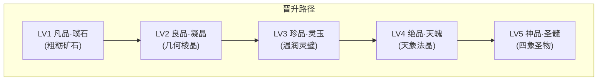

# 《三国五行塔防》五行宝石体系重构与视觉设计规范

> **设计宗旨**：摒弃原版“金刚钻/火焰钻/灵木钻/铂金晶”等现代工业矿物生硬拼凑感，回归中国传统玉石文化、道家五行相生相克哲学与四象神兽（白虎、青龙、玄武、朱雀、麒麟）神韵，构建自「凡石璞矿」步步升华为「太古神髓」的五阶仙道进化图谱。

---

## 一、品阶境界演化总则（LV1 - LV5）

| 等级 | 境界品阶 | 质地特征 | 视觉外形规律 | 光效表现 | 合成进阶 |
| :--- | :--- | :--- | :--- | :--- | :--- |
| **LV1** | **凡品·原石** | 粗粝原矿，石纹斑驳 | 天然不规则多面体碎石，钝角粗面 | 表面哑光，缝隙仅见微弱星芒 | 3合1 ➔ LV2 |
| **LV2** | **良品·凝晶** | 灵气初凝，剔透晶莹 | 规整多棱几何晶体（双锥/六角棱柱） | 晶面反射清亮折射光，冷光内敛 | 3合1 ➔ LV3 |
| **LV3** | **珍品·灵玉** | 温润内敛，通灵凝华 | 精修佩饰（水滴/璧环/方印），祥云如意纹 | 玉质由内散发柔润晕彩，带悬浮微粒 | 3合1 ➔ LV4 |
| **LV4** | **绝品·天魄** | 法则聚形，异象纷呈 | 悬浮重叠神晶簇/天道宝轮/真火红莲 | 环绕八卦符箓/星阵光环，法则波动 | 3合1 ➔ LV5 |
| **LV5** | **神品·圣髓** | 神兽合一，造化极道 | 四象圣兽图腾环抱至尊圣珠/皇冠神钻 | 圣兽虚影浮现，混沌神华撕裂长空 | 登峰造极 |

---

## 二、五行宝石详细设计案（5大系 × 5等级 = 25款）



### 1. 金系宝石【西方白帝 · 破军锐金】
- **属性内涵**：主肃杀、破甲、锋芒无匹。克木（金克木），生水（金生水）。
- **主色调**：白金、冷银、曜金、寒铁灰。

| 等级 | 新命名 | 旧称对照 | 图案造型（Silhouette & Motif） | 色彩与材质规范 | 典故与视觉意象 |
| :--- | :--- | :--- | :--- | :--- | :--- |
| **LV1** | **庚金璞石** | 铁晶石 | 天然多棱粗矿石，带刀劈斧凿般矿裂，破口露寒光 | `#90A4AE` (矿灰) / `#ECEFF1` (金属光) | 采自深山庚金老矿之天然原胚，形体钝拙，杀气未淬。 |
| **LV2** | **沉银玄晶** | 银晶石 | 规整双锥八面晶体，切面棱角锐利如刀刃 | `#B0BEC5` (亮银) / `#78909C` (暗银) | 经地火锻打洗去石皮，晶体冷若玄钢，折射冷月寒光。 |
| **LV3** | **曜金灵玉** | 金晶石 | 精修立面菱形金玉，中心透射耀眼十字星芒 | `#FFD54F` (灿金) / `#FFE082` (星芒白) | 锋芒化作玉质，温润中隐藏斩金断玉之锐，无坚不摧。 |
| **LV4** | **太白金魄** | 铂金晶 | 三枚悬浮利剑晶簇拱卫主核，周身环绕破军星轮 | `#FFF8E1` (炽白金) / `#FFC107` (金芒) | 汲取太白金星晨昏锐气而成，悬空微颤，剑气四溢。 |
| **LV5** | **白虎神髓** | 金刚钻 | 皇冠式多面神钻，正中浮现咆哮金白虎图腾，外展八道剑芒光羽 | `#FFFFFF` (纯曜白) / `#FFA000` (白虎圣金) | 西方白虎神君真灵杀伐神髓，号令天下兵戈，锐破虚空。 |

---

### 2. 木系宝石【东方青帝 · 苍生生息】
- **属性内涵**：主生机、回春、坚韧成长。克土（木克土），生火（木生火）。
- **主色调**：青竹绿、帝王翠、碧罗青、嫩芽金绿。

| 等级 | 新命名 | 旧称对照 | 图案造型（Silhouette & Motif） | 色彩与材质规范 | 典故与视觉意象 |
| :--- | :--- | :--- | :--- | :--- | :--- |
| **LV1** | **青藤原石** | 木灵石 | 扁椭圆深苔卵石，表面干藤缠络痕迹，石隙透青绿 | `#2E4C2F` (苔绿) / `#81C784` (生机青) | 幽谷古树盘根之下挖掘的灵石，吸收初春草木萌发之露。 |
| **LV2** | **碧罗凝晶** | 青木晶 | 仿若青竹节的六棱立柱晶石，半透质感，内见年轮灵纹 | `#4CAF50` (竹翠) / `#A5D6A7` (晶莹绿) | 千年灵竹玉化之晶，节节高升，带有若有若无的草木清芳。 |
| **LV3** | **苍灵翡翠** | 翡翠石 | 饱满欲滴的如意水滴双润玉佩，玉身雕刻卷草祥云纹 | `#2E7D32` (正阳翠) / `#C8E6C9` (温润浅绿) | 纯阳乙木真露凝固而成，正阳浓翠，蕴含枯木逢春之造化。 |
| **LV4** | **建木灵魄** | 灵木钻 | 盛开通灵青莲晶体，金丝叶脉贯通，周遭环绕浮动光叶粒子 | `#047857` (建木深青) / `#FBBF24` (金灵脉) | 上古通天神树建木灵心，连通天人两界，百木朝宗。 |
| **LV5** | **青龙圣珠** | 神木珠 | 翠龙衔吐的混沌龙珠，盘龙身躯环抱护珠，祥云瑞气升腾 | `#00E676` (至尊苍绿) / `#ECFDF5` (龙魂瑞彩) | 东方青龙孟章神君龙魂温润之至圣龙珠，天地生生不息。 |

---

### 3. 水系宝石【北方玄帝 · 幽渊玄水】
- **属性内涵**：主润下、冰封、深邃浩瀚。克火（水克火），生木（水生木）。
- **主色调**：深海墨蓝、霁蓝、冰魄蓝、玄霜雪白。

| 等级 | 新命名 | 旧称对照 | 图案造型（Silhouette & Motif） | 色彩与材质规范 | 典故与视觉意象 |
| :--- | :--- | :--- | :--- | :--- | :--- |
| **LV1** | **凝露水石** | 水灵石 | 扁平青灰河磨石，表面经年水润不干，微泛冰露光斑 | `#1E3A5F` (冷泉蓝) / `#80D8FF` (水露光) | 极寒泉眼深处的冷水原石，触之彻骨冰凉，常年水汽凝露。 |
| **LV2** | **流泉寒晶** | 蓝玉晶 | 尖锐三棱冰晶刺，内部封冻流动的一缕清泉水线 | `#0277BD` (晴海蓝) / `#E1F5FE` (冰白) | 奔腾流泉瞬间冰封而成的灵晶，静中有动，冰爽剔透。 |
| **LV3** | **沧海明珠** | 水晶钻 | 正圆皎洁深海夜明珠，周围荡漾三道同心水纹涟漪 | `#01579B` (渊蓝) / `#40C4FF` (月华水光) | 沧海月明珠有泪，吸纳万顷碧波与太阴月华，深邃沉静。 |
| **LV4** | **玄冥冰魄** | 深海珠 | 六芒对称雪花冰轮，层叠冰刃，周围萦绕永不散去的白霜寒气 | `#0091EA` (极冰蓝) / `#FFFFFF` (玄霜雪白) | 北冥幽冥之渊万年不化之坚冰核心，滴水即可冰封大川。 |
| **LV5** | **玄武神珠** | 玄冰玉 | 神龟灵蛇交尾护持的镇海巨珠，内含归墟深渊倒影与水坎法印 | `#0D47A1` (玄墨深蓝) / `#00E5FF` (极光青蓝) | 北方玄武执明神君镇海至宝，海纳百川，镇压八荒四海狂澜。 |

---

### 4. 火系宝石【南方赤帝 · 涅槃离火】
- **属性内涵**：主爆裂、破阵、烈烈燎原。克金（火克金），生土（火生土）。
- **主色调**：朱砂红、熔岩金红、烈阳深红、三昧紫炎。

| 等级 | 新命名 | 旧称对照 | 图案造型（Silhouette & Motif） | 色彩与材质规范 | 典故与视觉意象 |
| :--- | :--- | :--- | :--- | :--- | :--- |
| **LV1** | **炽火砂石** | 火灵石 | 焦炭黑褐熔结碎岩，不规则裂隙中涌出炽热岩浆橙光 | `#3E2723` (焦黑) / `#FF5722` (岩浆橙红) | 火山口边缘捡拾的火山弹碎石，内有地火余烬未熄。 |
| **LV2** | **熔火赤晶** | 赤玉晶 | 标准八面体切工红晶，晶体如一团凝固的跳跃火焰 | `#C62828` (朱砂赤) / `#FFEB3B` (焰芯金) | 地脉真火千锤百炼剔除焦炭杂质，红如朝霞，温度炽热。 |
| **LV3** | **炎阳赤玉** | 火焰钻 | 镂雕大日金乌的圆融红玉璧，四周流转护体赤焰光环 | `#B71C1C` (纯阳赤玉) / `#FFD54F` (金乌焰) | 温润血玉吸收大日九阳精芒，如一轮袖珍旭日，驱除万邪。 |
| **LV4** | **三昧天火魄** | 烈火珠 | 炽热红莲形态，莲瓣呈琉璃半透红，莲心喷涌金色真火 | `#D50000` (天火赤) / `#FFF176` (三昧金焰) | 天地离火与三昧真火凝练成莲，花开见真性，燃尽尘世业障。 |
| **LV5** | **朱雀神髓** | 朱雀玉 | 朱雀神禽展翅引吭，火羽环抱跳动的离火神心，九天凤鸣 | `#FF1744` (涅槃神红) / `#FF80AB` (紫金霞光) | 南方朱雀陵光神君浴火涅槃遗留的本命神髓，万火臣服。 |

---

### 5. 土系宝石【中央黄帝 · 皇天后土】
- **属性内涵**：主厚重、承载、不动如山。克水（土克水），生金（土生金）。
- **主色调**：金褐、雄黄、蜜蜡琥珀金、玄黄正色。

| 等级 | 新命名 | 旧称对照 | 图案造型（Silhouette & Motif） | 色彩与材质规范 | 典故与视觉意象 |
| :--- | :--- | :--- | :--- | :--- | :--- |
| **LV1** | **厚土砾石** | 土灵石 | 方钝敦实的泥金沉积岩，层理清晰，质地致密沉重 | `#4E342E` (赭褐) / `#FFA000` (泥金) | 深山地脉沉淀千万年的高密硬石，重逾凡铁，沉稳质朴。 |
| **LV2** | **赭岩灵晶** | 黄石晶 | 阶梯层叠山峦状金晶，蜜蜡半透质感，内含重岩地气金纹 | `#FF8F00` (赭黄) / `#FFE082` (蜜蜡透金) | 大地灵气凝结而成的重阶之晶，如微缩山峦，坚忍不拔。 |
| **LV3** | **玄黄古玉** | 琥珀钻 | 四方外圆内方天地方印，表面阴刻八卦坤卦纹与山峦浮雕 | `#F57F17` (玄黄琥珀) / `#FFF9C4` (温润明金) | 承载坤道厚德之纯阳玄黄宝玉，坚不可摧，能化解万般冲击。 |
| **LV4** | **万岳龙魄** | 大地珠 | 九州五岳连峰微缩金晶群峰，主峰高耸，金色地脉龙脉游走 | `#E65100` (大岳重黄) / `#FFD54F` (龙脉金) | 汇聚九州山河龙脉精华，悬空有镇压山岳之雄浑重力场。 |
| **LV5** | **麒麟圣玉** | 麒麟玉 | 瑞兽麒麟踏息壤祥云之皇家玉玺大印，环绕八荒守护神环 | `#D97706` (至尊玄黄) / `#FEF3C7` (皇天圣金) | 中土圣兽麒麟吐纳之无上圣物，聚万土息壤，德载八方乾坤。 |

---

## 三、对应工程代码映射 (`src/data/equipment/gems.ts`)

```typescript
export const gemNames: Record<string, Record<number, string>> = {
  metal: {
    1: '庚金璞石', // 原: 铁晶石
    2: '沉银玄晶', // 原: 银晶石
    3: '曜金灵玉', // 原: 金晶石
    4: '太白金魄', // 原: 铂金晶
    5: '白虎神髓'  // 原: 金刚钻
  },
  wood: {
    1: '青藤原石', // 原: 木灵石
    2: '碧罗凝晶', // 原: 青木晶
    3: '苍灵翡翠', // 原: 翡翠石
    4: '建木灵魄', // 原: 灵木钻
    5: '青龙圣珠'  // 原: 神木珠
  },
  water: {
    1: '凝露水石', // 原: 水灵石
    2: '流泉寒晶', // 原: 蓝玉晶
    3: '沧海明珠', // 原: 水晶钻
    4: '玄冥冰魄', // 原: 深海珠
    5: '玄武神珠'  // 原: 玄冰玉
  },
  fire: {
    1: '炽火砂石', // 原: 火灵石
    2: '熔火赤晶', // 原: 赤玉晶
    3: '炎阳赤玉', // 原: 火焰钻
    4: '三昧天火魄', // 原: 烈火珠
    5: '朱雀神髓'  // 原: 朱雀玉
  },
  earth: {
    1: '厚土砾石', // 原: 土灵石
    2: '赭岩灵晶', // 原: 黄石晶
    3: '玄黄古玉', // 原: 琥珀钻
    4: '万岳龙魄', // 原: 大地珠
    5: '麒麟圣玉'  // 原: 麒麟玉
  }
}
```
