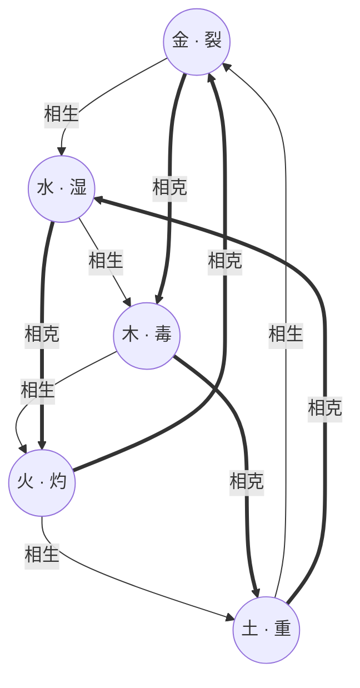
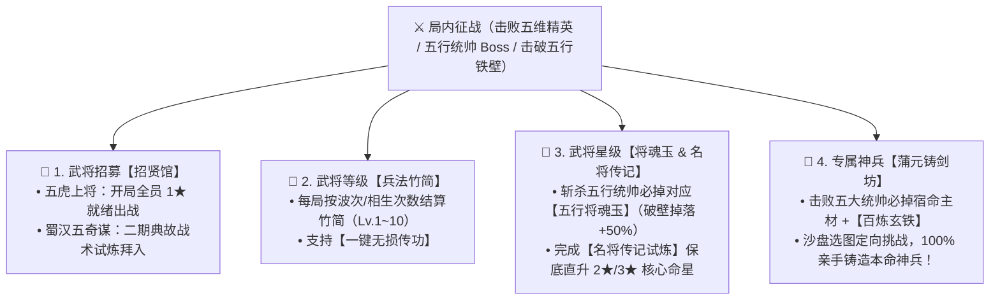
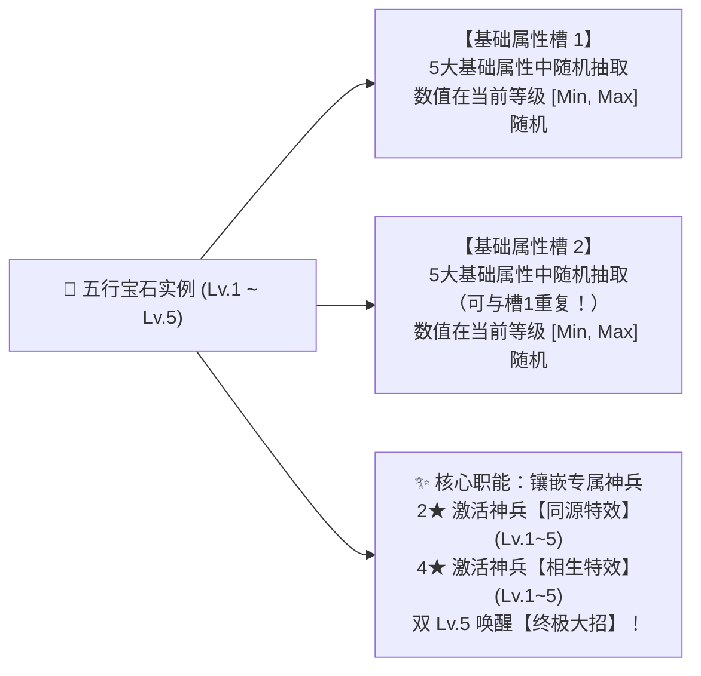
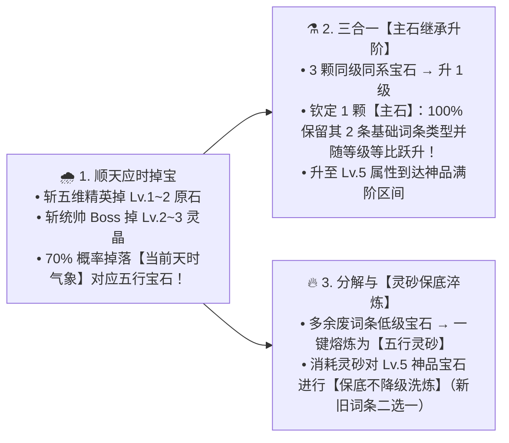
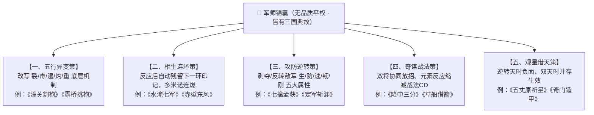
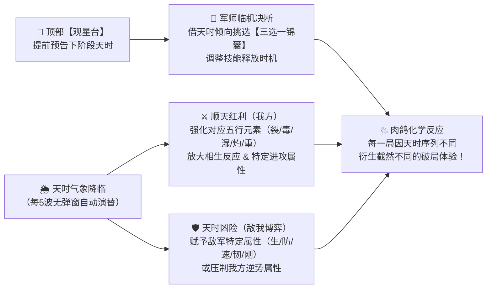
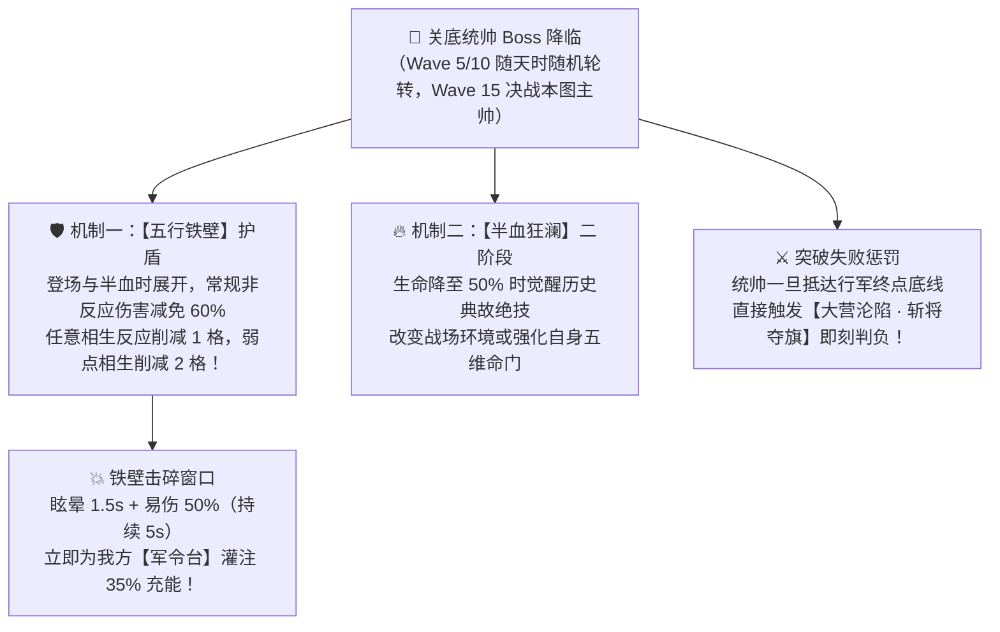
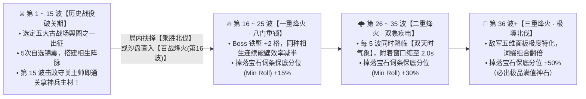
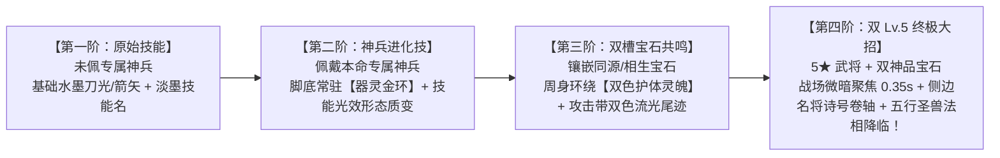
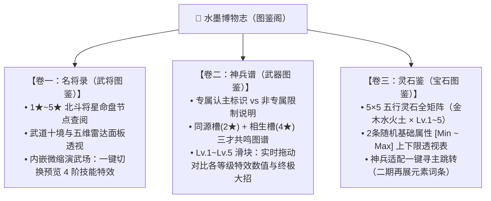

# 《三国五行塔防》五行系统全景设计与规范规范

> **版本**：v2.0.0（第一性原理精简重塑版）  
> **更新时间**：2026-10-05  
> **核心定位**：全游戏五行（金、木、水、火、土）底层运转、英雄战法、专属神兵、五行宝石、天命锦囊与化学连锁反应的全局权威设计规范。

---

## 零、第一性原理顶层基准：一期极简切片（Phase-1）与二期冻结归档（Phase-2）

### 1. 一期极简垂直切片（Phase-1 Vertical Slice）
为杜绝“系统贪大求全、体验过度膨胀、开发周期失控”的工程陷阱，一期严格收敛为**验证“五行生克对冲 + 双核相生阵脉 + 紧凑肉鸽战役”**的核心切片：

* **一期核心实装清单**：
  1. **武将阵容**：五虎上将（关羽·木 / 黄忠·火 / 张飞·土 / 马超·金 / 赵云·水）**开局全员解锁**，场上最大部署上限 5 人全员齐聚；
  2. **五大元素与五大相生**：5 大基础状态（裂/毒/湿/灼/重，严格一对一克制敌军五维属性，附着 `2.5s`） + 5 大双向相生反应（滋养/燎原/熔岩/锋芒/碎冰，**触发不抹除原状态**，同目标同反应内置 `1.5s` ICD）；
  3. **空间阵脉**：两名相生武将部署在彼此 `160px` 距离内时，连结水墨【相生阵脉连线】（阵脉定向反应锁 + 射程交叠区相生伤害与破壁效率 $+35\%$）；
  4. **无弹窗动态天时**：每 5 波自然轮转（全屏水墨滤镜与粒子），顶部【观星台】提前预告下一阶段天象；
  5. **单局 15 波战役（10~12 分钟）**：Wave 1~5（随机天时 + 先锋统帅） $\to$ Wave 6~10（次席天时 + 中军统帅） $\to$ Wave 11~15（固定【晴空朗日】+ 关底守关主帅决战）；
  6. **局内 5 次锦囊自选**：Wave 1 开局、Wave 4 清波后、Wave 7 清波后、Wave 10 清波后、Wave 13 清波后各给 1 次三选一（共 5 张，支持 3 连同策大成），附带 2 枚免费易策令与 1 张保底契合卡；
  7. **单 Boss【五行铁壁】破壁**：Boss 拥有 3~5 格铁壁，任意相生反应削减 1 格，命中战前预告的【命脉弱点相生】削减 2 格并附加 3s 瘫痪易伤；
  8. **战役与无尽一体化衔接**：通关第 15 波关底统帅时弹出水墨帅印抉择：`[🏆 凯旋班师]` 或 `[🔥 乘胜北伐 · 踏入无尽烽火 (Wave 16+)]`。

### 2. 冻结至二期功能清单（Phase-2 Backlog · 暂不开发）
以下系统在一期验证通过前**严格冻结**，严禁提前写入运行时战斗状态或引入复杂度：
* ❌ **蜀汉五奇谋武将**（诸葛亮/庞统/姜维/魏延/法正及 20 种双核分支）；
* ❌ **局内五阶军职晋升虎符体系**（伍长 $\to$ 大将军双核虎符限 2 席）；
* ❌ **18 点五维武学雷达配点模拟器**（一期等级仅提供温和基础成长，无自由配点）；
* ❌ **临阵微操水墨点名躲闪**（1.5s 警示点名与【奇谋破招】机制）；
* ❌ **八门地脉特殊地形阵眼**（定军高台、襄江水眼等 5 种特殊部署格）；
* ❌ **Lv.5 宝石元素专属词条**（一期宝石仅生成 2 条基础面板属性，不开启裂/毒/湿/灼/重特殊词条）；
* ❌ **关底双统帅同台**（【双帅同辕】与敌方合击机制）。

### 3. 严格四大独立伤害乘区计算公式（严禁私设独立乘区）
全游戏所有伤害结算统一遵循以下四大乘区计算体系，**区内加算、区间乘算**：
$$\text{最终伤害} = \text{基础基数} \times (1 + \sum \text{攻击力加成}) \times (1 + \sum \text{增伤加成}) \times (1 + \sum \text{易伤加成}) \times (1 + \text{实际暴伤倍率})$$

1. **乘区 1：基础伤害基数（Base Damage）**：武将攻击力面板 $\times$ 技能/反应倍率；
2. **乘区 2：攻击力加成（Attack Boost）**：装备/等级/锦囊提供的攻击力百分比加成（Additive）；
3. **乘区 3：增伤加成（Damage Increase）**：相生倍率、天时顺天红利、160px 相生阵脉 $+35\%$、锦囊全伤害提升统一在此区加算（Additive）；
4. **乘区 4：易伤加成（Vulnerability）**：Boss 破壁瘫痪 $+50\%$、状态削弱层数加深、锦囊《五气朝元》（每种状态 $+15\%$）统一在此区加算，严禁开辟独立乘区！
* **暴击伤害折算**：
  $$\text{实际暴击几率} = \max(0\%, \text{我方暴击率} - \text{目标韧性})$$
  $$\text{实际暴击伤害倍率} = \max(0\%, \text{我方暴击伤害} - 100\% - \text{目标刚毅})$$

### 4. 局外数值天花板与敌军抗性下限保底
* **局外总数值增益上限 $\le +50\%$**：局外养成（武将等级、星级、专属神兵、宝石面板）全部叠加上限不得超过初始白板面板的 $150\%$（$+50\%$ 极限增幅），坚守“局外保下限、局内定上限”；
* **敌军抗性削减下限保底 $\ge 40\%$**：敌军的【防御】、【韧性】与【刚毅】无论被破甲/破架削减多少，其最终生效值**不得低于初始属性的 $40\%$**，彻底杜绝 Boss 沦为零抗性肉鸡。

### 5. 战场生命机制与胜负判定
* **普通敌人突破底线**：扣除主公 **1 点生命**；
* **精英敌人突破底线**：扣除主公 **3 点生命**；
* **三国统帅 Boss 突破底线**：直接触发 **【大营沦陷 · 斩将夺旗】即刻判负**！
* **波间准备与微操规范**：
  * **波间布阵期**：玩家可自由拖拽换位调整阵型与 160px 相生阵脉，观察来敌预告；
  * **战斗交火期**：锁定武将位置，依靠相生反应、战法释放与火力集火抗敌；
  * **提前击鼓迎敌**：布阵期提前开战奖励 $+8$ 军费。

### 6. 二期解锁验收门槛（Playtest Verification Gates）
必须在核心玩家内测中满足以下 4 项量化指标后，方可启动 Phase-2 功能开发：
1. **多流派平衡**：至少 3 组不同的五虎相生双核（如木火关黄、水木赵关、土金张马）能够在适度熟练下通关第 15 波；
2. **通关率健康**：任何单一相生组合的通关率不得超过 $50\%$（杜绝单一最优解）；
3. **布阵参与度**：玩家在波间准备期的调防率 $\ge 60\%$（证明阵型与阵脉策略成立）；
4. **心智门槛友好**：新手在 3 局之内能清晰掌握五行状态的五维克制对应关系。

---

## 目录

0. [第一性原理顶层基准：一期极简切片与二期冻结归档](#零第一性原理顶层基准一期极简切片phase-1与二期冻结归档phase-2)
1. [设计哲学与架构总览](#一设计哲学与架构总览)
2. [五大基础属性、五行元素效果与底层生克法则](#二五大基础属性五行元素效果与底层生克法则)
3. [五大五行相生化学连锁反应（双向等价瞬爆）](#三五大五行相生化学连锁反应双向等价瞬爆)
4. [武将养成重塑：将星命盘（1~5★）、武道十境与专属神兵五阶进化](#四武将养成重塑将星命盘15武道十境与专属神兵五阶进化)
5. [五虎上将：原始技能 → 神兵进化 → 宝石成长 → 终极大招全解](#五五虎上将原始技能--神兵进化--宝石成长--终极大招全解)
6. [五行宝石体系与随机属性词条规则](#六五行宝石体系与随机属性词条规则)
7. [军师锦囊（无品质平权 · 三国典故机制改造体系）](#七军师锦囊无品质平权--三国典故机制改造体系)
8. [五行天时气象系统（无弹窗全局环境博弈）](#八五行天时气象系统无弹窗全局环境博弈)
9. [敌军五维兵种与三国五行统帅 Boss 设计](#九敌军五维兵种与三国五行统帅-boss-设计)
10. [水墨视觉表现规范：敌军状态、武将四阶战法演出与三大典藏图鉴](#十水墨视觉表现规范敌军状态武将四阶战法演出与三大典藏图鉴)
11. [实现路线与代码重构清单](#十一实现路线与代码重构清单)
12. [二期待议池（Phase-2 Backlog · 待一期试玩达标后逐个恢复）](#十二二期待议池phase-2-backlog--待一期试玩达标后逐个恢复)

---

## 一、设计哲学与架构总览

### 1. “局外保下限、局内定上限”
* **局外养成**（武将 1~5★ 将星命盘开窍、1~10 级温和基础成长、专属神兵、五行宝石）：废除枯燥的 60 级线性数值膨胀与武将品质高低分级，全局局外面板增益上限 $\le +50\%$；局外只负责**打通五行机制权限与提供稳健的生存/输出下限**；
* **局内肉鸽**（军令进度充能、三国典故锦囊三选一、天时气象博弈、五行相生破铁壁）：决定单局对抗高难度五维兵种与三国统帅 Boss 的上限。

### 2. 五行必须产生“化学反应”，而非单一数值克制
* 拒绝枯燥的纯数值倍率对撞；
* 任何相生五行碰撞，必须产生**定身、殉爆、熔岩地热、破甲弹射、极寒冰封**等兼具视效与机制质变的化学连锁反应。

### 3. 全局水墨视觉与零外置素材原则
* 所有五行特效、状态印章、飘字横幅完全依托 Canvas / Phaser 3 矢量几何图元与 WebAudio 原生现场合成（`SoundFX.ts`），严格遵守宣纸水墨国风调色规范（`InkTheme.ts`）。

---

## 二、五大基础属性、五行元素效果与底层生克法则

### 1. 攻防双方五大基础面板属性（武将/宝石 vs 敌军）

游戏的底层数值底座由**【我方五大进攻属性】**（武将面板、兵器、宝石词条共通）与**【敌军五大生存/机动属性】**构成，且彼此形成严密的攻防对冲关系：

#### （1）我方五大基础属性（武将 / 兵器 / 宝石随机词条池）

| 序号 | 基础属性名称 | 属性字段代码 | 核心战斗作用说明 |
| :---: | :---: | :---: | :--- |
| **1** | **攻击力** | `attack` | 决定武将普攻、主动战法、元素持续伤害及**五行相生反应**的结算基础倍率基数 |
| **2** | **攻击范围** | `range` | 决定武将索敌警戒半径（像素/码）以及范围型战法/溅射的覆盖区域 |
| **3** | **攻击速度** | `attackSpeed` | 决定武将每秒攻击次数（次/秒），直接加快**元素附着频率**与按普攻次数触发的被动循环 |
| **4** | **暴击几率** | `critRate` | 决定普攻与主动战法触发暴击的概率（$0\% \sim 100\%$） |
| **5** | **暴击伤害** | `critDamage` | 决定触发暴击时的伤害倍率（初始默认 $150\%$，词条数值直接累加暴击倍率上限） |

#### （2）敌军五大基础属性（引入【韧性】与【刚毅】抗暴体系）

针对敌军原有的“反暴击几率”与“反暴击伤害”，采用更具三国武道意境的**【韧性】**（柔韧化锋，降低被暴击率）与**【刚毅】**（刚毅护体/铁骨卸力，削减所受暴击伤害）命名：

| 序号 | 敌军属性名称 | 原含义 | 属性字段代码 | 核心战斗作用与对应的克制五行状态 |
| :---: | :---: | :---: | :---: | :--- |
| **1** | **生命** | 最大血量 | `hp` | 敌军生存血量上限 $\longleftarrow$ **被木系【毒】克制**（按最大生命百分比持续腐蚀） |
| **2** | **防御** | 护甲减伤 | `defense` | 减免受到的常规伤害 $\longleftarrow$ **被金系【裂】克制**（直接撕裂削减防御护甲） |
| **3** | **移动速度** | 行军移速 | `moveSpeed` | 敌军沿路径突进的速度 $\longleftarrow$ **被水系【湿】克制**（唯一降低移速的基础控制状态） |
| **4** | **韧性** | **反暴击几率** | `tenacity` | 抵消我方暴击几率（$\text{实际暴击率} = \max(0\%, \text{暴率} - \text{韧性})$） $\longleftarrow$ **被土系【重】克制** |
| **5** | **刚毅** | **反暴击伤害** | `fortitude` | 抵消我方暴击伤害（$\text{实际暴伤} = \max(100\%, \text{暴伤} - \text{刚毅})$） $\longleftarrow$ **被土系【重】克制** |

---

### 2. 五大元素效果（裂、毒、湿、灼、重）—— 精准对应敌军五大属性（零重叠）

为了让五大元素效果各司其职、绝不互相抢戏（特别是**把移速控制权 $100\%$ 留给【水·湿】**，**把硬控留给相生反应**，彻底杜绝基础状态出现大范围眩晕控场 Bug），五大元素效果与敌军五大属性形成严丝合缝的**「一物降一物」**对应关系：

| 五行 | 元素效果 | 对应武将 | 显性印记 | 状态代码 | 针对敌军哪项属性？ | 详细机制效果（零控制泛滥、零定位重叠） | 附着时长 | 视觉代表色 |
| :---: | :---: | :---: | :---: | :---: | :---: | :--- | :---: | :---: |
| **金** | **裂** | 马超 | **【金·裂】** | `bleed` | **破除【防御】** + 位移流血 | ① **锋芒破甲**：直接削减目标 **$35\%$ 防御护甲**； ② **移步淌血**：目标在移动时伤口撕裂，每秒承受 $45\%$ 攻击力的**流血真伤**（移速越快流血越痛；静止时流血减半）。 | **2.5s** | `#ffd54f` (金白) |
| **木** | **毒** | 关羽 | **【木·毒】** | `parasite` | **腐蚀【生命】** + 禁疗传染 | ① **蚀骨剧毒**：每秒扣除目标 **最大生命值 $2.0\%$** 的毒素伤害（最多叠 3 层，专克高血量巨盾与首领）； ② **生机断绝**：降低目标 $50\%$ 回血效果，阵亡时毒种向周围小范围传染。 | **2.5s** | `#4caf50` (碧青) |
| **水** | **湿** | 赵云 | **【水·湿】** | `wet` | **压制【移动速度】** *(唯一基础软控)* | ① **寒潮浸润**：唯一具备减速控制的基础状态，使目标**移动速度持续降低 $35\%$**； ② **反应媒介**：作为水生木【定身】与金生水【冰封】的核心先手状态。 | **2.5s** | `#29b6f6` (玄蓝) |
| **火** | **灼** | 黄忠 | **【火·灼】** | `burn` | **高频【攻击力】直伤** + 阵亡爆燃 | ① **烈火焚身**：每 $0.5\text{s}$ 高频跳字造成施法者 $20\%$ 攻击力火伤（每秒 $40\%$，清脆皮群怪极快）； ② **余烬爆燃**：处于灼烧中的敌人阵亡时迸发火花，对邻近敌军造成小范围灼伤。 | **2.5s** | `#ff5722` (赤朱) |
| **土** | **重** | 张飞 | **【土·重】** | `heavy` | **粉碎【韧性 & 刚毅】** + 暴击内震 | ① **重压破架（削韧破刚）**：万钧重压使敌军身架变形、无力卸力护心，**直接削减目标 $25\%$【韧性】（更易被暴击）与 $40\%$【刚毅】（受暴击伤害剧增）**； ② **负重内震**：处于【土·重】的目标每次受到暴击时，因负重无法卸力，额外迸发一次相当于本次伤害 $20\%$ 的土系内震伤！ | **2.5s** | `#a1887f` (厚褐) |

> [!TIP]
> **五大元素效果的设计闭环**：
> * **为什么【土·重】不再带减速或眩晕控场？**
>   1. **与【水·湿】彻底解耦**：移速控制由**【水·湿】**独占，硬控（定身/冰封）由**【相生反应】**独占，避免基础状态控场泛滥导致 Boss/精英寸步难行；
>   2. **完美闭环敌军五大属性**：`毒`克**生命**、`裂`克**防御**、`湿`克**移动速度**、`重`克**韧性与刚毅**、`灼`打**高频面板火伤**；
>   3. **完美契合「土生金」武学逻辑**：土系【重】先压垮敌人的身架（大幅削弱**韧性**与**刚毅**至保底下限，暴露致命破绽），金系【裂】再一枪撕碎**防御**打出满额暴击，形成“土破韧刚、金破护甲”的绝妙配合！
> * **为什么基础元素附着时长严格收紧为 `2.5s`？**
>   * 若附着长达 4.5s，敌军可走完大半张地图，武将随便乱摆都能触发反应；将窗口收紧为 **`2.5s`**，逼迫玩家必须在空间路径上精密规划**“前哨先手挂元素将”与“要冲后手引爆将”的站位衔接距离**！

---

### 3. 五行相生与生我者关系
* **我生者（生出）**：金生水、水生木、木生火、火生土、土生金。
* **生我者（母体）**：水之母为金、木之母为水、火之母为木、土之母为火、金之母为土。
* **神兵双槽镶孔准则**：每件神兵设有**【同源槽】**与**【相生槽】**两个独立宝石孔位——同源槽仅可镶嵌本命同系宝石，相生槽仅可镶嵌“生我者”母系宝石（例如木系神兵：同源槽嵌木、相生槽嵌水），两槽效果可同时并存生效。

### 4. 五行相克法则
* **克制环路**：金克木、木克土、土克水、水克火、火克金（详见下图内圈五角星黑线；相克深度机制后续单独扩展）。

---

## 三、五大五行相生化学连锁反应（双向等价瞬爆 & 空间阵脉连线）

### 1. 双向等价瞬爆、状态保留法则与【五行相生阵脉连线】
打破“必须先A后B”的死板限制，**无论先挂 A 再打 B，还是先挂 B 再打 A**，只要两种相生元素在 `2.5s` 附着窗口内于敌军身上相遇，立即结算对应的化学连锁反应！
* **相生不抹除底层状态（彻底解决破甲/叠毒/削韧断档矛盾）**：
  * 五种基础状态（`裂/毒/湿/灼/重`）各自按 `2.5s` 独立计时；
  * **触发相生反应时，绝不清除目标身上原有的破甲、3层叠毒、禁疗、减速与削韧刚毅减益**！改为对同一目标设有 **`1.5s` 同类相生反应内置冷却（ICD）**——既保证曹仁的破甲、张角的禁疗、董卓的削韧全程在线，又防止无脑一秒十爆。
* **【相生共鸣取优法则】（彻底破除“1阶高攻速工具人抢尾刀降伤”悖论）**：
  * 若按“谁碰巧打出第二击（Trigger）就只按谁的面板算”，高攻速 1 阶工具人会频繁抢走主力输出武将的反应尾刀导致伤害暴跌；
  * 因此，无论先手还是后手，只要两名武将触发相生反应，**反应基础伤害与暴击面板始终取参与反应双将中【攻击力最高者（主力输出武将）】作为主基数，并额外附加另一名铺垫武将 $25\%$ 的攻击力协同加成**（即 $\text{反应结算攻击基数} = \max(A, B) + 0.25 \times \min(A, B)$），同时全额享受目标身上已有的基础元素减益与破【五行铁壁】效果！
* **核心空间博弈 ——【160px 五行相生阵脉连线】与【阵脉定向反应锁】**：
  * 当两名具有**五行相生关系**的武将（如`水·赵云`与`木·关羽`、`木·关羽`与`火·黄忠`）部署在彼此 **`160px`（相生共鸣距离）** 以内时，两人脚下阵盘自动激发一道流动的**【双色水墨相生阵脉连线】**；
  * **① 阵脉定向反应锁（防散兵抢反应当内鬼）**：处于【相生阵脉连线】内的两名武将，其施加的元素印记**优先与阵脉搭档锁定触发定向相生反应**，彻底杜绝阵脉外的 1 阶高攻速散兵（如圈外赵云抢走关羽的木毒）干扰主力双核的化学反应！
  * **② 交叠火网红利**：处于这两名相生武将**射程交叠区**内的敌军，其身上的对应基础元素衰减速度减缓 **$30\%$**（等效延长至 $3.25\text{s}$），且在该交叠区内触发的对应相生反应，**最终反应伤害与对 Boss【五行铁壁】的破盾效率直接提升 $+35\%$**！

### 2. 标准五行相生相克图

> **图示说明**：
> * ⚪ **白色圆弧单向箭头（外圈顺时针）**：**五行相生**（金生水 $\to$ 水生木 $\to$ 木生火 $\to$ 火生土 $\to$ 土生金）。
> * ⚫ **黑色五角星单向箭头（内圈隔位）**：**五行相克**（金克木 $\to$ 木克土 $\to$ 土克水 $\to$ 水克火 $\to$ 火克金）。

---

### 3. 五大相生反应与基础状态的严密咬合明细

#### ① 水生木【滋养·蔓延】(`nourish`) —— 寒水润毒藤 · 群体定身蚀血
* **触发组合**：**【水·湿】**（减移速）+ **【木·毒】**（百分比蚀生命）
* **化学反应逻辑**：寒水浸润催生体内毒种破体疯长，将单体软控【水·湿】升格为**硬控定身**，并将单体【木·毒】向周围引爆扩散！
* **结算效果**：
  1. 造成 $1.5\times$ 攻击力木系伤害，并将主目标**荆棘定身束缚 2.0 秒**（移动速度归零）；
  2. 向周围 90 像素内所有敌军蔓延1层**【木·毒】**（持续扣除最大生命值 $2.0\%/\text{s}$ 并禁疗 $50\%$，持续 4 秒）。
* **水墨特效**：青翠巨藤盘旋破地而起，飘字【水生木·滋养】(`#00e676`)

#### ② 木生火【燎原·焚尽】(`wildfire`) —— 毒木作薪柴 · 烈焰殉爆轰炸
* **触发组合**：**【木·毒】**（寄生毒藤）+ **【火·灼】**（高频火伤）
* **化学反应逻辑**：以敌军体内的【木·毒】藤蔓为助燃薪柴，遇【火·灼】瞬间由内而外引发毁灭性**连环爆破**！
* **结算效果**：
  1. 主目标承受 $2.4\times$ 攻击力超高火系爆破主伤害，并**立即引爆结算其身上已有的 1 层【木·毒】最大生命百分比伤害**；
  2. 以主目标为核心爆发 **110 像素烈焰大爆炸**，周围所有敌军承受 $75\%$ 主伤害并被挂上余烬灼烧 3.5 秒。
* **水墨特效**：红黑浓墨烈火爆散，飘字【木生火·燎原】(`#ff3d00`)

#### ③ 火生土【熔岩·焦土】(`magma`) —— 烈火化熔岩 · 焚心碎刚炼狱
* **触发组合**：**【火·灼】**（高频火伤）+ **【土·重】**（削减韧性与刚毅 + 暴击内震）
* **化学反应逻辑**：烈火熔化厚土，在敌军脚下形成持续沸腾的**【熔岩焦土】**，将【火·灼】的持续火伤与【土·重】的“削韧破刚”扩增为**范围抗暴瓦解领域**（不抢【水·湿】的减速，也不抢【金·裂】的破甲）！
* **结算效果**：
  1. 爆发 $1.6\times$ 攻击力火土重击，并在原地生成持续 4 秒、半径 95 像素的**【熔岩焦土】**；
  2. 处于熔岩焦土内的所有敌军每秒承受 $45\%$ 攻击力地火灼烧，且身架被高温地脉彻底瓦解：**【韧性】降低 $40\%$、【刚毅】降低 $60\%$**，在焦土内每次受到暴击必定触发范围**【负重内震】**（额外迸发 $30\%$ 暴击内震伤）！
* **水墨特效**：赭红地脉龟裂岩浆溢出，飘字【火生土·熔岩】(`#ff9100`)

#### ④ 土生金【淬刃·锋芒】(`spikes`) —— 土破韧刚 · 金破护甲 · 暴击飞刃
* **触发组合**：**【土·重】**（削减韧性与刚毅）+ **【金·裂】**（削减防御 + 移动流血）
* **化学反应逻辑**：“土破韧刚、金破护甲”的极致物理爆发——【土·重】先压垮敌军抗暴架势（韧性/刚毅大减），【金·裂】再撕裂防御护甲，凝土成金迸射破甲暴击飞刃！
* **结算效果**：
  1. 主目标在**已受【土·重】削韧破刚**与**【金·裂】破除 $35\%$ 防御**的基础上，承受 $1.8\times$ 攻击力的金系穿刺重击（本次反应额外 $+35\%$ 暴击几率与 $+50\%$ 暴击伤害）；
  2. 从主目标体内向周围 160 像素内弹射 **3 枚淬金飞刃**，各造成 $100\%$ 破甲伤害，并立即撕裂伤口结算 1 次【金·裂】流血真伤！
* **水墨特效**：漫天金白剑气如雨辐射，飘字【土生金·锋芒】(`#ffd700`)

#### ⑤ 金生水【寒芒·碎冰】(`shatter`) —— 裂甲凝玄冰 · 极寒冻结破阵
* **触发组合**：**【金·裂】**（破除防御 + 伤口撕裂）+ **【水·湿】**（浸润减速）
* **化学反应逻辑**：【水·湿】的刺骨寒水顺着【金·裂】撕开的护甲裂口灌入体内，瞬间凝结成玄冰将目标**彻底冰封**，随后冰晶顺伤口爆裂！
* **结算效果**：
  1. 目标在【金·裂】破甲状态下承受 $1.7\times$ 攻击力寒冰穿刺伤害，并被**玄冰绝对冻结 2.5 秒**（移动与攻击完全停止）；
  2. 冰封破碎时对周围小范围溅射寒霜伤害，解冻后目标因寒气未散，移速降低 $35\%$ 持续 2 秒。
* **水墨特效**：六芒冰晶华爆裂溅射，飘字【金生水·碎冰】(`#00e5ff`)

---

## 四、武将养成重塑：将星命盘（1~5★）、武道十境与专属神兵五阶进化

### 1. 为什么要彻底推翻旧版“1~60 级线性加倍率 + 升星加面板”？

旧版武将养成存在三大严重痛点：
1. **冗长且无脑的数值膨胀**：1~60 级每级固定 $+5\%$ 属性倍率（满级翻 $4$ 倍，需刷 $500$ 万经验），中间 59 级毫无机制变化，满级后又直接靠纯数值碾压低波次，违背“局外保下限、局内定上限”原则；
2. **等级与星级同质化**：升级加面板、升星也加面板，玩家没有任何策略构建（Build）的选择权；
3. **五虎上将分三六九等**：旧版将赵云、黄忠划为“史诗”，关羽、张飞、马超划为“传说”，既违背三国情怀，又人为制造五行弱势卡。

为此，我们将武将养成重塑为**「将星开命格（纵向机制解锁）」$\times$「武道修境界（稳固下限成长）」$\times$「本命神兵五阶进化」**三位一体的高策略体系！

---

### 2. 武将星级：【将星命盘（1★ ~ 5★）】—— 废除品质分级，逐星打通五行灵窍与神兵共鸣

* **五虎平权**：**彻底废除武将“普通/稀有/史诗/传说”品质分级**！所有三国名将平起平坐，初始均为 **1★ 将星**，消耗【将魂石】最高升至 **5★ 将星**。
* **升星不堆白板倍率，每颗星都是一次机制质变**：将星直接决定武将的**普攻本命五行附着率**、**神兵宝石孔位的开窍权限**以及**3★ 三国本命特质**：

| 星级 | 命盘境界 | 普攻本命五行附着率 | 神兵宝石灵窍解锁权限 | 将星专属机制突破 |
| :---: | :---: | :---: | :--- | :--- |
| **1★** | **【初露锋芒】** | **$25\%$** | 可佩戴兵器/本命神兵（激活神兵技能变化），**宝石孔位尚未开窍** | 解锁武将【原始主动战法】与基础被动 |
| **2★** | **【威名远播】** | **$40\%$** | 🔓 **打通神兵【同源宝石槽】(`sameSocket`)** *(允许镶嵌同系宝石，激活专属神兵【同源特效】)* | **【轻装急行】**：该武将局内部署军费费用永久 **$-2$** |
| **3★** | **【独当一面】** | **$50\%$** | 保持【同源宝石槽】 | 🔥 **觉醒【三国本命特质】** *(每位武将独有的五行联动核心被动，见下表)* |
| **4★** | **【威震华夏】** | **$65\%$** | 🔓 **打通神兵【相生宝石槽】(`generatingSocket`)** *(允许同时镶嵌生我者母系宝石，实现【同源+相生特效】双槽同存)* | **【破壁先锋】**：由该武将触发的【五行相生反应】对 Boss【五行铁壁】造成 **$1.5\times$ 破盾削减** |
| **5★** | **【五虎天命】** | **$80\%$** | 🐉 **解锁【双 Lv.5 宝石 · 终极大招】觉醒权限** *(当同源槽与相生槽皆嵌满 5 级神品宝石时，解放终极大招)* | **【统帅军威】**：每次释放主动战法时，立即为战场【军令台】灌注 **$8\%$ 军令充能**（加速空格键三选一锦囊） |

#### 🔥 3★ 觉醒【五虎三国本命特质】全解（深度绑定五大元素状态）
升至 **3★** 时，五虎上将分别觉醒契合其三国典故与本命元素状态（裂/毒/湿/灼/重）的独特机制被动：
* **关羽（木 · 义绝春秋）**：战场上每有 1 名处于**【木·毒】**的敌军阵亡，关羽主动战法冷却立即缩短 $0.6\text{s}$，且毒种阵亡传染半径扩大 $35\%$。
* **黄忠（火 · 百步穿杨）**：对处于**【火·灼】**的敌军发起攻击时，黄忠本次攻击射程动态 $+25\%$，且箭矢无视目标 $20\%$【韧性】（更易暴击）。
* **张飞（土 · 万夫莫敌）**：处于张飞攻击范围内的敌军，其身上的**【土·重】**持续时间暂停衰减；且每次触发【负重内震】时，震波向周围 $85\text{px}$ 额外溅射 $50\%$ 内震伤害。
* **马超（金 · 神威铁骑）**：战场上每存在 1 名处于**【金·裂】**流血状态的敌军，马超自身攻击速度提升 $6\%$（最多叠加 6 层至 $+36\%$ 攻速）。
* **赵云（水 · 一身是胆）**：对处于**【水·湿】**的敌军每累计命中 4 次，第 4 击必定暴击，并使其身上的【水·湿】减速幅度在 $2.0\text{s}$ 内翻倍。

---

---

### 3. 武将等级：【武道十境（Lv.1 ~ Lv.10 · 纯粹基础成长）】—— 严格受控数值下限

* **精炼 10 级境界，严控数值膨胀**：
  * 彻底废除旧版 1~60 级冗长数值堆叠，浓缩为 **Lv.1 ~ Lv.10【武道十境】**（初阵 $\to$ 淬体 $\to$ 凝气 $\to$ 破锋 $\to$ 贯通 $\to$ 宗师 $\to$ 止水 $\to$ 天人 $\to$ 无双 $\to$ 化境）。
  * 每升 1 级，基础攻击力仅温和提升 **$+3.6\%$**（满级 Lv.10 合计仅 **$+36\%$** 基础攻击保底，严格符合全局局外面板增益 $\le +50\%$ 铁律）。
* **一期零配点负担**：等级纯粹提供扎实的保底下限，支持随时 **【一键免费无损传功】**。
* *(二期扩展：18 点五维武学雷达自由配点与 5/10 点突破特性已整体归档至文档末尾「二期待议池」)*。

---

### 4. 核心铁律：专属神兵绑定与五阶递进法则

在将星打通宝石孔位后，武将的技能形态遵循严格的**「专属神兵绑定 + 双槽宝石等级递进」**法则：

| 佩戴状态 | 基础属性加成（兵器+宝石） | 武将技能变化（神兵进化技） | 同源特效（需 2★ 解锁同源槽，随 Lv.1~5 成长） | 相生特效（需 4★ 解锁相生槽，随 Lv.1~5 成长） | 终极大招（需 5★ 且双槽皆为 Lv.5 激发） |
| :--- | :---: | :---: | :---: | :---: | :---: |
| **① 未佩戴兵器（素身）** | ❌ 无 | ❌ 仅释放【武将原始技能】 | ❌ 无 | ❌ 无 | ❌ 无 |
| **② 佩戴非专属神兵** *(通用兵器或他人专属)* | ✅ **生效** *(仅享兵器+宝石自身面板属性)* | ❌ **不生效** *(仍为原始技能)* | ❌ **无同源特效** *(即使嵌Lv.5也无特效)* | ❌ **无相生特效** *(即使嵌Lv.5也无特效)* | ❌ **无终极大招** |
| **③ 佩戴本命专属神兵（无宝石）** | ✅ 生效 + 专属属性加成 | ✅ **激活【神兵技能变化】** | ❌ 未激发 | ❌ 未激发 | ❌ 未激发 |
| **④ 专属神兵 + 同源宝石 (Lv.1~5)** | ✅ 生效 | ✅ 激活【神兵技能变化】 | ✅ **激活【同源特效】** *(随宝石等级 Lv.1$\to$5 逐级增强)* | ❌ 未激发 | ❌ 未激发 |
| **⑤ 专属神兵 + 同源(Lv.1~5) + 相生(Lv.1~5)** | ✅ 生效 | ✅ 激活【神兵技能变化】 | ✅ **激活【同源特效】** *(随等级 Lv.1$\to$5 增强)* | ✅ **同时并存【相生特效】** *(随等级 Lv.1$\to$5 增强)* | ❌ 未满级未激发 |
| **⑥ 专属神兵 + 同源(Lv.5) + 相生(Lv.5)** | ✅ 满额生效 | ✅ 激活【神兵技能变化】 | ✅ **满级【同源特效】(Lv.5)** | ✅ **满级【相生特效】(Lv.5)** | 🐉 **彻底唤醒【终极大招】** |

> [!IMPORTANT]
> **两大核心防崩坏铁律（专属限制 & 破除“一人成军悖论”）**：
> 1. **非专属神兵严格限制**：若武将未佩戴自己的本命专属神兵，仅生效兵器与宝石的基础/元素面板属性；**原始技能无变化、无同源特效、无相生特效、无终极大招**。
> 2. **破除“一人成军悖论”（相生宝石不抢队友配合）**：
>    * 如果佩戴相生宝石后普攻也能 100% 挂母元素自爆，会导致武将变成“单人自走永动机”，彻底杀死双将站位配合！
>    * 因此，**【相生宝石（Lv.1~5）】绝不赋予普攻白嫖母元素的能力**——日常高频相生反应**必须依靠两名相生武将（如水赵云 + 木关羽）在空间路径上的先后手接力与阵脉交叠**来触发；
>    * **相生宝石的两大真正职能**：① **【相生共鸣增幅】**：大幅提升该武将参与触发对应相生反应时的威力、范围或控制时长（随 Lv.1~5 成长）；② **【战法引信（仅限主动战法 CD 6~10s）】**：仅在释放主动战法的那一击时，按宝石等级（Lv.1 $25\% \to$ Lv.5 $100\%$）先手覆上母元素并引爆一次战略级相生反应！

---

### 5. 局内军费（Cost）部署循环与波间免费布阵调防

一期切片中，局内军费（Cost）聚焦于**节奏调控与出场序编排**，坚决剔除复杂的军职晋升层级：

1. **五虎梯次登场（Cost 部署循环）**：
   * 初始军费 20 点，武将部署消耗 10~15 军费（如赵云 10、张飞 12、关羽 15）；
   * 前期玩家根据开局天象与来敌预告先部署 1~2 名武将稳住防线；随着击杀敌军积累军费，逐步在战场上摆满 5 名五虎上将，连结多条 160px 相生阵脉，达成五行大圆满；
   * 撤退返还 $50\%$ 军费，留存动态调整余地。
2. **波间准备期自由调整阵型与阵脉**：
   * 在每一波出怪前的布阵准备期，玩家可**免费自由拖拽换位**场上任意武将（复用当前战场的拖拽系统），随时微调武将站位以搭建 **`160px` 相生阵脉连线**，或应对顶部【观星台】预告的下一阶段天象与兵种；
   * 出怪交火后武将站位锁定，考验战前站位决策与相生链条布局；
   * 点击【击鼓迎敌】提前开战，奖励 **$+8$ 军费**。
3. *(二期扩展：五阶军职晋升伍长 $\to$ 大将军虎符与临阵躲避水墨预警点名的【奇谋破招】已整体归档至文档末尾「二期待议池」)*。

---

### 6. 局外养成资源从哪来？—— 招贤馆、兵法竹简、斩将将魂与【蒲元铸剑坊】（拒绝逼氪抽卡 · 纯正三国宿命产出）

为杜绝传统手游“逼氪抽卡歪保底、无脑刷狗粮升 60 级、打 Boss 掉非本命废武器”的垃圾时间，所有局外养成资源的获取遵循**「确定性宿命解锁（武将 / 等级 / 星级 / 神兵）」$+$「顺天应时随机刷宝（五行宝石）」**的双轨驱动：

#### （1）武将从哪来？——【招贤馆：五虎开局全员就绪 + 奇谋寻访（零抽卡歪池）】
* **初期五虎上将（开局全员就绪，第 1 波即可部署！）**：
  * **开局五虎齐聚**：默认拥有 **关羽（木）+ 黄忠（火）+ 张飞（土）+ 马超（金）+ 赵云（水）** 全员出战权限；
  * **局内军费梯次登场**：第 1 波初始军费为 20，玩家可先部署 1~2 名武将（如水系赵云 10 + 木系关羽 15），随着击杀敌军获取军费，逐步在战场上部署齐 5 名五虎上将，打通完整五环相生阵脉！
* **二期蜀汉五奇谋（三国典故战术寻访 · 100% 确定性招募 · 二期实装）**：
  * 不设随机抽卡池，在【招贤馆】中完成对应历史典故战术目标即可迎入帐下（二期解锁）：
    * **【三顾茅庐】诸葛亮（木）**：单局集齐 3 张【观星借天策】锦囊并通关第 15 波；
    * **【凤雏献策】庞统（火）**：单局累计触发 30 次【木生火·燎原】反应；
    * **【九伐中原】姜维（土）**：单局累计触发 20 次【火生土·熔岩】反应；
    * **【子午奇谋】魏延（金）**：单局以满城防血量斩杀任意统帅 Boss；
    * **【定军山策】法正（水）**：单局利用【160px 相生阵脉连线】累计击碎 4 次 Boss 的【五行铁壁】。

#### （2）武将等级从哪来？——【兵法竹简 · 战局历练结算 & 全军无损传功】
* **产出途径**：每局战斗结束（无论胜败），根据本局**推进波次、触发五行相生反应总数**，结算发放通用历练资源 **【兵法竹简】**（首通统帅关卡额外奖励【孙子兵法孤本】）。
* **消耗与【武道共鸣 · 无损传功】**：
  * 消耗【兵法竹简】可将武将从 `Lv.1` 提升至 `Lv.10`，满级基础攻击温和提升 $+36\%$；
  * **零肝度负担设计**：武将等级支持 **【一键免费无损传功】**（随时 $100\%$ 返还已投入的兵法竹简），新武将可立即升级上阵测试新流派！
  * *(注：18 点自由配点模拟器已归入 Phase-2 Backlog，一期等级提供扎实的固定成长)*。

#### （3）武将星级从哪来？——【统帅斩将将魂 + 名将本命传记试炼】
将武将从 `1★` 升至 `5★`（依次点亮【天枢·本源】$\to$【天璇·同源槽】$\to$【天玑·本命特质】$\to$【天权·相生槽】$\to$【玉衡·化境大招】）所需的 **【将魂】** 来自两大途径：
1. **统帅 Boss 悬赏掉落（主产途径）**：
   * 击败镇守的五大五行统帅，必定掉落对应五行的 **【五行将魂玉】**（如斩张角掉【木之将魂】、斩曹仁掉【金之将魂】）及小概率掉落全武将通用的 **【无双金印】**；
   * **破壁悬赏激励**：若在讨伐 Boss 期间，玩家通过【五行相生反应】成功击碎过 Boss 的【五行铁壁】，结算时将魂掉落数量额外 **$+50\%$**！
2. **【名将传记试炼】（快速保底直升 2★ / 3★）**：
   * 每位名将在【名将录】中拥有专属的 3 章历史传记试炼（例如关羽：*① 温酒斩华雄（单局战法斩杀 3 名精英）* $\to$ *② 斩颜良诛文丑（单局触发 20 次水生木或木生火）* $\to$ *③ 水淹七军（与赵云结成相生阵脉击破曹仁）*）；
   * 完成前两章试炼所得的专属将魂，**恰好保底将该武将直送至 `2★`（解锁同源宝石槽）与 `3★`（觉醒三国本命特质）**，让玩家极快进入流派构筑核心期！

#### （4）武器与专属神兵从哪来？——【蒲元铸剑坊：五大古战场战役主材 100% 定向锻造】
历史记载蜀汉刀剑名匠**蒲元**于斜谷口为诸葛亮造刀三千口，“以竹筒内铁珠满中，举刀断之，应手虚落”。游戏内设立 **【蒲元铸剑坊】**，彻底告别随机抽武器的挫败感：
* **通用制式兵器（前期过渡）**：
  * 击败五维特化精英怪，随机掉落【百炼环首刀 / 精铁长枪 / 硬木强弓】等通用兵器，仅提供基础面板过渡，随时可分解为 **【百炼玄铁】**。
* **本命专属神兵（一生仅需铸造 1 把 · 五大古战场战役通关 $100\%$ 定向获取主材）**：
  * 每位名将的专属神兵只需锻造 **1 把**（终生受用，核心成长在于镶嵌其上的双槽五行宝石），无需重复刷多把同名武器升星！
  * 在【战役沙盘】的 **5 卷三国古战场舆图**中击败对应镇守统帅，必定掉落对应的**【统帅宿命神兵主材】**与通用**【百炼玄铁】**：

| 战役沙盘五卷古战场 | 镇守五行统帅 Boss | 必掉宿命神兵主材 | 定向铸造本命神兵（猛将 / 奇谋） | 历史宿命与五行呼应 |
| :---: | :---: | :---: | :--- | :--- |
| **卷一《巨鹿破黄巾》** | **张角（木 · 梅雨瘴林）** | **【太平青木髓】** | 关羽 **【青龙偃月刀】** / 诸葛亮 **【羽扇纶巾】** | 斩黄巾渠帅，汲太平青木灵气铸青龙 |
| **卷二《樊城破八门》** | **曹仁（金 · 朔风凛冽）** | **【八门庚金铁】** | 马超 **【虎头湛金枪】** / 魏延 **【双极破甲刃】** | 破曹仁八门金锁重甲，熔庚金铸无坚不摧之锋 |
| **卷三《合淝威逍遥》** | **张辽（水 · 寒潮暴雪）** | **【逍遥寒泉玉】** | 赵云 **【龙胆亮银枪】** / 法正 **【玄冥令旗】** | 战逍遥津疾风统帅，凝寒泉龙胆化七进七出之枪 |
| **卷四《焚城讨董卓》** | **董卓（土 · 黄沙漫天）** | **【西凉镇岳铜】** | 张飞 **【丈八蛇矛】** / 姜维 **【麒角镇岳枪】** | 诛暴虐太师，熔郿坞万钧玄铜铸崩山裂石之矛 |
| **卷五《虎牢战温侯》** | **吕布（火 · 赤地焚风）** | **【赤兔焚天晶】** | 黄忠 **【宝雕射日弓】** / 庞统 **【涅槃栖凤杖】** | 战虎牢关无双飞将，淬方天赤火化九天落日神弓 |

> *注：想刷哪位名将的神兵主材或同系将魂，直接在【战役沙盘】选择对应古战场出征，$100\%$ 零歪池拿到心仪主 C 的专属神兵！*

---

## 五、五虎上将：原始技能 $\to$ 神兵进化 $\to$ 宝石成长 $\to$ 终极大招全解

### 1. 关羽（木系 · 范围压制）— 专属神兵：【青龙偃月刀】

* **【武将原始技能】（未带青龙偃月刀时）**：
  * **主动战法《青龙劈斩》(CD 8s)**：挥刀对前方 180 码扇形区域造成 $220\%$ 木系物理伤害，并附着【木·毒】持续 2.5 秒。
  * **被动《武圣》**：普攻有 $15\%$ 概率触发一次 $80\%$ 伤害的横扫斩击。
* **【佩戴专属神兵 · 技能变化】（装备【青龙偃月刀】立即激活）**：
  * 主动战法进化为**《青龙偃月斩》**：劈斩进化为向外奔涌的 **240 码半月青龙刀气波**，伤害提升至 $280\%$，且命中处于【木·毒】或五行反应状态的敌人时，每次击杀返还主动战法 1 秒冷却；
  * 被动横扫触发率提升至 $25\%$，横扫范围扩大 $30\%$。
* **【镶嵌同源宝石（木宝石 Lv.1 ~ Lv.5）· 同源特效】**：
  * **特效机制【青龙木毒】**：普攻与战法挥出翠绿刀芒，额外溅射木系真气，延长【木·毒】持续时间并叠加每秒最大生命百分比毒素伤害，且随宝石等级提升暴击率与毒伤倍率：
  * **等级成长（Lv.1 $\to$ Lv.5）**：
    * `Lv.1 青藤原石`：刀芒额外造成 $20\%$ 木伤，【木·毒】每秒附加 $0.6\%$ 最大生命伤害，暴击率 $+4\%$
    * `Lv.2 碧罗凝晶`：刀芒额外造成 $35\%$ 木伤，【木·毒】每秒附加 $1.2\%$ 最大生命伤害，暴击率 $+8\%$
    * `Lv.3 苍灵翡翠`：刀芒额外造成 $50\%$ 木伤，【木·毒】每秒附加 $1.8\%$ 最大生命伤害，暴击率 $+12\%$
    * `Lv.4 建木灵魄`：刀芒额外造成 $70\%$ 木伤，【木·毒】每秒附加 $2.4\%$ 最大生命伤害，暴击率 $+16\%$
    * `Lv.5 青龙圣珠(Max)`：刀芒额外造成 $100\%$ 木伤，【木·毒】每秒附加 $3.0\%$ 最大生命剧毒（可叠 3 层），暴击率 $+20\%$
* **【镶嵌相生宝石（水宝石 Lv.1 ~ Lv.5）· 相生特效】（日常反应靠水系队友配合，战法自带引信）**：
  * **特效机制【沧海润木】**：① **相生共鸣**：大幅提升关羽参与触发【水生木·滋养】时的伤害、毒雾传染范围与藤蔓定身时长（日常普攻需配合水系队友赵云挂【水·湿】触发）；② **战法引信**：仅在关羽释放主动战法《青龙偃月斩》时，刀浪有概率先手覆上【水·湿】直接引爆一次大范围【水生木·滋养】：
  * **等级成长（Lv.1 $\to$ Lv.5）**：
    * `Lv.1 凝露水石`：【水生木·滋养】伤害 $+15\%$，主动战法冷却缩减 $0.3\text{s}$，释放主动战法时 $25\%$ 概率先手附带【水·湿】引爆滋养
    * `Lv.2 流泉寒晶`：【水生木·滋养】伤害 $+30\%$，主动战法冷却缩减 $0.6\text{s}$，释放主动战法时 $45\%$ 概率先手附带【水·湿】引爆滋养
    * `Lv.3 沧海明珠`：【水生木·滋养】伤害 $+50\%$、定身延长 $+0.4\text{s}$，战法冷却缩减 $0.9\text{s}$，释放主动战法时 $65\%$ 概率引爆滋养
    * `Lv.4 玄冥冰魄`：【水生木·滋养】伤害 $+75\%$、定身延长 $+0.7\text{s}$，战法冷却缩减 $1.2\text{s}$，释放主动战法时 $85\%$ 概率引爆滋养
    * `Lv.5 玄武神珠(Max)`：【水生木·滋养】伤害 **$+110\%$**、定身延长 **$+1.0\text{s}$**，战法冷却缩减 $1.5\text{s}$，释放主动战法时 **$100\%$ 必定引爆全场强化滋养**！
* **【双 Max 终极大招（5★ 关羽 + 木 Lv.5 + 水 Lv.5 同时镶嵌触发）】**：
  * 🐉 **终极大招《青龙啸天》**：释放主动战法或每参与触发 5 次【水生木】反应时，召唤苍天青龙法相横扫战场，对大范围（160 码）内所有敌军造成 $200\%$ 无视护甲的木系真灵斩，瞬间挂满【水·湿】+【木·毒】双印记并强制引爆全场【水生木·万木囚笼】定身 2.5 秒！

---

### 2. 张飞（土系 · 破架重击）— 专属神兵：【丈八蛇矛】

* **【武将原始技能】（未带丈八蛇矛时）**：
  * **主动战法《断桥怒喝》(CD 10s)**：咆哮震击周身 150 码地面，造成 $220\%$ 土系伤害，并附着【土·重】（削减目标 $25\%$ 韧性与 $40\%$ 刚毅，受暴击触发 $20\%$ 内震伤）持续 2.5 秒。
  * **被动《狂烈》**：对处于【土·重】状态下的敌人，张飞自身暴击率提升 $15\%$，造成伤害提升 $20\%$。
* **【佩戴专属神兵 · 技能变化】（装备【丈八蛇矛】立即激活）**：
  * 主动战法进化为**《当阳断桥喝》**：震地范围扩大至 **200 码**，伤害提升至 $280\%$，且对命中敌军施加**双倍效果的【土·重】**（削减 $50\%$ 韧性与 $60\%$ 刚毅，受最终生效值不低于 $40\%$ 铁律保底约束）；
  * 被动新增：张飞每次触发暴击时，向目标身后扇形区域迸发一次 $80\%$ 攻击力的**【地裂震波】**。
* **【镶嵌同源宝石（土宝石 Lv.1 ~ Lv.5）· 同源特效】**：
  * **特效机制【裂地重压】**：蛇矛砸击引发大地重压，大幅加深【土·重】对敌军**【韧性】与【刚毅】**的削减幅度，并提高【负重内震】的额外伤害倍率：
  * **等级成长（Lv.1 $\to$ Lv.5）**：
    * `Lv.1 厚土砾石`：普攻附带 $25\%$ 土伤余震，【土·重】削韧提升至 $30\%$ / 削刚提升至 $45\%$，暴击内震伤提升至 $25\%$
    * `Lv.2 赭岩灵晶`：普攻附带 $40\%$ 土伤余震，【土·重】削韧提升至 $35\%$ / 削刚提升至 $50\%$，暴击内震伤提升至 $30\%$
    * `Lv.3 玄黄古玉`：普攻附带 $60\%$ 土伤余震，【土·重】削韧提升至 $40\%$ / 削刚提升至 $55\%$，暴击内震伤提升至 $38\%$
    * `Lv.4 万岳龙魄`：普攻附带 $85\%$ 土伤余震，【土·重】削韧提升至 $45\%$ / 削刚提升至 $60\%$，暴击内震伤提升至 $48\%$
    * `Lv.5 麒麟圣玉(Max)`：普攻附带 $120\%$ 土伤余震，【土·重】使目标**韧性削减 $50\%$**与**刚毅削减 $60\%$**（达到 $40\%$ 保底极限），暴击内震伤提升至 **$60\%$**！
* **【镶嵌相生宝石（火宝石 Lv.1 ~ Lv.5）· 相生特效】（日常反应靠火系队友配合，战法自带引信）**：
  * **特效机制【熔火裂谷】**：① **相生共鸣**：当张飞与火系队友（黄忠）配合触发【火生土·熔岩】时，大幅提升熔岩焦土的持续伤害、作用半径与削韧破刚幅度；② **战法引信**：仅在释放主动战法《当阳断桥喝》时，咆哮震波有概率裹挟地心业火先手附着【火·灼】，当场炸开一片【火生土·熔岩焦土】：
  * **等级成长（Lv.1 $\to$ Lv.5）**：
    * `Lv.1 炽火砂石`：【火生土·熔岩】焦土每秒混伤提升至 $60\%$，释放主动战法时 $25\%$ 概率自带【火·灼】引爆熔岩焦土
    * `Lv.2 熔火赤晶`：【火生土·熔岩】焦土每秒混伤提升至 $80\%$、伤害 $+15\%$，释放主动战法时 $45\%$ 概率引爆熔岩焦土
    * `Lv.3 炎阳赤玉`：【火生土·熔岩】焦土每秒混伤提升至 $105\%$、半径 $+20\%$，释放主动战法时 $65\%$ 概率引爆熔岩焦土
    * `Lv.4 三昧天火魄`：【火生土·熔岩】焦土每秒混伤提升至 $130\%$、半径 $+30\%$，释放主动战法时 $85\%$ 概率引爆熔岩焦土
    * `Lv.5 朱雀神髓(Max)`：【火生土·熔岩】焦土每秒混伤提升至 **$165\%$**、半径 **$+45\%$**，释放主动战法时 **$100\%$ 必定在脚下铺设巨型熔岩焦土**！
* **【双 Max 终极大招（5★ 张飞 + 土 Lv.5 + 火 Lv.5 同时镶嵌触发）】**：
  * 🐉 **终极大招《万夫莫开》**：张益德当阳绝命断喝，释放主动战法或每参与触发 5 次【火生土】反应时引爆全场火山地脉，对射程内全部敌军造成 $260\%$ 必定暴击的火土崩山重击，瞬间将全场敌军【韧性】与【刚毅】压制至 $40\%$ 保底下限持续 6 秒，并使负重内震伤害提升 $100\%$，在地面留下持续 5 秒的巨型熔岩炼狱！

---

### 3. 赵云（水系 · 穿梭刺客）— 专属神兵：【龙胆亮银枪】

* **【武将原始技能】（未带龙胆亮银枪时）**：
  * **主动战法《白龙穿云》(CD 6s)**：化作流光对范围内最多 3 名敌人发起突刺，造成 $160\%$ 水系伤害并附着【水·湿】（降低移动速度 $35\%$）持续 2.5 秒。
  * **被动《龙胆》**：攻击速度提升 $15\%$，连续攻击同一目标第 4 次时造成 $140\%$ 水系重刺。
* **【佩戴专属神兵 · 技能变化】（装备【龙胆亮银枪】立即激活）**：
  * 主动战法进化为**《惊鸿穿云》**：穿梭突刺目标上限从 3 名提升至 **5 名**，单次伤害提升至 $210\%$，穿梭路径上的所有敌人均被挂上【水·湿】；
  * 被动进化：每第 3 次普攻即触发**【龙胆三连刺】**（瞬间刺出 3 枪），每枪独立附着/刷新【水·湿】。
* **【镶嵌同源宝石（水宝石 Lv.1 ~ Lv.5）· 同源特效】**：
  * **特效机制【寒泉折浪】**：亮银枪刺出二段破空寒潮水芒，大幅加深【水·湿】对敌军**【移动速度】**的压制幅度，并根据目标已损失的移动速度比例造成额外寒潮穿刺水伤（不带普攻硬控冰封，将冰封严格留给【金生水·碎冰】反应）：
  * **等级成长（Lv.1 $\to$ Lv.5）**：
    * `Lv.1 凝露水石`：二段水芒造成 $25\%$ 水伤，【水·湿】减速提升至 $42\%$，对减速目标伤害额外 $+15\%$
    * `Lv.2 流泉寒晶`：二段水芒造成 $40\%$ 水伤，【水·湿】减速提升至 $48\%$，对减速目标伤害额外 $+25\%$
    * `Lv.3 沧海明珠`：二段水芒造成 $60\%$ 水伤，【水·湿】减速提升至 $55\%$，对减速目标伤害额外 $+38\%$
    * `Lv.4 玄冥冰魄`：二段水芒造成 $85\%$ 水伤，【水·湿】减速提升至 $62\%$，对减速目标伤害额外 $+52\%$
    * `Lv.5 玄武神珠(Max)`：二段水芒造成 $120\%$ 水伤，【水·湿】减速提升至 **$70\%$**（寸步难行），对减速目标伤害额外 **$+75\%$**
* **【镶嵌相生宝石（金宝石 Lv.1 ~ Lv.5）· 相生特效】（日常反应靠金系队友配合，战法自带引信）**：
  * **特效机制【太白凝霜】**：① **相生共鸣**：当赵云与金系队友（马超）配合触发【金生水·碎冰】时，大幅提升碎冰无视防御伤害与绝对冰封时长；② **战法引信**：仅在赵云释放主动战法《惊鸿穿云》穿梭突刺时，枪尖凝聚太白庚金先手撕开【金·裂】并当场引爆【金生水·碎冰】：
  * **等级成长（Lv.1 $\to$ Lv.5）**：
    * `Lv.1 庚金璞石`：【金生水·碎冰】伤害 $+15\%$，释放主动战法时对穿梭目标有 $25\%$ 概率先手附带【金·裂】引爆碎冰冰封
    * `Lv.2 沉银玄晶`：【金生水·碎冰】伤害 $+30\%$，释放主动战法时有 $45\%$ 概率先手附带【金·裂】引爆碎冰冰封
    * `Lv.3 曜金灵玉`：【金生水·碎冰】伤害 $+50\%$、冰封延长 $+0.4\text{s}$，释放主动战法时有 $65\%$ 概率引爆碎冰冰封
    * `Lv.4 太白金魄`：【金生水·碎冰】伤害 $+75\%$、冰封延长 $+0.8\text{s}$，释放主动战法时有 $85\%$ 概率引爆碎冰冰封
    * `Lv.5 白虎神髓(Max)`：【金生水·碎冰】伤害 **$+110\%$**、冰封延长 **$+1.2\text{s}$**，释放主动战法时 **$100\%$ 必定将穿梭命中的 5 名敌军全部碎冰封冻**！
* **【双 Max 终极大招（5★ 赵云 + 水 Lv.5 + 金 Lv.5 同时镶嵌触发）】**：
  * 🐉 **终极大招《龙胆惊鸿·七进七出》**：释放主动战法或每参与触发 5 次【金生水】反应时，赵子龙银枪化作极寒冰龙七进七出，全屏残影连斩射程内所有敌军，造成 $240\%$ 破甲水金双系真伤，瞬间引爆连环【金生水·碎冰】并将全场敌军绝对冰封 2.0 秒！

---

### 4. 黄忠（火系 · 远程炮台）— 专属神兵：【宝雕射日弓】

* **【武将原始技能】（未带宝雕射日弓时）**：
  * **主动战法《烈焰箭雨》(CD 8s)**：向目标区域抛射火雨（半径 160 码），造成 $200\%$ 火系范围伤害并附着【火·灼】持续 2.5 秒。
  * **被动《百步穿杨》**：距离目标越远伤害越高（最高 $+25\%$）。
* **【佩戴专属神兵 · 技能变化】（装备【宝雕射日弓】立即激活）**：
  * 主动战法进化为**《赤焰落日箭》**：火雨轰炸半径扩大至 **230 码**，伤害提升至 $270\%$，箭雨落地后残留持续燃烧 3 秒的赤焰火海；
  * 被动进化：攻击范围（射程）提升 $+15\%$，距离增伤上限提升至 $+40\%$，且攻击处于【火·灼】状态的敌人暴击率额外 $+25\%$。
* **【镶嵌同源宝石（火宝石 Lv.1 ~ Lv.5）· 同源特效】**：
  * **特效机制【朱雀焚天】**：箭矢化作贯穿火凤，沿途留下焚烧火径，大幅提升【火·灼】每秒高频燃烧伤害，且灼烧阵亡的敌人会发生【余烬殉爆】波及周围：
  * **等级成长（Lv.1 $\to$ Lv.5）**：
    * `Lv.1 炽火砂石`：贯穿火矢额外造成 $25\%$ 火伤，【火·灼】伤害 $+20\%$，阵亡殉爆造成 $50\%$ 范围火伤
    * `Lv.2 熔火赤晶`：贯穿火矢额外造成 $40\%$ 火伤，【火·灼】伤害 $+40\%$，阵亡殉爆造成 $80\%$ 范围火伤
    * `Lv.3 炎阳赤玉`：贯穿火矢额外造成 $60\%$ 火伤，【火·灼】伤害 $+65\%$，阵亡殉爆造成 $110\%$ 范围火伤
    * `Lv.4 三昧天火魄`：贯穿火矢额外造成 $85\%$ 火伤，【火·灼】伤害 $+95\%$，阵亡殉爆造成 $150\%$ 范围火伤
    * `Lv.5 朱雀神髓(Max)`：贯穿火矢额外造成 $120\%$ 火伤，【火·灼】伤害 $+130\%$，阵亡触发【红莲殉爆】造成 $200\%$ 范围火伤并向周围传染【火·灼】
* **【镶嵌相生宝石（木宝石 Lv.1 ~ Lv.5）· 相生特效】（日常反应靠木系队友配合，战法自带引信）**：
  * **特效机制【建木助燃】**：① **相生共鸣**：当黄忠与木系队友（关羽）配合引爆【木生火·燎原】时，大幅提升燎原大爆炸的伤害倍率、最大生命毒伤结算比例与爆炸半径；② **战法引信**：仅在释放主动战法《赤焰落日箭》时，漫天箭雨先手播撒青木毒刺并瞬间被落日烈焰引爆全场【木生火·燎原】：
  * **等级成长（Lv.1 $\to$ Lv.5）**：
    * `Lv.1 青藤原石`：【木生火·燎原】爆炸伤害 $+15\%$，释放主动战法时箭雨有 $25\%$ 概率先手附带【木·毒】引爆燎原
    * `Lv.2 碧罗凝晶`：【木生火·燎原】爆炸伤害 $+30\%$，释放主动战法时箭雨有 $45\%$ 概率先手附带【木·毒】引爆燎原
    * `Lv.3 苍灵翡翠`：【木生火·燎原】爆炸伤害 $+45\%$、爆炸半径 $+15\%$，释放主动战法时有 $65\%$ 概率引爆燎原
    * `Lv.4 建木灵魄`：【木生火·燎原】爆炸伤害 $+65\%$、爆炸半径 $+25\%$，释放主动战法时有 $85\%$ 概率引爆燎原
    * `Lv.5 青龙圣珠(Max)`：【木生火·燎原】爆炸伤害 **$+95\%$**、爆炸半径 **$+40\%$**，释放主动战法时 **$100\%$ 必定对火雨内全部敌军引爆连环【木生火·燎原】**！
* **【双 Max 终极大招（5★ 黄忠 + 火 Lv.5 + 木 Lv.5 同时镶嵌触发）】**：
  * 🐉 **终极大招《九日连珠·焚天》**：释放主动战法或每参与触发 5 次【木生火】反应时，黄汉升仰天满弓射落九轮大日，化作九道毁天灭地的木火流星轰炸全图前 6 名敌军，每道流星造成 $180\%$ 火系真实爆破并强制触发连环【木生火·燎原】大殉爆，将整条防线化作焦土火海！

---

### 5. 马超（金系 · 破甲割裂）— 专属神兵：【虎头湛金枪】

* **【武将原始技能】（未带虎头湛金枪时）**：
  * **主动战法《铁骑突刺》(CD 9s)**：向正前方直线刺出枪芒，对路径上敌人造成 $230\%$ 金系伤害并附着【金·裂】（破除 $35\%$ 防御 + 移动流血真伤）持续 2.5 秒。
  * **被动《西凉铁骑》**：攻击速度提升 $12\%$，每次击杀敌人叠加 $4\%$ 攻击力（最多 5 层）。
* **【佩戴专属神兵 · 技能变化】（装备【虎头湛金枪】立即激活）**：
  * 主动战法进化为**《神威破军突》**：化作贯穿全场的金雷骑兵冲锋，宽度扩大 $40\%$，伤害提升至 $300\%$ **无视防御的穿透破甲伤**，并使路径上敌人的【金·裂】移动流血频率翻倍；
  * 被动进化：西凉战意每层提升至 $+7\%$ 攻击力与 $+5\%$ 暴击伤害，满层时枪枪附带金芒穿刺。
* **【镶嵌同源宝石（金宝石 Lv.1 ~ Lv.5）· 同源特效】**：
  * **特效机制【白虎撕裂】**：湛金枪芒撕裂敌军甲胄与大动脉，大幅加深【金·裂】对敌军**【防御】**的破除比例与移动流血撕裂真伤：
  * **等级成长（Lv.1 $\to$ Lv.5）**：
    * `Lv.1 庚金璞石`：额外造成 $25\%$ 金伤，【金·裂】破甲提升至 $40\%$，移动流血真伤 $+20\%$
    * `Lv.2 沉银玄晶`：额外造成 $40\%$ 金伤，【金·裂】破甲提升至 $45\%$，移动流血真伤 $+40\%$
    * `Lv.3 曜金灵玉`：额外造成 $60\%$ 金伤，【金·裂】破甲提升至 $52\%$，移动流血真伤 $+65\%$
    * `Lv.4 太白金魄`：额外造成 $85\%$ 金伤，【金·裂】破甲提升至 $60\%$，移动流血真伤 $+95\%$
    * `Lv.5 白虎神髓(Max)`：额外造成 $120\%$ 金伤，【金·裂】破甲提升至 **$60\%$**（达到 $40\%$ 保底极限），移动流血真伤 **$+140\%$**
* **【镶嵌相生宝石（土宝石 Lv.1 ~ Lv.5）· 相生特效】（日常反应靠土系队友配合，战法自带引信）**：
  * **特效机制【厚土聚锋】**：① **相生共鸣**：“土破韧刚、金破护甲”——当马超与土系队友（张飞）配合触发【土生金·锋芒】时，大幅增加迸射的破甲暴击飞刃数量，并对残血非首领敌军执行直接斩杀；② **战法引信**：仅在释放主动战法《神威破军突》铁骑冲锋时，马蹄踏地先手震出【土·重】（瓦解韧性与刚毅），紧接着枪芒引爆【土生金·锋芒】：
  * **等级成长（Lv.1 $\to$ Lv.5）**：
    * `Lv.1 厚土砾石`：【土生金·锋芒】飞刃伤害 $+15\%$、对生命 $<10\%$ 普通敌军直接斩杀；主动战法冲锋有 $25\%$ 概率先手附着【土·重】引爆锋芒
    * `Lv.2 赭岩灵晶`：【土生金·锋芒】飞刃数量 $+1$（共 4 道）、对生命 $<14\%$ 普通敌军斩杀；主动战法冲锋有 $45\%$ 概率引爆锋芒
    * `Lv.3 玄黄古玉`：【土生金·锋芒】飞刃数量 $+1$（共 4 道）、对生命 $<18\%$ 非首领敌军斩杀；主动战法冲锋有 $65\%$ 概率引爆锋芒
    * `Lv.4 万岳龙魄`：【土生金·锋芒】飞刃数量 $+2$（共 5 道）、对生命 $<22\%$ 非首领敌军斩杀；主动战法冲锋有 $85\%$ 概率引爆锋芒
    * `Lv.5 麒麟圣玉(Max)`：【土生金·锋芒】飞刃数量 **$+3$（共 6 道暴击飞刃）**、对生命 **$<28\%$** 非首领敌军直接一击斩杀；主动战法冲锋 **$100\%$ 必定先手踏碎韧刚并引爆漫天【土生金·锋芒】**！
* **【双 Max 终极大招（5★ 马超 + 金 Lv.5 + 土 Lv.5 同时镶嵌触发）】**：
  * 🐉 **终极大招《万骑奔雷·神威天降》**：释放主动战法或每参与触发 5 次【土生金】反应时，召唤西凉铁骑金芒幻影奔袭全场，对大范围敌军发起万雷穿心冲锋，造成 $250\%$ 金土混合真实破甲伤害，瞬间将全场敌人防御与韧性/刚毅压制至 $40\%$ 保底下限持续 5 秒、强制挂满【金·裂】动脉大出血，并迸发漫天【土生金·锋芒】剑雨收割残血敌军！

---

### 6. 阵容纵深扩展：【五行双璧 · 十选五出战架构】（五虎猛将 × 五奇谋将）

为了彻底打破“每门五行只有 1 名固定武将、每局出战阵容永远是同一套五人组”的长期耐玩度天花板，武将体系确立为**「每系双璧（1 猛将 + 1 奇谋）· 战前十选五编队」**架构（一期工程优先落地五虎上将，二期无缝扩展蜀汉五奇谋将）：

* **出战编队法则**：每局开战前，玩家在 **金、木、水、火、土** 五行中各选 1 位代表（或自由十选五）组成 5 人出战阵容；
* **同系异构体验**：哪怕同样走 **【木生火】** 相生双核，选择 **「关羽 + 黄忠（近战半月劈斩 + 超远暴击箭雨）」** 与选择 **「诸葛亮 + 庞统（八卦毒瘴陷阱 + 铁索连环传染火球）」** 将带来截然不同的空间摆阵与操作体验，使相生双核组合从 $5$ 种直接裂变为 **$20$ 种**！

| 五行 | 【甲组 · 五虎猛将】（一期实装 · 武技直伤突击） | 【乙组 · 蜀汉五奇谋】（二期扩展 · 阵法机关控场） | 专属神兵（奇谋组） | 奇谋组核心机制与五虎猛将的差异化定位 |
| :---: | :--- | :--- | :--- | :--- |
| **木** | **关羽** *(扇形挥砍 · 击杀刷CD)* | **诸葛亮** *(八阵毒瘴 · 地面持续机关)* | **【羽扇纶巾 / 八卦鹤氅】** | 不打正面劈砍，而是在路径上布设持续 $5\text{s}$ 的**【八阵毒雾格】**，踏入敌军自动每秒叠【木·毒】并延长阵脉内元素时间 |
| **火** | **黄忠** *(超远狙击 · 箭雨轰炸)* | **庞统** *(铁索火链 · 多目标连环传染)* | **【凤雏涅槃杖】** | 发射在敌军之间来回弹射 $5$ 次的**【连环火鸦】**，将命中的最多 4 名敌军以火索相连，一人触发【木生火】全链同步殉爆 |
| **土** | **张飞** *(近战怒吼 · 范围破韧刚)* | **姜维** *(九伐地脉 · 远程聚怪重压阵)* | **【伯约绿沉枪】** | 在远端地面立起**【天水镇岳碑】**，周期性将周围敌军向碑心轻微牵引聚拢并高频施加【土·重】，完美配合远程 AOE |
| **金** | **马超** *(直线冲锋 · 残血斩杀)* | **魏延** *(子午奇兵 · 路径流血刀阵)* | **【子午噬血狂刀】** | 在防线要冲铺设**【子午竹签刀网】**，经过的敌军强制挂上【金·裂】且移动流血伤害提升 $60\%$，专克张辽等高速骑兵 |
| **水** | **赵云** *(多段突刺 · 极速挂湿)* | **法正** *(孝直奇谋 · 寒泉镜像折返)* | **【玄冥奇策简】** | 在路径上展开**【寒泉迷津】**，不仅大范围挂【水·湿】，还能将冲得最快的第 1 名敌军强制向后推回 $80\text{px}$ 聚入交火区 |

---

## 六、五行宝石体系与随机属性词条规则

### 1. 宝石品阶演进（3 合 1 升阶机制）

| 五行 | Lv.1 璞石 | Lv.2 玄晶 | Lv.3 灵玉 | Lv.4 灵魄 | **Lv.5 神品神髓 (Max)** | 对应本命五行状态 (二期专属词条池) |
| :---: | :---: | :---: | :---: | :---: | :---: | :---: |
| **金** | 庚金璞石 | 沉银玄晶 | 曜金灵玉 | 太白金魄 | **白虎神髓** | **【金·裂】** (`bleed`) |
| **木** | 青藤原石 | 碧罗凝晶 | 苍灵翡翠 | 建木灵魄 | **青龙圣珠** | **【木·毒】** (`parasite`) |
| **水** | 凝露水石 | 流泉寒晶 | 沧海明珠 | 玄冥冰魄 | **玄武神珠** | **【水·湿】** (`wet`) |
| **火** | 炽火砂石 | 熔火赤晶 | 炎阳赤玉 | 三昧天火魄 | **朱雀神髓** | **【火·灼】** (`burn`) |
| **土** | 厚土砾石 | 赭岩灵晶 | 玄黄古玉 | 万岳龙魄 | **麒麟圣玉** | **【土·重】** (`heavy`) |

---

### 2. 宝石词条架构：「2 条随机基础属性」（一期切片聚焦基础面板）

每颗五行宝石的属性由 **2 条随机基础属性词条** 构成（严格受控于局外 $\le +50\%$ 铁律）：

#### （1）2 条基础属性词条（Lv.1 ~ Lv.5 全等级具备，严格受控于局外 $\le +50\%$ 铁律）
* **抽取规则**：宝石生成或通过「3 合 1」升阶时，系统从 **5 大基础属性**（`攻击力`、`攻击范围`、`攻击速度`、`暴击几率`、`暴击伤害`）中独立随机抽取 **2 条**；
* **可重复堆叠**：2 条基础词条**允许抽到相同属性**（例如刷出「攻击力 + 攻击力」或「暴击伤害 + 暴击伤害」）；
* **每级数值随机上下限范围表（单条词条 Roll 点区间 · 严控数值膨胀）**：
  *(武将满级提供 $+36\%$ 基础攻击，宝石 2 条攻击力词条合计极限 Roll 满仅 $+14\%$，二者相加严格锁定在 $+50\%$ 局外天花板内！)*

| 基础属性词条 | 属性字段 | Lv.1 璞石 `[Min ~ Max]` | Lv.2 玄晶 `[Min ~ Max]` | Lv.3 灵玉 `[Min ~ Max]` | Lv.4 灵魄 `[Min ~ Max]` | **Lv.5 神品 `[Min ~ Max]`** |
| :--- :---: | :---: | :---: | :---: | :---: | :---: | :---: |
| **攻击力** | `attackPct` | $+1.0\% \sim +1.5\%$ | $+1.6\% \sim +2.5\%$ | $+2.6\% \sim +3.8\%$ | $+3.9\% \sim +5.2\%$ | **$+5.3\% \sim +7.0\%$** |
| **攻击范围** | `rangePct` | $+1.0\% \sim +1.5\%$ | $+1.6\% \sim +2.5\%$ | $+2.6\% \sim +3.8\%$ | $+3.9\% \sim +5.5\%$ | **$+5.6\% \sim +8.0\%$** |
| **攻击速度** | `attackSpeedPct` | $+1.0\% \sim +2.0\%$ | $+2.1\% \sim +3.5\%$ | $+3.6\% \sim +5.2\%$ | $+5.3\% \sim +7.5\%$ | **$+7.6\% \sim +10.0\%$** |
| **暴击几率** | `critRate` | $+1.0\% \sim +1.5\%$ | $+1.6\% \sim +2.5\%$ | $+2.6\% \sim +3.8\%$ | $+3.9\% \sim +5.5\%$ | **$+5.6\% \sim +8.0\%$** |
| **暴击伤害** | `critDamage` | $+2.0\% \sim +4.0\%$ | $+4.1\% \sim +7.0\%$ | $+7.1\% \sim +11.0\%$ | $+11.1\% \sim +16.0\%$ | **$+16.1\% \sim +22.0\%$** |

> *(二期扩展：Lv.5 宝石绑定的裂/毒/湿/灼/重专属元素属性词条已归档至文档末尾「二期待议池」，一期纯净聚焦基础属性)*。

---

### 3. 宝石属性与专属神兵的生效边界汇总
1. **未佩戴本命专属神兵（佩戴通用兵器 / 佩戴他人神兵）**：
   * **生效部分**：兵器自身面板属性 $+$ 镶嵌宝石自身的 **「2 条随机基础属性」**；
   * **不生效部分**：**无武将技能变化**、**无神兵同源特效**、**无神兵相生特效**、**无神兵终极大招**。
2. **佩戴本命专属神兵**：
   * 除上述兵器与宝石自身属性 $100\%$ 生效外，激活**【神兵技能变化】**；
   * **同源槽（嵌本系宝石 Lv.1~5）**：激发神兵**【同源特效】**（随宝石等级 `Lv.1 -> Lv.5` 成长）；
   * **相生槽（嵌母系宝石 Lv.1~5）**：激发神兵**【相生特效】**（与同源特效并存，随宝石等级 `Lv.1 -> Lv.5` 成长）；
   * **双槽满级（同源 Lv.5 + 相生 Lv.5）**：彻底唤醒神兵**【终极大招】**！

---

### 4. 五行宝石从哪来？—— 顺天应时掉落、三合一【主石词条继承】与【灵砂保底淬炼】

武将、等级、星级与专属神兵均为**「确定性宿命解锁」**（提供稳固的流派骨架），而 **【五行宝石】则是支撑玩家百局不腻的「暗黑式刷宝（Loot）核心终局追求」**。为了兼顾“刷出极品词条的惊喜感”与“拒绝合出废属性坐牢”，宝石产出与养成闭环设计如下：

1. **【顺天应时】战场掉宝法则（把天时变成玩家的定向刷宝罗盘）**：
   * **精英与统帅必掉**：战局中击杀五维特化精英怪概率掉落 `Lv.1~2` 五行宝石；每 5 波击败五行统帅 Boss 必定掉落 `Lv.2~3` 高阶宝石（若用相生反应击碎过 Boss 铁壁，额外多掉 1 颗同系宝石）；
   * **天时定向掉率（$70\%$ 顺天权重）**：掉落宝石的五行属性与当前波次的**【天时气象】**深度挂钩——例如在 **【寒潮暴雪（水天时）】** 波次击杀精英，$70\%$ 概率掉落**水系宝石**；在 **【赤地焚风（火天时）】** 波次击杀精英，$70\%$ 概率掉落**火系宝石**！玩家想凑哪位武将的同源/相生宝石，在对应天时波次重点发力即可。
2. **三合一【主石词条继承】升阶（绝不把极品胚子合成废品）**：
   * 传统合成最痛苦的是“拿 1 颗极品双暴 Lv.1 宝石 + 2 颗狗粮去合成 Lv.2，结果随机重置成了废词条”。
   * 在本系统的**【三才炼石炉】**中，每 **3 颗同五行、同等级**的宝石可 $100\%$ 升阶为 1 颗高一级宝石（`Lv.1 → Lv.2 → Lv.3 → Lv.4 → Lv.5`）；
   * **【主石词条 $100\%$ 继承】**：合成时，玩家选定其中 1 颗作为**【主石】**，其余 2 颗作为**【辅石】**——合成后的高阶宝石将 **$100\%$ 继承【主石】原有的 2 条随机基础属性词条类型及其品质分位（Percentile）**，数值直接按新等级的 `[Min ~ Max]` 区间自动等比跃升！
   * 当由 3 颗 `Lv.4` 合成至终极 **`Lv.5 神品宝石`** 时，完整继承主石 2 条基础词条并跃升至神品极值区间（二期再开放觉醒第 3 条专属元素词条）；
3. **多余宝石回收与【五行灵砂 · 保底不降级淬炼】**：
   * 刷出词条不满意的多余低级宝石，可随时一键分解为 **【五行灵砂】**；
   * 消耗【五行灵砂】可在【灵石鉴 · 淬炼炉】中对已成型的 `Lv.4 / Lv.5` 宝石进行**词条重铸**或**数值洗炼**——且采用**【新旧结果二选一（绝不负优化）】**机制：若洗出的新数值低于原数值，玩家可无损保留原属性，让每一次无尽爬塔掉落的每一颗原石都化为变强的坚实阶梯！

---

## 七、军师锦囊（无品质平权 · 三国典故机制改造体系）

### 1. 核心设计变革：为什么废除“普通/史诗/传说”品质，全员绑定三国典故？

1. **废除网游式品质阶级（无白绿蓝紫金之分）**：
   * 诸葛孔明、郭奉孝、周公瑾留下的每一道【军师锦囊】，皆是因时制宜的破局奇谋——兵法只有**「对症与否」**，没有“下等白卡”与“无脑金卡”之分；
   * 所有锦囊在三选一中**平起平坐**，仅按**【兵法策系（改造哪个维度的规则）】**划分。一个锦囊是否强力，完全取决于它与玩家**当前上阵武将、神兵宝石、以及战场天时气象**能否碰撞出化学反应！
2. **无典故，不锦囊**：
   * 每一道锦囊均严格考据并绑定一段**三国历史/演义经典战例与典故**，让“拆锦囊定计”真正充满三国军师运筹帷幄的代入感。
3. **锦囊到底应该影响什么才好玩？——「改写底层规则，而非单纯加面板数值」**：
   * 枯燥的“攻击力 $+10\%$”毫无肉鸽乐趣；真正好玩的军师锦囊，必须直接**改造五大底层运转规则**：
     1. **【五行异变策】**：改写 `裂 / 毒 / 湿 / 灼 / 重` 的结算条件与形态（解决流派痛点，如让静止敌人也能触发移动流血、让【土·重】压至抗性保底下限时触发透骨内震破体）；
     2. **【相生连环策】**：让一次相生反应结算后**自动残留下一环母系印记**，实现“一击引爆水$\to$木$\to$火$\to$土多米诺连环爆”；
     3. **【攻防逆转策】**：把敌军的五大属性（生命/防御/移速/韧性/刚毅）直接**反转为我方伤害红利**，或打通我方五大属性的跨维转化；
     4. **【奇谋战法策】**：重构武将主动战法的释放形态（双人合击、回响连发、反应刷CD）；
     5. **【观星借天策】**：直接篡改或借用第八章【五行天时气象】的天地法则，化天灾为神助！

---

### 2. 第一策系：【五行异变策】（改写 裂/毒/湿/灼/重 的底层运作机制）

| 锦囊名称 | 对应元素 | 三国历史/演义典故出处 | 核心机制改造效果（怎么玩才爽？） |
| :--- | :---: | :--- | :--- |
| **《潼关割袍》** | **【金·裂】** | 马超于潼关杀得曹操割须弃袍，惶恐奔命，寸步皆血 | **【痛点破除·静亦流血】**：打破“静止不流血”限制！处于【金·裂】的敌军即使被**冰封或定身静止**，依然按**高速移动状态全额结算流血撕裂真伤**；且敌军每损失 $10\%$ 生命，【金·裂】破甲额外加深 $5\%$。 |
| **《刮骨疗毒》** | **【木·毒】** | 关羽樊城中矢毒入骨髓，华佗刮骨去毒而饮酒弈棋自若 | **【满层毒爆·回血反转】**：【木·毒】叠满 3 层时立即引爆一次**【蚀骨毒爆】**（瞬间结算剩余全部最大生命百分比毒伤），并将敌军的一切**回血/受疗效果 $100\%$ 反转为等额真实毒伤**（天克【梅雨瘴林】回血怪）！ |
| **《铁索横江》** | **【水·湿】** | 庞统献连环计，将曹军战船以铁索相连，一损俱损 | **【寒水连索·群体共伤】**：全场上所有处于【水·湿】状态的敌军形成水脉连索——当任意一名【水·湿】敌军受到**暴击**或**五行反应伤害**时，周围 140 码内所有其他【水·湿】敌军同步承受 $40\%$ 传导真实伤害！ |
| **《博望屯火》** | **【火·灼】** | 诸葛亮初出茅庐火烧博望坡，诱夏侯惇入窄道首尾难顾 | **【无限叠火·高温融甲】**：【火·灼】突破单层限制，变为**可无限叠加层数**（每次火系命中新增 1 层灼烧并刷新持续时间，上限 8 层）；当灼烧达到 4 层及以上时，高温直接融化目标 $40\%$ **防御**。 |
| **《霸桥挑袍》** | **【土·重】** | 曹操于霸陵桥送别，关羽立马桥上刀挑锦袍，重若泰山 | **【破架透骨·共振传伤】**：【土·重】对敌军韧性与刚毅的削减效率提升 $+50\%$（生效值受 $40\%$ 底线保底约束）；当敌军刚毅被削至保底下限时，触发【透骨】效果，使我方对其暴击伤害额外 $+35\%$（计入增伤区），且【负重内震】伤害向周围 120 码敌军共振扩散！ |

---

#### 3. 第二策系：【相生连环策】（反应后残留母气，构筑多米诺连环瞬爆）

在底层五行规则中，相生反应触发后底层状态继续留存并进入 `1.5s` ICD；而选出【相生连环策】锦囊后，**相生反应的余波会自动向周围敌军传染并提前激发下一环的相生引信**，让多属性阵容打出“一发入魂、连爆五环”的极致化学爽感！

| 锦囊名称 | 相生反应 | 三国历史/演义典故出处 | 核心连环改造效果（多米诺骨牌永动机） |
| :--- | :---: | :--- | :--- |
| **《水淹七军》** | **水生木** (`nourish`) | 关羽决襄江之水淹没于禁七军，水木交融困死敌阵 | **【水木接火】**：触发【水生木·滋养】定身时，藤蔓缠绕不仅范围扩大 $35\%$，且在反应结算后**自动在目标及受传染敌军身上残留【木·毒】印记**，使下一发火系攻击无需铺垫即可直接引爆【木生火·燎原】！ |
| **《赤壁东风》** | **木生火** (`wildfire`) | 诸葛亮七星坛借东风，周瑜黄盖火烧赤壁曹军连营 | **【木火接土】**：触发【木生火·燎原】大爆炸后，漫天热浪自动为爆炸波及的所有敌军**重新挂上【火·灼】印记**，使土系攻击可紧接着无缝引爆【火生土·熔岩】！ |
| **《盘蛇焚藤》** | **火生土** (`magma`) | 诸葛亮于盘蛇谷火烧兀突骨三万乌戈国藤甲兵，焦土绝谷 | **【火土接金】**：触发【火生土·熔岩】时，地面焦土凝结为沉重矿脉，**每 $1.5\text{s}$ 自动为踩踏熔岩的敌军挂上【土·重】印记（削韧破刚）**，使金系攻击跟进时可无缝触发【土生金·锋芒】并打出满额破甲暴击！ |
| **《暗渡陈仓》** | **土生金** (`spikes`) | 蜀军明修栈道、暗渡陈仓，借山岳地势奇兵突袭金戈破阵 | **【土金接水】**：【土生金·锋芒】折射飞刃数量 $+2$，且飞刃命中周围敌军时**必定为其挂上【金·裂】印记**，使水系攻击跟进时可瞬间在敌群中连环引爆【金生水·碎冰】！ |
| **《渭水筑城》** | **金生水** (`shatter`) | 曹操于渭水天寒之际泼水结冰筑起沙城，坚若玄铁寒冰 | **【金水接木】**：触发【金生水·碎冰】冻结目标时，爆裂的冰晶寒气自动为周围 120 码内所有敌军**挂上【水·湿】印记**，使木系攻击跟进时可立即引爆全场【水生木·滋养】！ |

---

### 4. 第三策系：【攻防逆转策】（剥夺/反转敌军五大属性 & 跨维属性转化）

直接针对第二章的**【我方五大进攻属性】**与**【敌军五大防守/机动属性（生/防/速/韧/刚）】**进行规则级扭转：

| 锦囊名称 | 作用维度 | 三国历史/演义典故出处 | 核心属性扭转法则 |
| :--- | :---: | :--- | :--- |
| **《七擒孟获》** | **逆转韧性/刚毅** | 诸葛亮深入南蛮七擒七纵孟获，彻底瓦解敌军心防与斗志 | **【抗暴反转】**：彻底瓦解敌军抗暴防线——我方攻击时，直接将目标敌军 $100\%$ 的**【韧性】反转为我方本次攻击的额外暴击几率**，将敌军 $100\%$ 的**【刚毅】反转为我方额外暴击伤害**（敌军越抗暴，被暴击得越惨）！ |
| **《定军斩渊》** | **射程转破甲** | 黄忠于定军山占山夺势居高临下，一刀连头带甲劈斩夏侯渊 | **【居高破甲】**：我方武将每拥有超出 $120$ 码的**攻击范围（射程）**，每 $10$ 码自动转化为 $4\%$ **无视敌军防御穿透率**与 $6\%$ **暴击伤害**；对防御高于 $50$ 的重甲敌军伤害额外 $+30\%$。 |
| **《长坂单骑》** | **惩罚敌军移速** | 赵云于长坂坡百万曹军中七进七出，敌军追袭越急死伤越惨 | **【以快打快】**：敌军**移动速度**越快，受到的我方伤害越高（敌军移速每提升 $10\%$，受击伤害加深 $15\%$）；同时我方武将每 $10\%$ **攻击速度**加成，同步提供 $15\%$ **攻击力**加成。 |
| **《八门金锁》** | **破盾剥夺属性** | 徐庶识破曹仁八门金锁阵，指点赵云从生门入、景门出破阵 | **【破阵瓦解】**：当精英或首领敌军的【铁壁】护盾被五行相生反应震碎时，触发【八门崩解】——**削夺该敌军 $40\%$ 的防御、韧性与刚毅（不低于下限保底 40%）**，并立即重置在场所有武将的主动战法冷却！ |

---

### 5. 第四策系：【奇谋战法策】（重构主动战法形态与军令台循环）

| 锦囊名称 | 作用维度 | 三国历史/演义典故出处 | 核心战法与军令改造法则 |
| :--- | :---: | :--- | :--- |
| **《隆中三分》** | **双将协同放招** | 诸葛亮未出茅庐定三分天下之计，荆益两路首尾呼应 | **【相生合击】**：当任意武将释放**主动战法**时，场上与其存在**「五行相生关系」**的另一名武将（如木系关羽放招时，水系赵云或火系黄忠），有 $60\%$ 概率立即**零冷却协同释放一次主动战法**！ |
| **《草船借箭》** | **反应刷CD与军令** | 诸葛亮趁江面大雾草船诱曹军万箭齐发，化敌之力为己用 | **【借势充能】**：每次在战场上成功引爆任意**五行相生反应**，全军武将的主动战法剩余冷却时间直接缩减 $1.2\text{s}$，且【军令台】立即获得额外军令能量充能！ |
| **《空城抚琴》** | **蓄势重击定乾坤** | 诸葛亮于西城大开城门焚香操琴，司马懿疑有伏兵骇然退兵 | **【静极思动】**：我方武将普攻攻速降低 $20\%$，但**主动战法伤害与覆盖范围提升 $55\%$**，且施加的所有元素状态（裂/毒/湿/灼/重）持续时间延长 $45\%$。 |
| **《木牛流马》** | **易策令与蓄势** | 诸葛亮北伐出祁山造木牛流马，粮草军令源源不绝 | **【军资不绝】**：立即获得 $2$ 枚【易策令】；此后每当玩家在三选一中使用【易策令】换牌时，全军武将获得 $+3\%$ **攻击力**（计入攻击加成区）与 $+3\%$ **攻击速度**（单局最多累计 5 次叠加至 $+15\%$）。 |

---

### 6. 第五策系：【观星借天策】（与第八章「天时气象」深度联动）

| 锦囊名称 | 作用维度 | 三国历史/演义典故出处 | 核心天时法则改造 |
| :--- | :---: | :--- | :--- |
| **《五丈原祈星》** | **逆转天时负面** | 诸葛亮于五丈原帐中设七星灯步罡踏斗，祈禳北斗逆天改命 | **【逆天改命】**：我方全员**完全免疫【天时气象】带来的一切负面削减**（如暴雪减攻速、黄沙减射程），并将其反转为等额的正面加成；同时天时对我方有利属性的增幅额外提升 $50\%$！ |
| **《奇门遁甲》** | **双天时并存** | 诸葛亮精研奇门遁甲八阵图，呼风唤雨借天地之力破敌 | **【双象合璧】**：打破单一气象限制——使**【当前天时】**与顶部【观星台】预告的**【下一阶段天时】**的**我方顺天增益效果同时并存生效**（我方享双倍天时红利，敌军仅受当前单一气象影响）！ |
| **《望梅止渴》** | **天时轮转爆发** | 曹操行军酷暑缺水，指前方梅林振奋三军将士死战之心 | **【应天振军】**：每次战场【天时气象】发生轮转（每 5 波）时，立即为【军令台】灌注 $60\%$ 军令能量，并在接下来 20 秒内使全军普攻必定附着当前天时对应五行的基础元素状态！ |

---

### 7. 构筑节奏与可控方差：【5次关键节点自选（一期不分策系大成）】

为了在 15 波短平快战役中保证构筑成型深度与可控方差：

1. **【5次关键节点三选一自选】**：
   * 玩家在单局内共获得 **5 次**锦囊三选一机会：**Wave 1 开局自选定基调**，随后在 **Wave 4、7、10、13 清波后**各获得 1 次三选一；
   * **保底与方差控制**：每次抽取**保底至少 1 张与场上现有武将/阵脉契合的锦囊**，其余 2 张全随机；每局自带 **2 枚免费【易策令（重随刷新）】**；
   * 5 张锦囊池容量兼顾流派专精与跨系容错，构筑目标清晰。
2. **【一期不设策系大成门槛】**：
   * 一期锦囊卡牌各自独立生效（聚焦机制改写与手感质变），**不设 3 连同系大成的硬性绑定要求**，让玩家自由根据当前局势与天象跨系挑选卡牌（如水淹七军配合刮骨疗毒）；
   * *(二期扩展：五大策系集满 3 张触发的【丞相奇谋大成】全局终极被动已整体归档至文档末尾「二期待议池」)*。

---

## 八、五行天时气象系统（无弹窗全局环境博弈）

### 1. 为什么要取消弹窗交互，改为「敌我双向天时法则」？

在肉鸽塔防中，若“天时”只是每 10 波弹出的另一个二选一按钮，不仅会打断战斗节奏、与【军师锦囊（三选一）】体验重叠，还会沦为单纯的数值白给。
因此，**【五行天时气象】**重塑为**「零弹窗打断、敌我同受天威影响、提前观星预告」**的全局动态战场环境系统：

1. **零打断沉浸感**：天时每 **5 波**自动流转演替，以全屏宣纸水墨粒子（秋风落叶、青霖毒瘴、漫天飞雪、赤金热浪、大漠黄沙）结合顶部天象印章自然切换，绝不弹窗中断玩家操作。
2. **「双刃剑」敌我同修法则**：
   * 真正的三国古战场“天时”对敌我双方一视同仁——每种天气既会**大幅赋能顺应天时的五行元素效果（裂/毒/湿/灼/重）、相生反应与我方基础属性**，同时也会**强化敌军的特定生存/机动属性（生命/防御/移速/韧性/刚毅）或限制我方逆势属性**；
   * 杜绝一套固定套路无脑挂机，逼迫玩家根据当前与即将到来的天时动态调整火力重心。
3. **「观星台预告」与锦囊构筑的肉鸽化学反应**：
   * 顶部 HUD 常驻显示**【当前天时】**与**【下一阶段天时预告】**；
   * 玩家在开启【三选一军师锦囊】时，不再是闭着眼睛选面板最高项，而是**“看天选策、未雨绸缪”**——*例如看到即将迎来【梅雨瘴林】（敌军生命 $+30\%$、韧性 $+25\%$ 且每秒回血），玩家在选锦囊时会果断抓取《刮骨疗毒》（回血反转毒伤）与《水淹七军》，借天时毒瘴将高血敌军瞬间融化！*

---

### 2. 六大古战场天时气象全解（敌我属性 & 元素效果对照表）

每局游戏 **第 1~5 波从五大五行天时中随机轮转并在开局前预告**，第 6~10 波轮转次席天象，**第 11~15 波固定为【晴空朗日】（基准天象），保证与关底守关主帅决战的公平性**：

| 天时名称 | 天象五行 | 水墨视觉氛围 | 我方影响（五大基础属性 & 元素/相生增幅） | 敌军影响（生命 / 防御 / 移速 / 韧性 / 刚毅） | 肉鸽破局指南（如何借天时制敌） |
| :--- | :---: | :--- | :--- | :--- | :--- |
| **① 晴空朗日** *(基准天时)* | **无** *(中正)* | 宣纸暖白，清风微拂 | • 我方全基础属性与元素效果保持 $100\%$ 基准值 | • 敌军全基础属性保持 $100\%$ 基准值 | Wave 11~15 终局决战天时，敌我均无环境偏倚，纯拼武将阵型与相生构筑实力 |
| **② 朔风凛冽** *(金秋杀气)* | **金** | 银白肃杀秋风卷落叶，刀兵泛起冷冽寒芒 | • 顺风借势：我方**暴击几率 $+15\%$**、**攻击速度 $+15\%$** • 金气大盛：**【金·裂】**破甲提升至 $50\%$，移动流血真伤 **$+50\%$** • **【土生金·锋芒】**弹射飞刃数量 $+2$ | • 敌军借风疾行：**移动速度 $+25\%$** • 寒风刺骨使敌军**韧性 $-15\%$**（更易被暴击），但重甲紧锁使**刚毅 $+25\%$** | **高速冲阵局**！敌军跑得极快，切忌放任突破；给敌军挂上**【金·裂】**，敌军跑得越快流血越猛，再配合《长坂单骑》或【水·湿】减速截停 |
| **③ 梅雨瘴林** *(春木毒瘴)* | **木** | 青绿霉雨绵延，林间毒瘴蒸腾 | • 瘴气助毒：**【木·毒】**每秒最大生命腐蚀提升至 **$3.2\%$**，阵亡毒种传染范围 $+60\%$ • **【水生木·滋养】**藤蔓定身延长 $+1.0\text{s}$ • 我方**攻击范围 $+15\%$** | • 敌军受生机滋养：**生命上限 $+30\%$**，且每秒恢复 $1.0\%$ 最大生命 • 潮湿苔甲使敌军**韧性 $+25\%$**（极难被暴击） | **肉盾回血局**！敌军血厚且高韧性抗暴，直伤暴击流会刮痧；启用**【木·毒】**配合《刮骨疗毒》或《七擒孟获》，以毒攻毒融化巨盾 |
| **④ 寒潮暴雪** *(玄冬冰封)* | **水** | 漫天鹅毛大雪，河道结冰，哈气成霜 | • 极寒侵骨：**【水·湿】**减速效果提升至 **$45\%$**，持续时间 $+2.0\text{s}$ • **【金生水·碎冰】**冰封时长 $+1.0\text{s}$，碎冰范围真伤 **$+45\%$** • 我方**暴击伤害 $+35\%$** | • 严寒冻僵弓弦：我方全员**攻击速度 $-15\%$** • 敌军覆冰成甲：**防御 $+30\%$**，但严寒同样使敌军**移动速度 $-15\%$** | **慢速铁桶局**！虽然我方攻速降低且敌军护甲极高，但敌军移速也慢；用**【金·裂】**配合《潼关割袍》（冰封照常流血）或【金生水·碎冰】真伤炸穿冰雕 |
| **⑤ 赤地焚风** *(盛夏烈日)* | **火** | 宣纸泛起赤金热浪，地面火星升腾 | • 烈火燎原：我方全员**攻击力 $+20\%$** • **【火·灼】**跳字频率加快 $35\%$，阵亡爆燃伤害 **$+60\%$** • **【木生火·燎原】**爆炸范围与伤害 $+40\%$ | • 酷暑狂躁：敌军**移动速度 $+15\%$** • 高温炙烤使敌军甲脆：**防御 $-15\%$**、**刚毅 $-30\%$**（受暴击伤害剧增） • 我方【水·湿】持续时间减半 | **极致对攻爽局**！水系减速变短，但敌军防御与【刚毅】大幅削弱，且我方攻击与火伤暴涨，配合《博望屯火》与《赤壁东风》轰炸清屏 |
| **⑥ 黄沙漫天** *(大漠沙暴)* | **土** | 昏黄沙暴席卷战场，飞沙走石遮蔽视线 | • 万岳破架：**【土·重】**对敌军**韧性与刚毅的削减幅度额外 $+50\%$**，且【负重内震】伤害翻倍 • **【火生土·熔岩】**焦土持续时间 $+2.5\text{s}$ | • 狂沙障目：我方全员**攻击范围（射程）$-20\%$** • 敌军沙石裹甲：初始**韧性 $+30\%$**、**刚毅 $+40\%$**（未挂【土·重】前极耐暴击） | **重压破架局**！我方手变短且敌军初始高韧高刚；必须先用张飞/土系攻击给敌军挂上强化**【土·重】**配合《霸桥挑袍》将其韧性与刚毅压制至 $40\%$ 保底下限，再接【土生金】满暴击收割！ |

---

### 3. 【八门地脉 · 古战场特殊地形阵眼】*(已归入 Phase-2 Backlog)*

> [!NOTE]
> 为保证一期切片核心聚焦于“五行元素对冲与 160px 相生阵脉”，特殊地形阵眼（定军高台、襄江水眼、剑阁险隘、博望林盘、五丈星坛）暂时归档至 **Phase-2 Backlog**。待一期基础阵脉玩法验证成熟后，再行开放地形阵眼升级。

---

## 九、敌军五维兵种与三国五行统帅 Boss 设计

为彻底告别传统塔防“Boss 只是大号血牛木桩”的枯燥体验，敌军体系严格围绕**敌军五大基础属性（生命 `hp`、防御 `defense`、移动速度 `moveSpeed`、韧性 `tenacity`、刚毅 `fortitude`）**构建。每一个普通兵种、精英词缀与关底统帅 Boss，都是对我方**五大元素状态（裂/毒/湿/灼/重）**与**五大相生连锁（滋养/燎原/熔岩/锋芒/碎冰）**的针对性实战考题。

---

### 1. 普通与精英兵种：五维属性分化模型

不同五行与兵种的敌军不再是千篇一律的数值模板，而是在五大基础属性上呈现鲜明的战术倾向，迫使玩家在阵线中合理搭配不同五行的武将：

| 兵种序列 | 典型三国兵种 | 绑定五行 | 五维属性突出倾向 | 战场威胁特征 | 五行最优解法 |
| :--- | :--- | :---: | :--- | :--- | :--- |
| **高血肉盾型** | **黄巾力士 / 藤甲巨汉** | **木** | **【生命】极高**（$2.2\times$） 【移速】偏慢（$0.75\times$） | 血条极其厚重，站在前排吸收大量单体火力，掩护后方快马突进 | **【木·毒】**（按最大生命百分比腐蚀）+ **【木生火·燎原】**引爆百分比火伤 |
| **重甲铁卫型** | **陷阵重甲兵 / 先登死士** | **金** | **【防御】极高**（减伤 $55\%$） 【刚毅】偏高（$40\%$） | 常规物理与低阶技能打在身上严重刮痧，缓步推进压迫阵线 | **【金·裂】**（唯一基础破甲 + 移动流血真伤）+ **【金生水·碎冰】**无视防御破冰 |
| **疾风突袭型** | **西凉轻骑 / 白马游骑** | **水** | **【移动速度】极高**（$1.6\times$） 【生命/防御】偏低 | 移速极快，极易趁武将技能冷却间隙直接溜过防线扣除帅旗生命 | **【水·湿】**（唯一基础移速软控）压速 + **【水生木·滋养】**藤蔓硬控定身截停 |
| **诡道妖术型** | **太平妖术师 / 五斗祭酒** | **火** | **【韧性】极高**（$50\%$ 反暴击） 【移速】中等 | 天生高韧性免疫大部分常规暴击，且周期性为周围友军驱散负面或加速 | **【火·灼】**高频火伤压血线，或以 **【土·重】**削减其高额韧性后暴击秒杀 |
| **磐石督军型** | **虎豹铁骑 / 西凉铁卫** | **土** | **【韧性】高（$45\%$）+【刚毅】极高（$75\%$）** 【生命】高 | 兼具高血量与双抗暴属性，纯暴击直伤流遇到会彻底哑火 | **【土·重】**瓦解韧性与刚毅 + **【火生土·熔岩】/【土生金·锋芒】**触发内震穿透 |

---

### 2. 首领（Boss）三大通用核心机制与【顺天统帅轮转法则】：拒绝死板背板

每隔 **5 波**（第 5、10、15 波），战场将迎来一位三国名将统帅 Boss 坐镇。首领登场遵循 **【顺天统帅轮转 + 15波本图主帅决战】**：
* **前两席统帅顺天轮转**：第 5 波（先锋统帅）与第 10 波（中军统帅），直接与该阶段随机轮转的**【天时气象】**同步绑定（【梅雨瘴林·木】出**张角**、【朔风凛冽·金】出**曹仁**、【寒潮暴雪·水】出**张辽**、【黄沙漫天·土】出**董卓**、【赤地焚风·火】出**吕布**，顶部【观星台】提前 5 波同步预告下一阶段天时与坐镇统帅）；
* **第 15 波决战本图主帅**：第 15 波固定由【战役沙盘】当前选定舆图的**历史镇守主帅**坐镇关底终极大考（如《巨鹿》张角、《虎牢》吕布），且天时必定切换为【晴空朗日】以保证公平无偏决战！

1. **【五行铁壁】破防法则（Elemental Aegis · 宽容下限 + 精准奖励）**：
   * Boss 登场时及生命值首次降至 $50\%$ 时，周身会凝结一层水墨金纹**【五行铁壁】**（拥有 $3\sim 5$ 格铁壁韧性值），铁壁存在期间 Boss 受到的常规非反应伤害降低 **$60\%$**；
   * **破壁削减判定**：
     * **基础破壁（宽容保底）**：任意五行相生反应命中，必定削减 **1 格**铁壁值（确保玩家无论主玩哪对相生双核，均可稳定破壁通关）；
     * **命脉弱点相生（精准奖励）**：若命中该 Boss 战前预告的【命脉弱点相生】（如木系张角弱【木生火·燎原】、金系曹仁弱【金生水·碎冰】、水系张辽弱【水生木·滋养】、土系董卓弱【火生土·熔岩】、火系吕布弱【土生金·锋芒】），单次直接削减 **2 格**铁壁并附加 **3.0 秒【命门瘫痪】易伤**！
   * **破壁高光回馈**：当铁壁韧性归零粉碎时，Boss 陷入 **$1.5$ 秒【破壁僵直】**并在接下来 **$5.0$ 秒内承受伤害提升 $50\%$（计入全局易伤区加算）**；同时立即为我方【军令台】灌注 **$35\%$ 军令能量**！
2. **【半血狂澜】二阶段质变（Phase II Awakening）**：
   * 当 Boss 生命值降至 $50\%$ 以下时，不仅会重置一次【五行铁壁】，还会触发契合其三国历史典故的**二阶段狂澜战法**（如张角召唤黄天祭坛、张辽开启八百破十万疾行、吕布开启鬼神无双），逼迫玩家留存武将主动技能或【空格键】三选一锦囊在二阶段决胜。
3. **【Boss 突破防线即刻判负】**：
   * 统帅 Boss 拥有极高威慑力，一旦突破防线抵达底线，直接判为【大营沦陷 · 斩将夺旗】立即失败，彻底杜绝无视 Boss 强行通关的投机打法。

---

### 3. 五大三国五行统帅 Boss 全解（五维巅峰大考）

五位三国统帅 Boss 分别对应 **金、木、水、火、土** 五行，且前四位分别将敌军五大基础属性中的 **【生命】、【防御】、【移动速度】、【韧性 & 刚毅】** 推向极致，第五位 **【吕布】** 则是检验全队五行大成的六边形终极统帅：

| 首领名号与五行 | 历史典故原型 | 五维属性面板特征 | 首领专属战法（一阶段 & 半血二阶段） | 五行破局命门与弱点相生 |
| :--- | :--- | :--- | :--- | :--- |
| **① 【天公将军 · 张角】** **（木系首领）** | 巨鹿起义，诵《太平要术》符水疗疾、役使黄巾力士 | • **【生命】极高（$1.8\times$ 首领基准）** • 【韧性】高（$40\%$） • 【防御】偏低 • 【移速】缓慢 | • **一阶段【太平符水】**：每 $6$ 秒挥动九节杖洒下符水，恢复自身及周围 $150\text{px}$ 内友军 **$8\%$ 最大生命值**。 • **二阶段【苍天已死】**（$<50\%$ 生命）：召唤 4 名高血量【黄巾力士】护卫，且自身每秒持续恢复 $2\%$ 最大生命。 | **【生命与回血大考】** • **命脉弱点相生**：**【木生火·燎原】**（引爆最大生命百分比火海，单次破 2 格铁壁）； • 基础克制：用【木·毒】禁疗，再以火系触发燎原瞬间清空血条。 |
| **② 【八门金锁 · 曹仁】** **（金系首领）** | 樊城死守、布八门金锁阵，坚若磐石刀枪不入 | • **【防御】极高（减伤高达 $70\%$）** • 【刚毅】高（$50\%$） • 【生命】高 • 【移速】偏慢 | • **一阶段【金锁铁甲】**：天生极高防御，且每前进 $8$ 秒架起金锁巨盾，为周围敌军提供 $+35\%$ 防御光环。 • **二阶段【樊城死战】**（$<50\%$ 生命）：防御再提升 $25\%$，免疫普通击退与微弱减速，化身移动钢铁堡垒。 | **【护甲铁桶大考】** • **命脉弱点相生**：**【金生水·碎冰】**（无视防御破冰真伤，单次破 2 格铁壁）； • 基础克制：必须以【金·裂】撕裂护甲并附带移动流血，再接金生水绝对冰封。 |
| **③ 【威震逍遥 · 张辽】** **（水系首领）** | 合淝之战率八百死士突袭十万大军，疾如暴风直取帅旗 | • **【移动速度】极高（$1.75\times$ 首领基准）** • 【韧性】中高（$35\%$） • 【生命/防御】中等 | • **一阶段【白狼急袭】**：移速冠绝全场，每 $5$ 秒触发 $2$ 秒“疾风突进”（移速再 $+50\%$，无视低于 $25\%$ 的轻微减速）。 • **二阶段【八百破十万】**（$<50\%$ 生命）：唤醒战魂残影，自身与周围友军移速全面飙升，极易瞬间冲穿防线！ | **【极速突防大考】** • **命脉弱点相生**：**【水生木·滋养】**（2.0s 强力藤蔓硬控定身，单次破 2 格铁壁）； • 基础克制：先以【水·湿】减速，在突进瞬间以木系定身按在原地集火。 |
| **④ 【暴虐太师 · 董卓】** **（土系首领）** | 挟天子霸凌洛阳，体魄肥硕裹西凉重铠，悍不畏死 | • **【韧性】极高（$80\%$ 反暴击率）** • **【刚毅】极高（$120\%$ 反暴击伤害）** • 【生命】高、【移速】慢 | • **一阶段【西凉魔躯】**：超高的【韧性】与【刚毅】使其几乎免疫暴击流伤害，常规暴击打上去不仅不暴，暴伤也被完全抵消。 • **二阶段【酒池肉林】**（$<50\%$ 生命）：每 $5$ 秒震地咆哮，使周围我方武将暴击率降低 $20\%$，并强化自身刚毅。 | **【双抗暴魔躯大考】** • **命脉弱点相生**：**【火生土·熔岩】**（生成破韧刚焦土，单次破 2 格铁壁）； • 基础克制：以【土·重】压垮身架（削韧破刚至保底下限），再接【土生金·锋芒】暴击内震穿透。 |
| **⑤ 【无双飞将 · 吕布】** **（火系终极首领）** | 虎牢关一人独战三英，方天画戟赤兔胭脂兽，三国战力巅峰 | • **【五维全能大魔王】** • 生命 $1.5\times$ / 防御 $50\%$ / 移速 $1.4\times$ / 韧性 $50\%$ / 刚毅 $60\%$ | • **一阶段【赤兔画戟】**：每损失 $20\%$ 生命挥戟斩出烈焰气浪，驱散自身携带的**单一未反应元素状态**，并短暂加速突进。 • **二阶段【鬼神无双】**（$<50\%$ 生命）：展开 **3 层【无双火罡盾】**，期间免伤 $75\%$ 且移速/韧性大增，唯有多元素相生连携可破！ | **【五虎连携终极综合大考】** • **命脉弱点相生**：任意相生均可削减，**【土生金·锋芒】**高额剑气迸射单次破 2 格铁壁； • 基础克制：高频多相生连携破盾后，吕布陷入 5 秒失衡，全军开大战斩将！ |

---

### 4. 顶层模式合一：【战役即无尽 · 15 波破关与 Wave 16+ 百战无尽烽火】

为彻底解决传统塔防“闯关模式只有 3 波怪根本跑不通肉鸽构筑，而独立拆分‘出师征战’与‘百战无尽’两个入口又割裂古战场地图与定向掉落”的模式痛点，游戏将**「出师征战（历史战役）」与「百战（无尽烽火）」完全合并为一体化征战架构**：

1. **主界面入口归一（`TitleScene.ts`）**：
   * 主菜单取消独立的无尽爬塔入口，所有战斗统一由正中央虎符主令台 **`◆ 出师征战 ◆`** 进入【出师征战 · 九州百战沙盘（`LevelSelectScene`）】；
   * 主菜单 2×2 功能名片矩阵规整为：**`[将 · 聚贤武将]`**、**`[兵 · 神兵灵石]`**、**`[档 · 军机密档]`**、**`[鉴 · 水墨博物志]`**；底栏卷轴实时题刻玩家**【🔥 百战烽火最高纪录：第 X 波】**。
2. **九州百战沙盘 = 五大三国古战场舆图（前 15 波破关 + Wave 16+ 百战无尽）**：
   * 沙盘设立 **5 卷三国历史古战场舆图**（《巨鹿破黄巾·张角》《樊城破八门·曹仁》《合淝威逍遥·张辽》《焚城讨董卓·董卓》《虎牢战温侯·吕布》），每卷舆图同时记录**破关状态**与**本图百战最高波次**；
   * **第 1 ~ 15 波【历史破关期（单局 10~12 分钟）】**：
     * Wave 1~5 迎战首位顺天先锋统帅，Wave 6~10 迎战次席顺天中军统帅，**第 11~15 波固定【晴空朗日】决战本图镇守主帅**；
     * 击败第 15 波主帅即宣告**「本卷战役大捷通关」**（100% 必掉本命神兵主材、专属将魂与金币功勋，并解锁下一卷古战场舆图与本图百战直入权限）！
   * **第 15 波大捷抉择 & 已平定舆图双轨出征**：
     * **局内无缝衔接**：从第 1 波出征击败第 15 波主帅瞬间，屏幕弹出水墨帅印抉择——玩家既可选择 **`[🏆 凯旋班师]`** 立即领奖回营铸造神兵，也可趁着当前已成型的相生阵脉与 5 策锦囊，点击 **`[🔥 乘胜北伐 · 踏入无尽烽火 (Wave 16+)]`** 先行保存首通奖励并无缝继续挑战 `Wave 16+`！
     * **沙盘双轨直入**：已在第 15 波平定的古战场舆图，在沙盘右侧《军机密报》中同时开放 **`[⚔️ 破关征战 (第1波)]`** 与 **`[🔥 百战烽火 (第16波)]`** 双按钮；选择第 16 波直入百战时，系统自动补发前 15 波积累的战备军费与 **5 次三选一锦囊自选机会**，让玩家在心仪的历史地图上直接组建阵容冲击百战纪录并刷取对应 70% 顺天本命灵石与将魂！

| 征战波次区间 | 战役 / 百战无尽阶段 | 战场机制跃迁考题（检验玩家已大成的神仙构筑！） | 战利品与宝石保底回馈 |
| :---: | :---: | :--- | :--- |
| **第 1 ~ 15 波** | **⚔️【历史战役破关期】** | 正常 `2.5s` 元素附着、单一天时流转、第 15 波决战本图镇守统帅；击败即算战役通关，可选择直接结算或继续北伐。 | 必掉本图【统帅神兵主材】+【五行将魂玉】+ 标准宝石 |
| **第 16 ~ 25 波** | **🔥【一重烽火 · 八门重锁】** | 统帅 Boss 的【五行铁壁】护盾增加 $2$ 格，且**连续两次相同的五行相生反应对铁壁削减效率减半**（逼迫玩家不能只靠单一反应挂机，必须调动多将打出双环交替破壁）！ | 掉落宝石随机词条保底分位（Min Roll 下限）**$+15\%$** + 本图定向将魂与主材 |
| **第 26 ~ 35 波** | **🌩️【二重烽火 · 双象疾电】** | 每 5 波战场同时降临 **2 种【天时气象】**（敌军同享双天时五维增幅），且基础五行状态附着窗口从 `2.5s` 收紧至 **`2.0s`**！ | 掉落宝石随机词条保底分位（Min Roll 下限）**$+30\%$** |
| **第 36 波+** | **👹【三重烽火 · 极境北伐】** | 统帅 Boss 与精英携带复合强化词缀（双词缀魔神化），高频冲阵考验集火与反应链连击！*(注：双帅同辕合击归入 Phase-2)*。 | 掉落宝石随机词条保底分位（Min Roll 百分位下限）**$+50\%$**（从 `[Min ~ Max]` 区间后半段抽取，必出接近 `[Max]` 满值的极品神石，绝不突破基础属性上限，严守局外 $\le +50\%$ 铁律）！ |

---

## 十、水墨视觉表现规范：敌军状态、武将四阶战法演出与三大典藏图鉴

所有战场状态反馈、技能演出与图鉴界面均遵循**「零外置图片依赖、Phaser 3 程序化矢量水墨绘制（`InkTheme.ts`）」**准则，确保在高密度战斗中**一眼辨识元素状态、直观感受养成质变、透明查阅词条图谱**。

---

### 1. 敌军【五大基础五行状态】与【五大相生状态】的战场展示方式

为了在怪群密集的战场上让玩家瞬间看清敌军身上的元素附着与化学反应，采用**「头顶篆刻印章 + 躯干墨韵动态 + 脚下阵法光环 + 双印合璧横幅」**四层立体视觉反馈：

#### （1）敌军【五大基础五行状态（裂 / 毒 / 湿 / 灼 / 重）】显性展示

| 五行状态 | ① 头顶水墨篆刻印章（带圆形倒计时环） | ② 兵人躯干墨韵视觉反馈 | ③ 脚底/血条辅助标识 | ④ 伤害/状态跳字表现 |
| :--- | :--- | :--- | :--- | :--- |
| **【金·裂】** (`bleed`) | **白金裂痕方印 `「裂」`**（`#ffd54f` 金白字 + 浓墨底），印章带一道斜劈裂口 | 躯干浮现一道**银白交叉剑痕**；只要敌军处于**移动中**，脚后跟持续滴落**朱砂血墨粒子**（静止时血滴暂停） | 血条右侧常驻**「碎盾」小图标**（直观提示防御已削减 $35\%$） | 移动时每秒跳出金红斜体字 `-XX 裂伤` |
| **【木·毒】** (`parasite`) | **碧青圆印 `「毒·1~3」`**（`#4caf50` 翠绿字），角标实时显示叠毒层数（`×1/×2/×3`），满 3 层时印章外圈泛起碧光脉冲 | 躯干缠绕向上攀爬的**青墨毒藤线条**，肩头不断升腾细小的**碧绿毒泡粒子** | 血条边框染为**暗青毒色**；敌军触发回血时头顶闪现红色**`「禁疗」`叉号印** | 每秒跳出碧绿腐蚀字 `-XX% 蚀毒` |
| **【水·湿】** (`wet`) | **玄蓝水滴印 `「湿」`**（`#29b6f6` 玄青字），印章下沿有水珠垂落动效 | 兵人剪影染上**淡青水墨滤镜**，步伐拖沓，每走一步脚下荡开一圈**浅蓝水波涟漪** | 脚底环绕一圈逆时针慢转的**水纹减速环**（唯一基础移速软控标识） | 附着瞬间弹出浅蓝字 `浸湿 移速-35%` |
| **【火·灼】** (`burn`) | **朱砂火纹印 `「灼」`**（`#ff5722` 赤朱字），随每 $0.5\text{s}$ 跳字高频明暗呼吸 | 肩头与衣角燃起向上窜动的**赤金火苗粒子**，剪影边缘呈现热浪微颤 | 阵亡瞬间躯干化为**红黑余烬爆散**，向邻近敌军画出弧形火星传染轨迹 | 每 $0.5\text{s}$ 高频跳出明橙色字 `-XX 灼` |
| **【土·重】** (`heavy`) | **厚褐镇岳印 `「重」`**（`#a1887f` 赭石字），挂载瞬间自上而下重重砸落 | 头顶浮现半透明**水墨泰山压顶虚影**，兵人剪影纵向微压扁（`scaleY * 0.9`），显出沉重失衡姿态 | 血条下方亮起**「破韧·破刚」碎裂金星纹**；每次受暴击时躯干炸开一圈**土黄十字震波** | 受暴击瞬间额外弹出醒目大字 **`💥负重内震 -XXX`** |

> * **多状态并排与倒计时提示**：若敌军同时挂有多个非相生基础印章（如 `「裂」` + `「灼」`），印章在头顶自动居中并排（间距 `18px`），外圈顺时针消退细墨弧线；剩余不足 $1.0\text{s}$ 时闪烁提示。
> * **Boss【五行铁壁】护盾条**：Boss 血条正上方额外渲染一条 **3~5 格金色竹简护盾条**，周身环绕半透明金钟罩水墨光环；每次受相生反应轰击，对应一格金竹简碎裂飞散！

---

#### （2）敌军【五大五行相生状态】双印合璧与持续状态展示

当第二种相生元素命中、触发**【五行相生化学反应】**时，执行**「0.25s 双印碰撞合璧 + 毛笔书法横幅 + 反应持续视觉」**三段式演出：

* **双印合璧动画**：敌军头顶原有的基础印章（如 `「湿」`）与新命中的元素印章（如 `「毒」`）向中心急速碰撞合一，炸开一圈双色水墨太极气浪，升起带黑墨飞白底衬的书法横幅！

| 相生反应 | 瞬爆书法横幅与音效 | 敌军/地面持续状态视觉展示（一眼看懂硬控与领域效果） |
| :--- | :--- | :--- |
| **① 水生木【滋养·蔓延】** (`nourish` · 2.0s 藤蔓定身) | **【水生木·滋养】**（翠青描金字）+ 藤蔓破土抽打声 | • **脚底荆棘囚笼（硬控显性化）**：敌军脚下破土钻出 **4 根墨绿带刺藤蔓**将其下半身死死捆缚锁在原地，头顶显示 **`「藤蔓定身 2.0s」`**； • **毒雾扩散波**：以该敌军为圆心向外荡开半径 $120\text{px}$ 的碧绿毒瘴环，周围敌军头顶齐刷刷亮起 `「毒」` 印！ |
| **② 木生火【燎原·焚尽】** (`wildfire` · 毒爆火海) | **【木生火·燎原】**（赤红描金字）+ 轰然爆燃重音 | • **翠火由内而外殉爆**：敌军体内的青绿毒藤瞬间化为赤红烈焰冲天炸裂，升起一朵水墨火云； • **地面余烬火环**：爆炸半径（$110\text{px}$）地面残留持续 $3.5\text{s}$ 的焦黑火圈，踏入敌军自动挂 `「灼」`。 |
| **③ 火生土【熔岩·焦土】** (`magma` · 4.0s 破韧刚焦土) | **【火生土·熔岩】**（暗金赤褐字）+ 大地龟裂轰鸣 | • **地面熔岩焦土法阵**：在敌军脚下生成半径 $95\text{px}$、持续 $4.0\text{s}$ 的**龟裂赤金岩浆池**（边缘有水墨碎石与沸腾火泡）； • **区域破韧刚标识**：站在焦土内的所有敌军全身泛起暗红地火裂纹，头顶常驻 **`「焦土：韧刚瓦解」`**，每次受暴击脚下直接炸开一圈金色【负重内震】冲击波！ |
| **④ 土生金【淬刃·锋芒】** (`spikes` · 破甲暴击飞刃) | **【土生金·锋芒】**（耀金银白字）+ 金铁交鸣剑吟 | • **万剑穿心 + 三道金虹折线**：主目标胸口爆开耀眼金芒，紧接着 **3 道金白水墨剑气**以清晰的折线轨迹射向周围 $160\text{px}$ 内的 3 名敌军； • 被飞刃命中的敌军身体剧震、飙出朱砂血墨粒子并直接挂上 `「裂」` 印！ |
| **⑤ 金生水【寒芒·碎冰】** (`shatter` · 2.5s 绝对冰封) | **【金生水·碎冰】**（冰晶青白字）+ 寒冰凝结与碎裂声 | • **半透明六棱玄冰柱（硬控显性化）**：敌军全身被一座**六棱半透明青白冰雕**彻底封冻（行军步态完全静止，头顶显示 **`「绝对冰封 2.5s」`**）； • **解冻冰晶飞溅**：$2.5\text{s}$ 结束时，冰雕轰然炸裂为十余片水墨冰晶向四周飞溅。 |

---

### 2. 我军武将【技能发动展示效果】（四阶进化视效递进）

为直观展现第四、五章设计的**「原始技能 $\to$ 专属神兵技能变化 $\to$ 同源/相生宝石特效 $\to$ 双 Lv.5 终极大招」**，我军武将从待机光环到技能释放的视觉演出严格按 **4 阶层层递进**：

| 进化阶段 | 武将待机外观表现 | 技能发动瞬间演出（起手式） | 技能投射物 / 打击区视觉特效 |
| :--- | :--- | :--- | :--- |
| **① 原始技能** *(未带专属神兵)* | 标准水墨武将剪影 + 单颗微弱本命灵魄 | 武将轻微蓄力放大（`scale 1.15x`），头顶弹出淡墨底白字**《青龙劈斩》**等原始战法名 | 单色基础水墨刀弧或单支箭矢，命中仅产生普通墨点飞溅 |
| **② 专属神兵技能** *(佩戴本命神兵)* | 武将手中兵器泛起**本命五行流光**，脚底常驻一圈淡金色**【器灵共鸣环】** | 发动时脚下炸开**水墨八卦阵图**，头顶弹出朱砂金边篆书**《青龙偃月斩》**（进化技名） | **技能形态肉眼可见质变**：关羽劈斩化为向前奔涌的 240 码巨型半月青龙刀浪；黄忠单箭化为覆盖半屏的烈火流星箭雨；马超化作三道金光铁骑残影来回冲杀 |
| **③ 同源 + 相生特效并存** *(2★嵌同源 + 4★嵌相生)* | 武将周身同时环绕 **2 颗交织旋转的宝石灵魄**（一颗本命色、一颗母系相生色，光晕随 Lv.1~5 增强） | 起手时两颗灵魄汇入兵刃，兵刃迸发**双色五行交织电芒**（如关羽刀刃翠木缠绕玄水、张飞矛尖厚土裹挟烈火） | 每道刀气/箭矢均拖曳着**双色水墨流光尾迹**；命中敌军时同时绽放同源强化光效与相生先手印记 |
| **④ 双 Lv.5 终极大招** *(5★ + 双神品宝石)* | 武将脚下升腾起**金色盘龙气焰**，头顶五星闪烁紫金神芒 | **【名将高光时刻（0.35s 视觉聚焦，零弹窗不打断操作）】**： 1. 战场背景瞬间压暗 $35\%$（凸显大招光效）； 2. 屏幕左侧滑入一道**水墨宣纸立绘切入条（Cut-in）**，挥毫写出终极诗号（如关羽：**「青龙啸天 · 万木囚笼」**）； 3. 伴随古琴泛音与战鼓重击 | **【五行守护圣兽法相降临】**： • **关羽（木）**：半空浮现百丈水墨**苍天青龙法相**俯冲盘旋，全屏降下碧雨甘霖与万木荆棘； • **黄忠（火）**：天际裂开赤金火云，**朱雀火陨**携漫天毒刺箭雨轰炸全场； • **张飞（土）**：大地崩裂升起**玄黄巨岳火山**，全屏熔岩喷发震碎敌军韧刚； • **马超（金）**：万道**白虎庚金剑雨**从天而降，银甲铁骑虚影纵横犁庭； • **赵云（水）**：九天卷起**玄武寒冰龙卷**，将全屏敌军聚拢并瞬间凝为冰雕！ |

---

### 3. 三大水墨典藏图鉴设计（武将图鉴 / 武器图鉴 / 宝石图鉴）

在主界面与整备界面设立**【水墨博物志（图鉴阁）】**，下设**【名将录】、【神兵谱】、【灵石鉴】**三大分卷，采用**宣纸线装古籍 + 动态交互预览器**设计，让玩家随时查阅养成路线与词条上下限：

#### （1）【名将录 · 武将图鉴】—— 北斗将星盘 + 武道境界五维雷达 + 微缩演武沙盒
采用**「左列五虎竹简、中立将星与五维面板、右设动态微缩演武场」**的三栏古籍布局：
1. **左侧 · 五行名将竹简栏**：
   * 按【木·关羽】【火·黄忠】【土·张飞】【金·马超】【水·赵云】排列，竹简顶部镌刻五行篆印、当前将星（`★★★☆☆`）与武道境界（`Lv.10 化境`）。
2. **中栏 · 【1★~5★ 北斗将星命盘】与【五维武学雷达图】**：
   * **北斗将星图**：以水墨星轨连线展示 `1★ 初露锋芒` $\to$ `2★ 打通同源槽` $\to$ `3★ 三国本命特质（如义绝春秋）` $\to$ `4★ 打通相生槽` $\to$ `5★ 双神品终极大招`；点击任一星位即展开对应机制详解；
   * **五维属性雷达图**：以水墨正五边形雷达图展示武将当前境界下的 `攻击力 / 攻击范围 / 攻击速度 / 暴击几率 / 暴击伤害` 基础分布与成长曲线，直观呈现五虎定位差异；*(注：18点自由配点与5点/10点突破特性已归档至第十二章二期待议池)*。
3. **右栏 · 【四阶技能实时演武沙盒（Mini Sandbox）】**：
   * 图鉴内嵌一个 **$260 \times 180\text{px}$ 的动态水墨演武台**，场内站立当前武将与木桩敌军；
   * 底部设有 4 个预览切换按钮：**`[① 原始技能]`** $\to$ **`[② +专属神兵]`** $\to$ **`[③ +同源/相生宝石]`** $\to$ **`[④ 🐉双Lv.5终极大招]`**；玩家点击任意按钮，演武台内的武将立即现场演示该阶段的技能特效、双印合璧与法相降临！

#### （2）【神兵谱 · 武器图鉴】—— 器灵认主三才图 + Lv.1~5 宝石等级滑动预览器
1. **中央 · 神兵器灵三才共鸣图**：
   * 中央展示程序化绘制的**水墨神兵圖腾**（青龙偃月刀、丈八蛇矛、龙胆亮银枪、麒麟烈日弓、虎头湛金枪），顶部钤盖**朱砂认主印章**（如 `「关羽本命专属 · 非关羽佩戴仅生效基础面板属性」`）；
   * 左右两侧以水墨灵脉连接两个宝石镶孔：
     * **左孔【同源灵窍（2★开启）】**：显示适配的本命同系宝石及同源特效名称；
     * **右孔【相生灵窍（4★开启）】**：显示适配的“生我者”母系宝石及相生特效名称；
   * 双孔下方汇聚至底部的**【5★ 双神品合璧 · 终极大招篆刻章】**。
2. **底部 · 【Lv.1 ~ Lv.5 宝石共鸣滑块预览器】（核心交互亮点）**：
   * 提供一个 **`Lv.1 ──●── Lv.5` 水墨游标滑块**；
   * 玩家左右拖动滑块时，上方实时刷新该神兵在 `Lv.1 / Lv.2 / Lv.3 / Lv.4 / Lv.5` 下的**【同源特效精确数值】**与**【相生特效精确数值】**（滑至 `Lv.5` 时，底部【终极大招】印章自动点亮金光并展开大招说明），让玩家一眼看清每升一级宝石带来的质变。

#### （3）【灵石鉴 · 宝石图鉴】—— 5×5 灵石矩阵 + 随机词条上下限 `[Min ~ Max]` 透视卷轴
1. **左侧 · 5×5 五行灵石全矩阵**：
   * 纵轴为 **金、木、水、火、土** 五行，横轴为 **Lv.1（原石）$\to$ Lv.2（凝晶）$\to$ Lv.3（明珠）$\to$ Lv.4（灵魄）$\to$ Lv.5（神品圣珠）** 共 25 枚水墨切面灵石图标；支持点击任意灵石查看详情。
2. **右侧 · 【随机词条上下限透视卷轴】（彻底透明化随机区间）**：
   * **2 条随机基础属性池（可重复抽取）**：
     * 完整列出该等级灵石在 5 大基础属性（`攻击力`、`攻击范围`、`攻击速度`、`暴击几率`、`暴击伤害`）上的**随机数值上下限 `[Min ~ Max]`**（例如选中 `Lv.5 圣珠` 时显示：`攻击力 [+5.3% ~ +7.0%]`、`暴击伤害 [+16.1% ~ +22.0%]` 等，严格符合局外 $\le +50\%$ 铁律）；
     * 若玩家背包中已拥有该等级宝石，自动在图鉴旁标注玩家当前馆藏最高词条的**品相评级（普通 / 良工 / 极品满Roll 🔥）**；
     * **【一键寻主跳转】**：底部直接列出该宝石作为**【同源石】**可激活哪把神兵、作为**【相生母石】**又可激活哪把神兵（如点击【水宝石】可一键跳转查看：赵云【龙胆亮银枪·同源】与关羽【青龙偃月刀·水生木相生】）。
   * *(注：Lv.5 元素特异词条已归档至文档末尾「二期待议池」)*。

---

## 十一、实现路线与代码重构清单

### 1. Phase-1 一期核心切片重构清单（当前首要任务）

1. **改造 `ElementalReactionManager.ts` 与五大元素状态（裂/毒/湿/灼/重）**：
   * 将 `checkReaction` 升级为五大相生双向判定（非抹除底层状态，附着 `2.5s`，同目标同反应 `1.5s` 内置冷却 ICD）；
   * 落实五大元素效果与敌军五大属性的精准一对一克制：
     * **【木·毒】**克**生命**（百分比最大生命腐蚀 + 禁疗）；
     * **【金·裂】**克**防御**（唯一基础破甲 + 移动流血真伤）；
     * **【水·湿】**克**移动速度**（唯一基础移速软控）；
     * **【土·重】**克**韧性 & 刚毅**（削韧破刚 + 受暴击触发负重内震伤，无减速/眩晕控场）；
     * **【火·灼】**打**高频攻击力火伤** + 阵亡爆燃。
2. **落地【严格四大独立伤害乘区计算公式】与抗性保底（`DamageCalculator.ts`）**：
   * 严格实现：$\text{最终伤害} = \text{基础基数} \times (1 + \text{攻击力加成}) \times (1 + \text{增伤加成}) \times (1 + \text{易伤加成}) \times (1 + \text{暴伤倍率})$；
   * 落实敌军【防御】、【韧性】与【刚毅】削减下限保底：任何减益生效后不得低于初始值的 $40\%$。
3. **落实 15 波短平快战役与漏怪梯度惩罚（`BattleSystem.ts` / `WaveManager.ts`）**：
   * 单局战役收敛为 15 波：Wave 1~5（随机天时 + 先锋统帅） $\to$ Wave 6~10（次席天时 + 中军统帅） $\to$ Wave 11~15（固定【晴空朗日】+ 关底守关主帅决战）；
   * 胜负判定：普通怪突破扣 1 血，精英怪扣 3 血，统帅 Boss 突破底线直接【大营沦陷 · 斩将夺旗】即刻判负；
   * 局内部署：五虎上将开局全解锁，场上最大部署 5 人齐上阵；
   * 波间准备期完全自由拖拽换位调整阵型与 160px 相生阵脉，交火期站位锁定。
4. **Boss【五行铁壁】双轨破壁机制（`EnemyEntity.ts` / `BattleSystem.ts`）**：
   * 统帅 Boss 拥有 3~5 格铁壁；任意相生反应命中削减 1 格，命中战前预告的【命脉弱点相生】削减 2 格并附加 3s 瘫痪易伤。
5. **重构军师锦囊 5 次自选与四大乘区归集（`AugmentManager.ts` / `augments.ts`）**：
   * 5 次三选一节点：Wave 1 开局、Wave 4 清波后、Wave 7 清波后、Wave 10 清波后、Wave 13 清波后；保底 1 张契合卡 + 2 枚免费易策令；
   * 移除独立乘算词条，所有锦囊增益严格归入【增伤区】或【易伤区】加算。
6. **战役与无尽一体化（`EndlessModeManager.ts` / `BattleScene.ts`）**：
   * 通关第 15 波关底统帅时，弹出水墨帅印抉择：`[🏆 凯旋班师]` 或 `[🔥 乘胜北伐 · 踏入无尽烽火 (Wave 16+)]`。
7. **五行宝石基础属性系统（`gems.ts` / `EquipmentManager.ts`）**：
   * 一期宝石固定 2 条基础面板属性，三合一指定主石 100% 继承词条类型。
8. **敌军状态四层水墨视觉与武将技能视效（`EnemyEntity.ts` / `HeroEntity.ts`）**：
   * 头顶印章、躯干墨韵、双印合璧 0.25s 碰撞、五大相生持续状态（藤蔓定身/余烬火环/熔岩池/金虹剑气/六棱冰雕）。

---

## 十二、二期待议池（Phase-2 Backlog · 待一期试玩达标后逐个恢复）

> [!CAUTION]
> **二期待议池准则**：以下 8 大子系统在一期切片验证通过前**严格冻结**，严禁提前写入运行时战斗核心状态或引入开发复杂度。所有系统设计完整封存入库，待一期实机测试达标后再行解冻评估。

### 1. 二期解冻准入测试门槛（Playtest Verification Gates）
必须在核心玩家内测中**全部满足以下 4 项量化指标**后，方可启动本池内系统的逐个解冻与逐步实装：
1. **多流派平衡**：至少 3 组不同的五虎相生双核（如木火关黄、水木赵关、土金张马）能够在适度熟练下通关第 15 波；
2. **通关率健康**：任何单一相生双核组合的通关率不得超过 $50\%$（杜绝单一最优解挂机）；
3. **布阵参与度**：玩家在天时切换与波间准备期的主动调防率 $\ge 60\%$（证明阵型与阵脉策略成立）；
4. **心智门槛友好**：新手在 3 局之内能清晰说出 5 大基础状态（裂/毒/湿/灼/重）分别克制敌军哪项五维属性。

---

### 2. 待议系统一：【蜀汉五奇谋】武将与 20 种双核流派扩展
* **定位**：由五虎上将（猛将代表）扩展至五行双璧（每行 1 猛将 + 1 奇谋），演化出 20 种相生组合：
  * **诸葛亮（木 · 观星控场）**：七星八卦阵，水生木定身连锁与大范围木系毒瘴；
  * **庞统（火 · 连环爆燃）**：铁索连环火，引爆全屏木生火燎原大爆炸；
  * **姜维（土 · 继志文武）**：攻守兼备，火生土熔岩焦土与万岳镇暴；
  * **魏延（金 · 奇谋破袭）**：子午奇谋突刺，金系破甲与土生金飞刃穿刺；
  * **法正（水 · 逆势奇算）**：定军山奇谋推怪，金生水绝对冰封与击退聚怪。
* **招募方式**：达成对应三国典故战术试炼 100% 拜入【招贤馆】，零抽卡歪池。

---

### 3. 待议系统二：局内五阶军职晋升与【双核大将军虎符】
* **定位**：消耗局内粮草逐步提升武将阶位，并以 2 枚大将军虎符确立单局相生主轴：
  * **1阶 · 伍长（初始部署）** $\to$ **2阶 · 校尉（25粮草）** $\to$ **3阶 · 偏将（45粮草）** $\to$ **4阶 · 牙门将（70粮草）** $\to$ **5阶 · 大将军（110粮草 + 1枚虎符，全场限2席）**；
  * **【双核天地合璧】**：若受封大将军的 2 人互为五行相生搭档且在阵脉内，一人放主动战法时另一人自动 $60\%$ 连携追击。

---

### 4. 待议系统三：18 点【五维武学雷达自由配点】与突破特性
* **定位**：武将升至 Lv.10 拥有 18 点武学点，在五大属性中自由分配（单项上限 10 点），激活 5 点小成与 10 点大成突破特性：

| 五维武学分支 | 对应属性 | 每点加成 | 投入 5 点 · 小成突破特性 | 投入 10 点 · 大成终极突破特性 |
| :--- | :---: | :--- | :--- | :--- |
| **① 锻力篇** | 攻击力 | 每点 $+3.5\%$ | 主动战法基础伤害额外 $+15\%$ | **【破军】**：参与触发相生反应伤害提升 $+30\%$ |
| **② 拓境篇** | 攻击范围 | 每点 $+3.0\%$ | 战法与反应爆炸半径 $+15\%$ | **【八荒】**：射程外圈增伤 $+25\%$，战法范围 $+30\%$ |
| **③ 疾风篇** | 攻击速度 | 每点 $+4.0\%$ | 普攻附着概率额外 $+10\%$ | **【连珠】**：每第 5 次攻击必挂本命五行状态 |
| **④ 洞察篇** | 暴击几率 | 每点 $+3.0\%$ | 攻击无视敌军 $12\%$ 韧性 | **【诛心】**：暴击延长目标身上状态 $1.0\text{s}$ |
| **⑤ 摧锋篇** | 暴击伤害 | 每点 $+7.0\%$ | 攻击无视敌军 $20\%$ 刚毅 | **【断岳】**：对【重/裂】暴击附加 $25\%$ 穿甲内震 |

---

### 5. 待议系统四：临阵微操水墨点名躲闪与【奇谋破招（Perfect Dodge）】
* **定位**：打破布阵后挂机，首领水墨预警点名微操：
  * 精英与 Boss 周期性对武将格位释放 **`1.5s` 朱砂水墨预警点名圈**；
  * 玩家消耗 15 粮草拖动武将瞬移躲开，触发水墨残影**【奇谋破招】**：立返 10 粮草、充能 $15\%$ 军令，并隔空反震削减 Boss $0.5$ 格铁壁。

---

### 6. 待议系统五：【八门地脉 · 古战场特殊地形阵眼】
* **定位**：地图上随机觉醒的 5 类特殊地利部署格，与天时、阵脉联动：
  * **定军高台**：驻守武将射程 $+25\%$、范围 $+20\%$；
  * **襄江水眼**：攻速 $+20\%$、元素附着率 $+15\%$；
  * **剑阁险隘**：攻击力 $+25\%$、相生破铁壁效率 $+35\%$；
  * **博望林盘**：战法冷却缩减 $25\%$、状态时长 $+0.6\text{s}$；
  * **五丈星坛**：暴击率 $+15\%$、暴击伤害 $+35\%$、相生阵脉扩距至 `220px`。

---

### 7. 待议系统六：Lv.5 宝石元素专属随机词条（裂 / 毒 / 湿 / 灼 / 重）
* **定位**：宝石升至 Lv.5（神品）觉醒第 3 条绑定五行的专属元素词条：
  * **金·白虎神髓**：攻击附着【金·裂】，削减目标防御 $[25\% \sim 45\%]$ 与流血真伤；
  * **木·青龙圣珠**：攻击附着【木·毒】，每秒最大生命腐蚀 $[1.5\% \sim 3.5\%]$ 与禁疗；
  * **水·玄武神珠**：攻击附着【水·湿】，削减目标移速 $[25\% \sim 45\%]$；
  * **火·朱雀神髓**：攻击附着【火·灼】，造成每秒火伤与阵亡范围爆燃；
  * **土·麒麟圣玉**：攻击附着【土·重】，削减目标韧性 $[20\% \sim 40\%]$、刚毅 $[35\% \sim 65\%]$ 与内震。

---

### 8. 待议系统七：锦囊五大策系 · 三连【丞相奇谋大成】全局终极被动
* **定位**：收集同一策系 3 张锦囊唤醒全局终极质变（严格遵从四大乘区）：
  * **五行异变策 (3/3) · 【五气朝元】**：每种基础状态使目标受到的所有伤害提升 $+15\%$（计入【易伤区】加算，五毒俱全 $+75\%$）；
  * **相生连环策 (3/3) · 【火烧连营】**：同类相生 ICD 缩短至 `0.6s`，触发相生弹射连锁反应电弧；
  * **攻防逆转策 (3/3) · 【乾坤倒转】**：破壁或斩精英全军永久 $+5\%$ 攻击力与 $+8\%$ 暴伤；
  * **奇谋战法策 (3/3) · 【出师表】**：战法释放 $35\%$ 触发兵法双咏（再放一次 $75\%$ 战法）；
  * **观星借天策 (3/3) · 【呼风唤雨】**：顺天红利翻倍，天时切换降下全屏天威雷罚削减 Boss 1 格铁壁。

---

### 9. 待议系统八：无尽烽火关底【双帅同辕】双统帅同台合击与控速拆伙
* **定位**：无尽深渊高波次（Wave 36+）极境大考：
  * 关底同时登场 2 位五行相生统帅 Boss（如曹仁+张辽、张角+吕布）；
  * 两帅行军距离小于 `180px` 触发敌方合击免伤与全屏攻击；
  * 考验玩家利用移速差、减速、定身与冰封进行“控速拆伙、逐个击破”。
