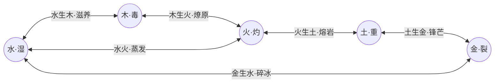

# 《三国五行塔防》五行系统全景设计与规范规范

> **版本**：v1.2.0  
> **更新时间**：2026-09-26  
> **核心定位**：全游戏五行（金、木、水、火、土）底层运转、英雄战法、专属神兵、五行宝石、天命锦囊与化学连锁反应的全局权威设计规范。

---

## 目录

1. [设计哲学与架构总览](#一设计哲学与架构总览)
2. [五行基础状态与底层生克法则](#二五行基础状态与底层生克法则)
3. [六大五行化学连锁反应（双向等价瞬爆）](#三六大五行化学连锁反应双向等价瞬爆)
4. [英雄五行技能体系（五虎大圆满）](#四英雄五行技能体系五虎大圆满)
5. [专属神兵与器灵共鸣机制](#五专属神兵与器灵共鸣机制)
6. [五行宝石体系与5级神品独立特技](#六五行宝石体系与5级神品独立特技)
7. [军师锦囊（天命肉鸽）五行词条池](#七军师锦囊天命肉鸽五行词条池)
8. [天时军情与敌方五行交互](#八天时军情与敌方五行交互)
9. [实现路线与代码重构清单](#九实现路线与代码重构清单)

---

## 一、设计哲学与架构总览

### 1. “局外保下限、局内定上限”
* **局外养成**（武将等级、星级、专属神兵、五行宝石）：确立流派雏形与基石属性；
* **局内肉鸽**（军令进度充能、天命锦囊三选一、五行连携操作）：决定单局对抗高难度波次的上限定位。

### 2. 五行必须产生“化学反应”，而非单一数值克制
* 拒绝枯燥的“火克金、水克火”纯数值倍率对撞；
* 任何两门五行碰撞，必须产生**定身、殉爆、熔岩地热、破甲弹射、极寒冰封、蒸汽爆破**等兼具视效与机制质变的化学连锁反应。

### 3. 全局水墨视觉与零外置素材原则
* 所有五行特效、状态印章、飘字横幅完全依托 Canvas / Phaser 3 矢量几何图元与 WebAudio 原生现场合成（`SoundFX.ts`），严格遵守宣纸水墨国风调色规范（`InkTheme.ts`）。

---

## 二、五行基础状态与底层生克法则

### 1. 五行基础映射表

| 五行 | 对应武将 | 显性印记 | 基础状态代码 | 基础机制效果 | 附着基础时长 | 视觉代表色 |
| :---: | :---: | :---: | :---: | :--- | :---: | :---: |
| **金** | 马超 | **【金·裂】** | `bleed` | 削弱防御 35%，移动时承受流血撕裂真实伤害 | 4.5s | `#ffd54f` (金白) |
| **木** | 关羽 | **【木·毒】** | `parasite` | 灵种寄生入体，每秒扣除最大生命 2% 并抑制受疗效果 | 4.5s | `#4caf50` (碧青) |
| **水** | 赵云 | **【水·湿】** | `wet` | 寒水浸润，移动速度降低 25% | 4.5s | `#29b6f6` (玄蓝) |
| **火** | 黄忠 | **【火·灼】** | `burn` | 烈火焚身，每秒承受 25% 攻击力火伤（保底 8 点） | 4.5s | `#ff5722` (赤朱) |
| **土** | 张飞 | **【土·重】** | `heavy` | 万岳重压，削弱防御 25%，破除身法平衡易遭硬直 | 4.5s | `#a1887f` (厚褐) |

### 2. 五行相生与生我者关系
* **我生者（生出）**：金生水、水生木、木生火、火生土、土生金。
* **生我者（母体）**：水之母为金、木之母为水、火之母为木、土之母为火、金之母为土。
* **神兵镶孔准则**：神兵仅允许镶嵌“同源五行”与“生我者五行”（例如木系神兵允许镶嵌木系与水系宝石）。

### 3. 五行相克法则
* **克制链**：金克木、木克土、土克水、水克火、火克金。
* **伤害结算**：基础克制伤害倍率为 **1.5×**（可受锦囊【天相逆乱】等增幅至 **2.3×+**），由 `DamageCalculator.calculateDamage` 统一结算。

---

## 三、六大五行化学连锁反应（双向等价瞬爆）

### 1. 双向等价瞬爆机制
打破“必须先A后B”的死板限制，**无论先挂 A 再打 B，还是先挂 B 再打 A**，只要两种元素相遇，立即结算对应的化学连锁反应！
* 反应伤害基准：由**打出第二击的终结者（Trigger）**武将当前攻击力决定；
* 破盾机制：任何反应命中均**直接击碎精英/首领怪的【铁壁】护盾**；
* 消耗规则：反应结算完成后，清空该单位身上的原附着状态，等待下一轮五行元素轮转。

### 2. 反应效果详解



#### ① 水生木【滋养·蔓延】(`nourish`)
* **触发组合**：【水】+【木】（无论水打木还是木打水）
* **伤害倍率**：$1.5\times$ 攻击力木系范围伤害
* **控制效果**：目标**绝对定身束缚 2.0 秒**
* **连锁扩散**：向周围 90 像素内所有敌军传染【寄生毒】(持续4秒)并减速 20%(持续3秒)
* **水墨特效**：青翠巨藤盘旋破地而起，飘字【水生木·滋养】(`#00e676`)

#### ② 木生火【燎原·焚尽】(`wildfire`)
* **触发组合**：【木】+【火】（无论木打火还是火打木）
* **伤害倍率**：$2.4\times$ 攻击力超高单体主伤害
* **连环火海**：以目标为核心爆发 **110 像素烈焰大爆炸**，周围所有敌军承受 $75\%$ 主伤害，受击剧烈震颤并附着【火·灼烧】3.5 秒
* **水墨特效**：红黑浓墨烈火爆散，飘字【木生火·燎原】(`#ff3d00`)

#### ③ 火生土【熔岩·焦土】(`magma`)
* **触发组合**：【火】+【土】（无论火打土还是土打火）
* **伤害倍率**：$1.6\times$ 攻击力土系重击伤害
* **熔岩地热**：生成持续 4 秒的地热地陷，目标**减速 50% 并破甲 40%**；周围 80 像素溅射减速 40%
* **水墨特效**：赭红地脉龟裂岩浆溢出，飘字【火生土·熔岩】(`#ff9100`)

#### ④ 土生金【淬刃·锋芒】(`spikes`)
* **触发组合**：【土】+【金】（无论土打金还是金打土）
* **伤害倍率**：$1.8\times$ 攻击力金系破甲真伤
* **穿透弹射**：金戈破空向周围弹射至多 **3 枚高速飞刃**（索敌范围 160 像素），各造成 $100\%$ 满额伤害与受击抖动
* **水墨特效**：漫天金白剑气如雨辐射，飘字【土生金·锋芒】(`#ffd700`)

#### ⑤ 金生水【寒芒·碎冰】(`shatter`)
* **触发组合**：【金】+【水】（无论金打水还是水打金）
* **伤害倍率**：$1.7\times$ 攻击力水系伤害
* **极寒冰封**：目标被玄冰完全冻结 **2.5 秒**（打断施法/前进步伐）；解冻后附带 40% 减速 2 秒
* **水墨特效**：六芒冰晶华爆裂溅射，飘字【金生水·碎冰】(`#00e5ff`)

#### ⑥ 水火相克【汽化·蒸发】(`vaporize`)
* **触发组合**：【水】+【火】（水打火 或 火打水）
* **伤害倍率**：$2.2\times$ 真实殉爆伤害（无视护甲抗性）
* **爆破震撼**：剧烈蒸汽震屏击退，对周围 60 像素产生高压气浪
* **水墨特效**：紫白水汽蘑菇云冲霄，飘字【水火·蒸发】(`#e040fb`)

---

## 四、英雄五行技能体系（五虎大圆满）

| 武将 | 五行 | 定位 | 主动战法 (CD) | 战法机制与五行联动 | 被动技能机制 |
| :--- | :---: | :---: | :--- | :--- | :--- |
| **关羽** | **木** | 范围压制 | **青龙偃月斩** (8s) | 挥出 220 码半月青龙刀气，造成 $260\%$ 木系 AOE 并附着【木·毒】4s；若目标已有【水】，直接引动【水生木·滋养】大范围定身藤蔓 | **武圣**：普攻 $20\%$ 触发 $80\%$ 木系横扫；击杀带有【木·毒】或处于五行反应状态的敌人，大招冷却减 1s |
| **张飞** | **土** | 控制重甲 | **当阳断桥喝** (10s) | 震地 180 码，造成 $220\%$ 土系 AOE、击退 40px、眩晕 1.5s 并施加【土·重】4s；若目标带有【火】，引爆【火生土·熔岩】焦土 | **狂烈**：攻击残血($<50\%$)或带【土·重】敌人增伤 $25\%$；造成击退/眩晕后附加 $20\%$ 易伤 |
| **赵云** | **水** | 穿梭刺客 | **惊鸿穿云** (6s) | 穿梭突刺至多 5 名敌军，各造成 $180\%$ 水伤，施加【水·湿】与减速 $35\%$ 4s；若目标带有【金】，引动【金生水·碎冰】 | **龙胆**：攻速提升 $15\%$；连续攻击同一目标 3 次，第 4 次必定触发三连刺并必定刷新【水·湿】 |
| **黄忠** | **火** | 远程炮台 | **赤焰落日箭** (8s) | 倾泻 220 码火雨造成 $240\%$ 火系 AOE，附着【火·灼】4s；若目标带有【木】，瞬发【木生火·燎原】连环大爆炸 | **百步穿杨**：射程增幅最高增伤 $35\%$；对处于【火·灼】状态的敌人暴击率提升 $25\%$ |
| **马超** | **金** | 突刺破甲 | **神威破军突** (9s) | 直线贯穿全场造成 $280\%$ 金系穿透真实破甲，附着【金·裂】；若目标带有【土】，触发【土生金·锋芒】漫天飞刃 | **西凉骠骑**：攻速提升 $15\%$；击杀敌军叠加西凉战意（每层攻击力 $+6\%$，至多叠 5 层） |

---

## 五、专属神兵与器灵共鸣机制

### 1. 镶孔与觉醒法则
神兵具有专属孔位属性，仅允许镶嵌**同源**或**相生**宝石：
* **非专属佩戴**：获得基础攻防属性，器灵沉睡，无专属特技；
* **专属神将佩戴**：
  * **同源共鸣**：大幅升华武将本体属性与基础元素效果；
  * **相生滋养**：借助母系五行（生我者）打出跨系相生联动；
  * **Lv5 神品终极唤醒**：释放毁天灭地的专属本命终极大招。

### 2. 五虎专属神兵明细

```
【关羽 · 青龙偃月刀】(木孔: 允许木/水)
  ├── 同源(木): 刀芒半月波斩，必定挂【木·毒】种子，暴击率提升
  ├── 相生(水): 刀风带润泽之息，施加【水·湿】并自发触发滋养连锁，战法冷却减 600ms
  └── Lv5终极【青龙啸天】: 青龙法相横空，对周围 120 码敌军扫荡 60% 木系真灵斩

【张飞 · 丈八蛇矛】(土孔: 允许土/火)
  ├── 同源(土): 蛇矛震裂大地，施加【土·重】减速 50% 并震荡周围小兵
  ├── 相生(火): 矛尖引爆地脉烈焰，攻击在地面留下熔岩灼烧裂隙并加深易伤
  └── Lv5终极【万夫莫开】: 当阳绝命断喝，震退全场、削减 40% 护甲并强制眩晕 1.5s

【赵云 · 龙胆亮银枪】(水孔: 允许水/金)
  ├── 同源(水): 攻击附带二段破空枪芒，施加【水·湿】水润状态
  ├── 相生(金): 枪芒注入极寒锋芒，攻击已有潮湿目标触发【碎冰穿刺】造成大范围真伤
  └── Lv5终极【龙胆惊鸿】: 赵子龙枪出如龙七进七出，穿梭全场并绝对冰封敌阵 1.5s

【黄忠 · 宝雕射日弓】(火孔: 允许火/木)
  ├── 同源(火): 烈焰箭矢贯穿，沿途留下焚烧火径并附带【火·灼】
  ├── 相生(木): 射出木系生机箭，命中带有寄生目标直接引爆【木生火·烈火燎原】
  └── Lv5终极【九日连珠】: 仰天引弓射落九日，焚天烈焰箭雨全图轰炸前 5 名敌军

【马超 · 虎头湛金枪】(金孔: 允许金/土)
  ├── 同源(金): 金芒撕裂防御，施加【金·裂】并大幅提升物理暴击与 40% 破甲
  ├── 相生(土): 厚土聚锋，对生命低于 25% 的非精英目标直接执行满血斩杀
  └── Lv5终极【万骑奔雷】: 西凉铁骑金芒幻影奔袭全场，粉碎敌人 50% 护甲持续 5s
```

---

## 六、五行宝石体系与5级神品独立特技

### 1. 宝石品阶演进（3 合 1 机制）

| 五行 | Lv1 璞石 | Lv2 玄晶 | Lv3 灵玉 | Lv4 灵魄 | **Lv5 神品神髓** |
| :---: | :---: | :---: | :---: | :---: | :---: |
| **金** | 庚金璞石 | 沉银玄晶 | 曜金灵玉 | 太白金魄 | **白虎神髓** |
| **木** | 青藤原石 | 碧罗凝晶 | 苍灵翡翠 | 建木灵魄 | **青龙圣珠** |
| **水** | 凝露水石 | 流泉寒晶 | 沧海明珠 | 玄冥冰魄 | **玄武神珠** |
| **火** | 炽火砂石 | 熔火赤晶 | 炎阳赤玉 | 三昧天火魄 | **朱雀神髓** |
| **土** | 厚土砾石 | 赭岩灵晶 | 玄黄古玉 | 万岳龙魄 | **麒麟圣玉** |

### 2. 5 级神品通用独立特技（无需神兵专属即可生效）
* **金（白虎神髓）**：普攻触发【破甲】，削弱目标 $50\%$ 防御，使目标受伤害提升 $35\%$ 持续 5 秒，伴有白金裂痕破刃视效。
* **木（青龙圣珠）**：普攻触发【剧毒】，每秒扣除最大生命 $3\%$（可叠至 3 层）持续 5 秒，伴有翠绿毒雾喷涌。
* **水（玄武神珠）**：普攻触发【冰冻】，绝对定身冰封 2 秒，解冻后附带 $40\%$ 深度减速 3 秒，伴有六芒冰晶覆体。
* **火（朱雀神髓）**：普攻触发【灼烧】+【红莲殉爆】，每秒火伤；若敌人在灼烧中阵亡，引爆 80 像素红莲业火，造成 $1.5\times$ 范围真伤并向周围传染烈火。
* **土（麒麟圣玉）**：普攻触发【眩晕】，原地昏迷瘫痪 2 秒，彻底打断敌军前进步伐与蓄力，伴有万岳震波。

---

## 七、军师锦囊（天命肉鸽）五行词条池

### 1. 相生共鸣专属锦囊（双五行英雄在场加权推荐）
* **【借东风】（木生火）**：火/木攻速 $+30\%$，【木生火·燎原】爆炸伤害提升 $50\%$。
* **【春风化雨】（水生木）**：【水生木·滋养】定身延长至 3.5 秒，全员攻击力 $+15\%$。
* **【百炼成钢】（土生金）**：【土生金·锋芒】弹射飞刃 $+3$，破甲受击增伤 $+25\%$。
* **【玄冰裂魄】（金生水）**：【金生水·碎冰】伤害提升 $60\%$，冻结延长至 4 秒。
* **【大地熔炉】（火生土）**：【火生土·熔岩】减速提升至 $70\%$，路过敌人按最大生命百分比扣血。
* **【水火既济·雾隐雷鸣】（水生火相冲·新增）**：【水火·蒸发】伤害提升 $60\%$，蒸发时产生强力蒸汽爆破，震退周围小兵 60 像素并附加 1 秒眩晕。

### 2. 全局五行奥义
* **【生生不息】（史诗）**：每次触发任意相生反应，全员攻击临时 $+2\%$（可叠 50%）。
* **【天相逆乱】（史诗）**：五行相克伤害倍率从 1.5x 提升至 2.3x！
* **【八阵奇谋】（传说）**：全相生相克反应伤害翻倍（$+100\%$），全员技能 CD 缩短 $25\%$。
* **【五行圆融】（无尽传说）**：全队攻击 $+30\%$，连锁反应伤害 $+75\%$，克制倍率 $+50\%$。
* **【五行共鸣】（无尽精进·可无限选）**：连锁反应伤害额外提升 $35\%$。

---

## 八、天时军情与敌方五行交互

### 1. 天时军情决策（每10波随机轮转）
* **赤地烈日 ➔ 【顺风纵火】**：【燎原】范围扩大 60%，灼烧流血伤害提升 60%。
* **暴雨洪峰 ➔ 【引水灌城】**：水系伤害提升 45%，【滋养】定身延长至 3.5 秒。
* **暴雨洪峰 ➔ 【雷动九天】**：【碎冰】范围扩大 80%，金系普攻 25% 概率金雷击退。
* **辎重脱节 ➔ 【攻心瓦解】**：敌军全员初始护甲削弱 40%，Boss 受反应伤害提高 50%。

### 2. 敌军五行与【铁壁】护盾机制
* 普通与精英敌军均具备固定五行属性；
* 高波次精英与首领附带【铁壁】护盾（减免大部分常规伤害），**唯有受到五行化学连锁反应命中时，方能直接震碎铁壁**，为全队创造破防输出窗口。

---

## 九、实现路线与代码重构清单

1. **改造 `ElementalReactionManager.ts`**：
   * 将 `checkReaction` 升级为双向判定（如 `(A==water && B==wood) || (A==wood && B==water)`）；
   * 确保相生 5 组与水火蒸发无论先后顺序均能正确命中并结算。
2. **升级 `EnemyEntity.ts` 显性五行印记**：
   * 拆分土系【重】与金系【裂】，统合为【水·湿】、【木·毒】、【火·灼】、【土·重】、【金·裂】显性头部水墨印章。
3. **补充 `AUGMENT_POOL` 新锦囊**：
   * 在 `src/data/augments/index.ts` 中加入【水火既济·雾隐雷鸣】(`aug_vaporize_burst`)；
   * 在 `AugmentManager.ts` 中增加对其蒸发增伤与震退机制的支持。
4. **对齐技能与图鉴文案**：
   * 更新 `src/data/skills/statusInfo.ts` 与 `activeSkills.ts`，明确文案表达“双向任意顺序皆可引爆”。
5. **单元测试验证（Definition of Done）**：
   * 在 `tests/unit/elemental/elementalReaction.test.ts` 中新增正反向双向反应单元测试；
   * 运行测试套件与类型构建检查，确保 100% 通过。
