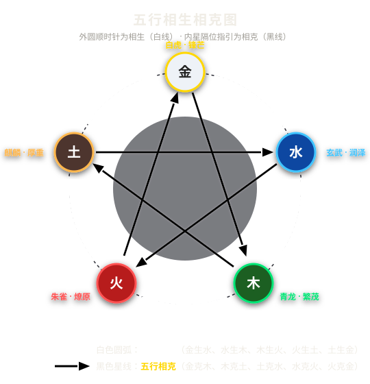
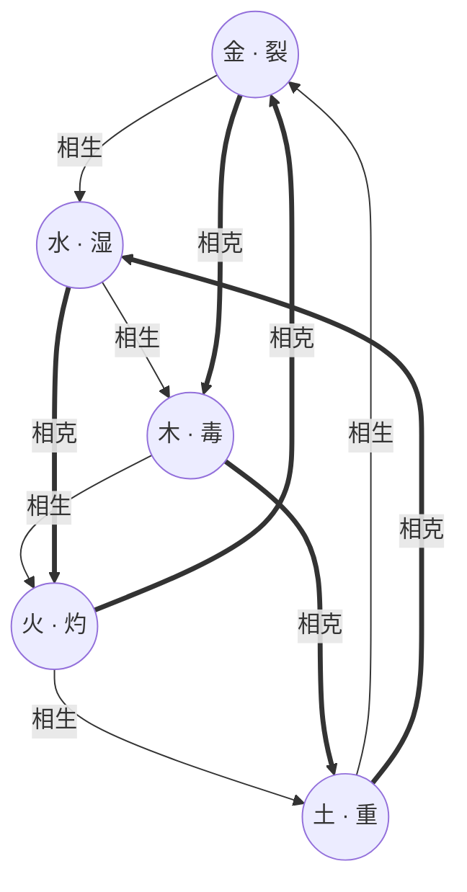
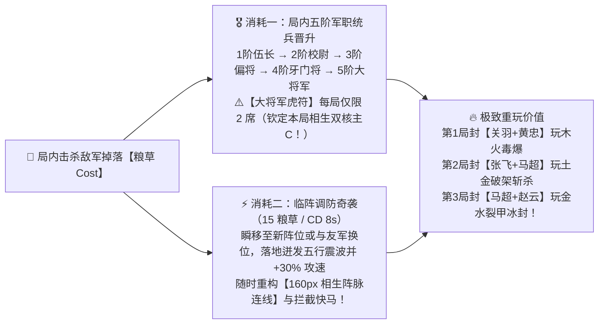
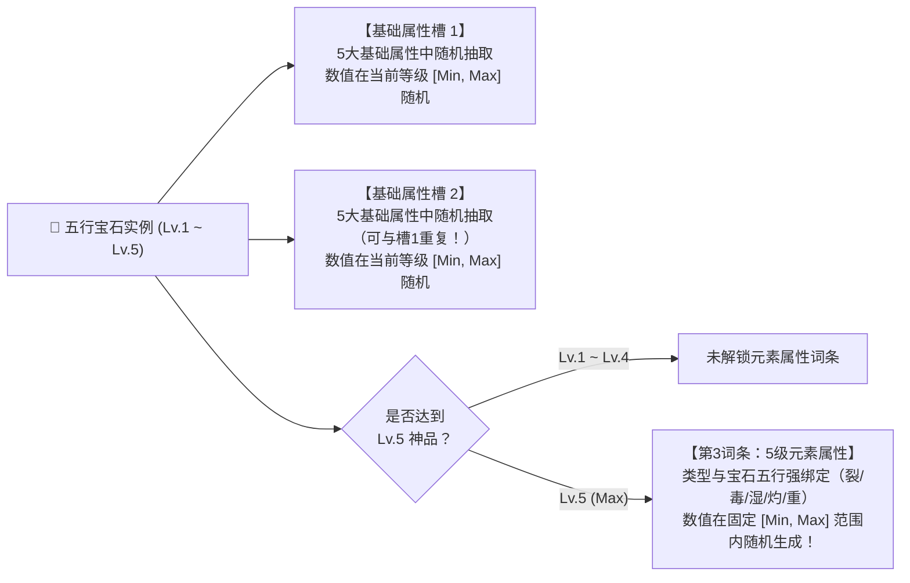
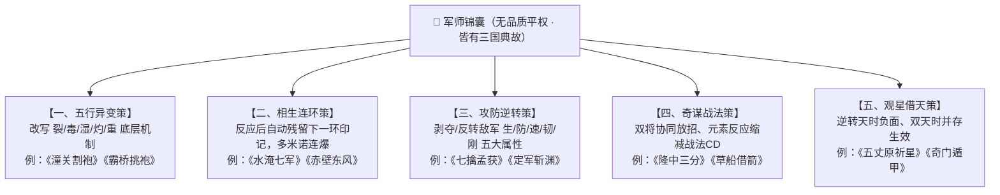
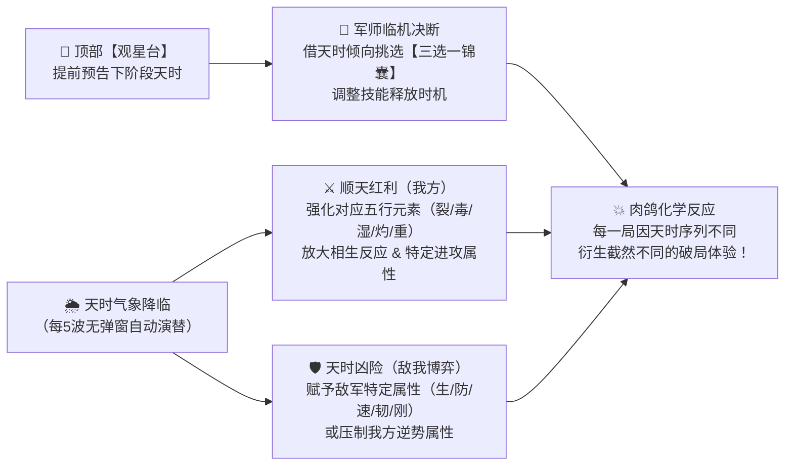
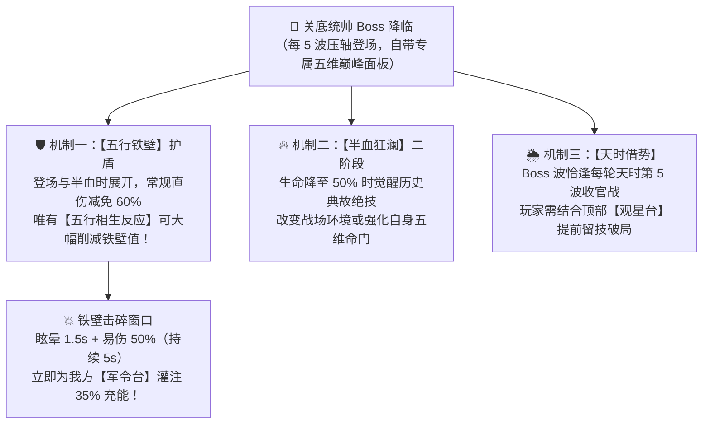
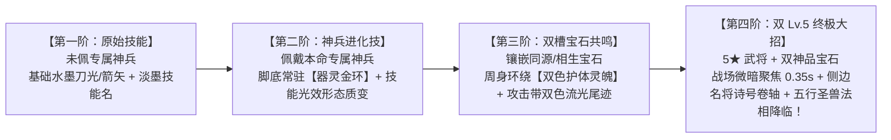
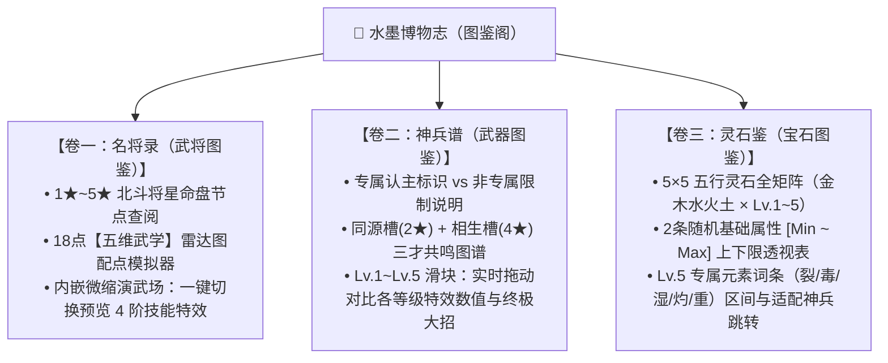

# 《三国五行塔防》五行系统全景设计与规范规范

> **版本**：v1.2.0  
> **更新时间**：2026-09-26  
> **核心定位**：全游戏五行（金、木、水、火、土）底层运转、英雄战法、专属神兵、五行宝石、天命锦囊与化学连锁反应的全局权威设计规范。

---

## 目录

1. [设计哲学与架构总览](#一设计哲学与架构总览)
2. [五大基础属性、五行元素效果与底层生克法则](#二五大基础属性五行元素效果与底层生克法则)
3. [五大五行相生化学连锁反应（双向等价瞬爆）](#三五大五行相生化学连锁反应双向等价瞬爆)
4. [武将养成重塑：将星命盘（1~5★）、武道十境（五维自由配点）与专属神兵五阶进化](#四武将养成重塑将星命盘15武道十境五维自由配点与专属神兵五阶进化)
5. [五虎上将：原始技能 → 神兵进化 → 宝石成长 → 终极大招全解](#五五虎上将原始技能--神兵进化--宝石成长--终极大招全解)
6. [五行宝石体系与随机属性词条规则](#六五行宝石体系与随机属性词条规则)
7. [军师锦囊（无品质平权 · 三国典故机制改造体系）](#七军师锦囊无品质平权--三国典故机制改造体系)
8. [五行天时气象系统（无弹窗全局环境博弈）](#八五行天时气象系统无弹窗全局环境博弈)
9. [敌军五维兵种与三国五行统帅 Boss 设计](#九敌军五维兵种与三国五行统帅-boss-设计)
10. [水墨视觉表现规范：敌军状态、武将四阶战法演出与三大典藏图鉴](#十水墨视觉表现规范敌军状态武将四阶战法演出与三大典藏图鉴)
11. [实现路线与代码重构清单](#十一实现路线与代码重构清单)

---

## 一、设计哲学与架构总览

### 1. “局外保下限、局内定上限”
* **局外养成**（武将 1~5★ 将星命盘开窍、1~10 级五维武学自由配点、专属神兵、五行宝石）：废除枯燥的 60 级线性数值膨胀与武将品质高低分级，局外只负责**打通五行机制权限与自由定制武将五维流派倾向**；
* **局内肉鸽**（军令进度充能、三国典故锦囊三选一、天时气象博弈、五行相生破铁壁）：决定单局对抗高难度五维兵种与三国统帅 Boss 的上限。

### 2. 五行必须产生“化学反应”，而非单一数值克制
* 拒绝枯燥的纯数值倍率对撞；
* 任何相生五行碰撞，必须产生**定身、殉爆、熔岩地热、破甲弹射、极寒冰封**等兼具视效与机制质变的化学连锁反应。

### 3. 全局水墨视觉与零外置素材原则
* 所有五行特效、状态印章、飘字横幅完全依托 Canvas / Phaser 3 矢量几何图元与 WebAudio 原生现场合成（`SoundFX.ts`），严格遵守宣纸水墨国风调色规范（`InkTheme.ts`）。

---

## 二、五大基础属性、五行元素效果与底层生克法则

### 1. 攻防双方五大基础面板属性（武将/宝石 vs 敌军）

游戏的底层数值底座由**【我方五大进攻属性】**（武将面板、兵器、宝石词条共通）与**【敌军五大生存/机动属性】**构成，且彼此形成严密的攻防对冲关系：

#### （1）我方五大基础属性（武将 / 兵器 / 宝石随机词条池）

| 序号 | 基础属性名称 | 属性字段代码 | 核心战斗作用说明 |
| :---: | :---: | :---: | :--- |
| **1** | **攻击力** | `attack` | 决定武将普攻、主动战法、元素持续伤害及**五行相生反应**的结算基础倍率基数 |
| **2** | **攻击范围** | `range` | 决定武将索敌警戒半径（像素/码）以及范围型战法/溅射的覆盖区域 |
| **3** | **攻击速度** | `attackSpeed` | 决定武将每秒攻击次数（次/秒），直接加快**元素附着频率**与按普攻次数触发的被动循环 |
| **4** | **暴击几率** | `critRate` | 决定普攻与主动战法触发暴击的概率（$0\% \sim 100\%$） |
| **5** | **暴击伤害** | `critDamage` | 决定触发暴击时的伤害倍率（初始默认 $150\%$，词条数值直接累加暴击倍率上限） |

#### （2）敌军五大基础属性（引入【韧性】与【刚毅】抗暴体系）

针对敌军原有的“反暴击几率”与“反暴击伤害”，采用更具三国武道意境的**【韧性】**（柔韧化锋，降低被暴击率）与**【刚毅】**（刚毅护体/铁骨卸力，削减所受暴击伤害）命名：

| 序号 | 敌军属性名称 | 原含义 | 属性字段代码 | 核心战斗作用与对应的克制五行状态 |
| :---: | :---: | :---: | :---: | :--- |
| **1** | **生命** | 最大血量 | `hp` | 敌军生存血量上限 $\longleftarrow$ **被木系【毒】克制**（按最大生命百分比持续腐蚀） |
| **2** | **防御** | 护甲减伤 | `defense` | 减免受到的常规伤害 $\longleftarrow$ **被金系【裂】克制**（直接撕裂削减防御护甲） |
| **3** | **移动速度** | 行军移速 | `moveSpeed` | 敌军沿路径突进的速度 $\longleftarrow$ **被水系【湿】克制**（唯一降低移速的基础控制状态） |
| **4** | **韧性** | **反暴击几率** | `tenacity` | 抵消我方暴击几率（$\text{实际暴击率} = \max(0\%, \text{暴率} - \text{韧性})$） $\longleftarrow$ **被土系【重】克制** |
| **5** | **刚毅** | **反暴击伤害** | `fortitude` | 抵消我方暴击伤害（$\text{实际暴伤} = \max(100\%, \text{暴伤} - \text{刚毅})$） $\longleftarrow$ **被土系【重】克制** |

---

### 2. 五大元素效果（裂、毒、湿、灼、重）—— 精准对应敌军五大属性（零重叠）

为了让五大元素效果各司其职、绝不互相抢戏（特别是**把移速控制权 $100\%$ 留给【水·湿】**，**把硬控留给相生反应**，彻底杜绝基础状态出现大范围眩晕控场 Bug），五大元素效果与敌军五大属性形成严丝合缝的**「一物降一物」**对应关系：

| 五行 | 元素效果 | 对应武将 | 显性印记 | 状态代码 | 针对敌军哪项属性？ | 详细机制效果（零控制泛滥、零定位重叠） | 附着时长 | 视觉代表色 |
| :---: | :---: | :---: | :---: | :---: | :---: | :--- | :---: | :---: |
| **金** | **裂** | 马超 | **【金·裂】** | `bleed` | **破除【防御】** + 位移流血 | ① **锋芒破甲**：直接削减目标 **$35\%$ 防御护甲**； ② **移步淌血**：目标在移动时伤口撕裂，每秒承受 $45\%$ 攻击力的**流血真伤**（移速越快流血越痛；静止时流血减半）。 | **2.5s** | `#ffd54f` (金白) |
| **木** | **毒** | 关羽 | **【木·毒】** | `parasite` | **腐蚀【生命】** + 禁疗传染 | ① **蚀骨剧毒**：每秒扣除目标 **最大生命值 $2.0\%$** 的毒素伤害（最多叠 3 层，专克高血量巨盾与首领）； ② **生机断绝**：降低目标 $50\%$ 回血效果，阵亡时毒种向周围小范围传染。 | **2.5s** | `#4caf50` (碧青) |
| **水** | **湿** | 赵云 | **【水·湿】** | `wet` | **压制【移动速度】** *(唯一基础软控)* | ① **寒潮浸润**：唯一具备减速控制的基础状态，使目标**移动速度持续降低 $35\%$**； ② **反应媒介**：作为水生木【定身】与金生水【冰封】的核心先手状态。 | **2.5s** | `#29b6f6` (玄蓝) |
| **火** | **灼** | 黄忠 | **【火·灼】** | `burn` | **高频【攻击力】直伤** + 阵亡爆燃 | ① **烈火焚身**：每 $0.5\text{s}$ 高频跳字造成施法者 $20\%$ 攻击力火伤（每秒 $40\%$，清脆皮群怪极快）； ② **余烬爆燃**：处于灼烧中的敌人阵亡时迸发火花，对邻近敌军造成小范围灼伤。 | **2.5s** | `#ff5722` (赤朱) |
| **土** | **重** | 张飞 | **【土·重】** | `heavy` | **粉碎【韧性 & 刚毅】** + 暴击内震 | ① **重压破架（削韧破刚）**：万钧重压使敌军身架变形、无力卸力护心，**直接削减目标 $25\%$【韧性】（更易被暴击）与 $40\%$【刚毅】（受暴击伤害剧增）**； ② **负重内震**：处于【土·重】的目标每次受到暴击时，因负重无法卸力，额外迸发一次相当于本次伤害 $20\%$ 的土系内震伤！ | **2.5s** | `#a1887f` (厚褐) |

> [!TIP]
> **五大元素效果的设计闭环**：
> * **为什么【土·重】不再带减速或眩晕控场？**
>   1. **与【水·湿】彻底解耦**：移速控制由**【水·湿】**独占，硬控（定身/冰封）由**【相生反应】**独占，避免基础状态控场泛滥导致 Boss/精英寸步难行；
>   2. **完美闭环敌军五大属性**：`毒`克**生命**、`裂`克**防御**、`湿`克**移动速度**、`重`克**韧性与刚毅**、`灼`打**高频面板火伤**；
>   3. **完美契合「土生金」武学逻辑**：土系【重】先压垮敌人的身架（削空**韧性**与**刚毅**，暴露致命破绽），金系【裂】再一枪撕碎**防御**打出满额暴击，形成“土破韧刚、金破护甲”的绝妙配合！
> * **为什么基础元素附着时长严格收紧为 `2.5s`？**
>   * 若附着长达 4.5s，敌军可走完大半张地图，武将随便乱摆都能触发反应；将窗口收紧为 **`2.5s`**，逼迫玩家必须在空间路径上精密规划**“前哨先手挂元素将”与“要冲后手引爆将”的站位衔接距离**！

---

### 3. 五行相生与生我者关系
* **我生者（生出）**：金生水、水生木、木生火、火生土、土生金。
* **生我者（母体）**：水之母为金、木之母为水、火之母为木、土之母为火、金之母为土。
* **神兵双槽镶孔准则**：每件神兵设有**【同源槽】**与**【相生槽】**两个独立宝石孔位——同源槽仅可镶嵌本命同系宝石，相生槽仅可镶嵌“生我者”母系宝石（例如木系神兵：同源槽嵌木、相生槽嵌水），两槽效果可同时并存生效。

### 4. 五行相克法则
* **克制环路**：金克木、木克土、土克水、水克火、火克金（详见下图内圈五角星黑线；相克深度机制后续单独扩展）。

---

## 三、五大五行相生化学连锁反应（双向等价瞬爆 & 空间阵脉连线）

### 1. 双向等价瞬爆与【五行相生阵脉连线】（塔防二维空间博弈）
打破“必须先A后B”的死板限制，**无论先挂 A 再打 B，还是先挂 B 再打 A**，只要两种相生元素在 `2.5s` 附着窗口内于敌军身上相遇，立即结算对应的化学连锁反应！
* **反应伤害基准**：由**打出第二击的终结者（Trigger）**武将当前**攻击力**决定，并享受该武将的**暴击几率 / 暴击伤害**与目标当前的**防御 / 韧性 / 刚毅**结算；
* **继承前置减益**：反应结算瞬间，**先享受目标身上已有的两项基础元素减益**（例如【土·重】已削减的韧性/刚毅、【金·裂】已削减的防御），再清空原附着状态，等待下一轮五行轮转；
* **破盾机制**：任何相生反应命中均**直接削减精英/首领怪的【五行铁壁】护盾**。
* **核心空间博弈 ——【五行相生阵脉连线】（Spatial Leyline Link）**：
  * 当两名具有**五行相生关系**的武将（如`水·赵云`与`木·关羽`、`木·关羽`与`火·黄忠`）部署在彼此 **`160px`（相生共鸣距离）** 以内时，两人脚下阵盘自动激发一道流动的**【双色水墨相生阵脉连线】**；
  * **交叠火网红利**：处于这两名相生武将**射程交叠区**内的敌军，其身上的对应基础元素衰减速度减缓 **$30\%$**（等效延长至 $3.25\text{s}$），且在该交叠区内触发的对应相生反应，**最终反应伤害与对 Boss【五行铁壁】的破盾效率直接提升 $+35\%$**！
  * 这使得“武将摆在哪个拐角、谁和谁贴近结阵、谁和谁构成双核交火区”成为塔防空间布局的灵魂！

### 2. 标准五行相生相克图

> **图示说明**：
> * ⚪ **白色圆弧单向箭头（外圈顺时针）**：**五行相生**（金生水 $\to$ 水生木 $\to$ 木生火 $\to$ 火生土 $\to$ 土生金）。
> * ⚫ **黑色五角星单向箭头（内圈隔位）**：**五行相克**（金克木 $\to$ 木克土 $\to$ 土克水 $\to$ 水克火 $\to$ 火克金）。

---

### 3. 五大相生反应与基础状态的严密咬合明细

#### ① 水生木【滋养·蔓延】(`nourish`) —— 寒水润毒藤 · 群体定身蚀血
* **触发组合**：**【水·湿】**（减移速）+ **【木·毒】**（百分比蚀生命）
* **化学反应逻辑**：寒水浸润催生体内毒种破体疯长，将单体软控【水·湿】升格为**硬控定身**，并将单体【木·毒】向周围引爆扩散！
* **结算效果**：
  1. 造成 $1.5\times$ 攻击力木系伤害，并将主目标**荆棘定身束缚 2.0 秒**（移动速度归零）；
  2. 向周围 90 像素内所有敌军蔓延1层**【木·毒】**（持续扣除最大生命值 $2.0\%/\text{s}$ 并禁疗 $50\%$，持续 4 秒）。
* **水墨特效**：青翠巨藤盘旋破地而起，飘字【水生木·滋养】(`#00e676`)

#### ② 木生火【燎原·焚尽】(`wildfire`) —— 毒木作薪柴 · 烈焰殉爆轰炸
* **触发组合**：**【木·毒】**（寄生毒藤）+ **【火·灼】**（高频火伤）
* **化学反应逻辑**：以敌军体内的【木·毒】藤蔓为助燃薪柴，遇【火·灼】瞬间由内而外引发毁灭性**连环爆破**！
* **结算效果**：
  1. 主目标承受 $2.4\times$ 攻击力超高火系爆破主伤害，并**立即引爆结算其身上已有的 1 层【木·毒】最大生命百分比伤害**；
  2. 以主目标为核心爆发 **110 像素烈焰大爆炸**，周围所有敌军承受 $75\%$ 主伤害并被挂上余烬灼烧 3.5 秒。
* **水墨特效**：红黑浓墨烈火爆散，飘字【木生火·燎原】(`#ff3d00`)

#### ③ 火生土【熔岩·焦土】(`magma`) —— 烈火化熔岩 · 焚心碎刚炼狱
* **触发组合**：**【火·灼】**（高频火伤）+ **【土·重】**（削减韧性与刚毅 + 暴击内震）
* **化学反应逻辑**：烈火熔化厚土，在敌军脚下形成持续沸腾的**【熔岩焦土】**，将【火·灼】的持续火伤与【土·重】的“削韧破刚”扩增为**范围抗暴瓦解领域**（不抢【水·湿】的减速，也不抢【金·裂】的破甲）！
* **结算效果**：
  1. 爆发 $1.6\times$ 攻击力火土重击，并在原地生成持续 4 秒、半径 95 像素的**【熔岩焦土】**；
  2. 处于熔岩焦土内的所有敌军每秒承受 $45\%$ 攻击力地火灼烧，且身架被高温地脉彻底瓦解：**【韧性】降低 $40\%$、【刚毅】降低 $60\%$**，在焦土内每次受到暴击必定触发范围**【负重内震】**（额外迸发 $30\%$ 暴击内震伤）！
* **水墨特效**：赭红地脉龟裂岩浆溢出，飘字【火生土·熔岩】(`#ff9100`)

#### ④ 土生金【淬刃·锋芒】(`spikes`) —— 土破韧刚 · 金破护甲 · 暴击飞刃
* **触发组合**：**【土·重】**（削减韧性与刚毅）+ **【金·裂】**（削减防御 + 移动流血）
* **化学反应逻辑**：“土破韧刚、金破护甲”的极致物理爆发——【土·重】先压垮敌军抗暴架势（韧性/刚毅大减），【金·裂】再撕裂防御护甲，凝土成金迸射破甲暴击飞刃！
* **结算效果**：
  1. 主目标在**已受【土·重】削韧破刚**与**【金·裂】破除 $35\%$ 防御**的基础上，承受 $1.8\times$ 攻击力的金系穿刺重击（本次反应额外 $+35\%$ 暴击几率与 $+50\%$ 暴击伤害）；
  2. 从主目标体内向周围 160 像素内弹射 **3 枚淬金飞刃**，各造成 $100\%$ 破甲伤害，并立即撕裂伤口结算 1 次【金·裂】流血真伤！
* **水墨特效**：漫天金白剑气如雨辐射，飘字【土生金·锋芒】(`#ffd700`)

#### ⑤ 金生水【寒芒·碎冰】(`shatter`) —— 裂甲凝玄冰 · 极寒冻结破阵
* **触发组合**：**【金·裂】**（破除防御 + 伤口撕裂）+ **【水·湿】**（浸润减速）
* **化学反应逻辑**：【水·湿】的刺骨寒水顺着【金·裂】撕开的护甲裂口灌入体内，瞬间凝结成玄冰将目标**彻底冰封**，随后冰晶顺伤口爆裂！
* **结算效果**：
  1. 目标在【金·裂】破甲状态下承受 $1.7\times$ 攻击力寒冰穿刺伤害，并被**玄冰绝对冻结 2.5 秒**（移动与攻击完全停止）；
  2. 冰封破碎时对周围小范围溅射寒霜伤害，解冻后目标因寒气未散，移速降低 $35\%$ 持续 2 秒。
* **水墨特效**：六芒冰晶华爆裂溅射，飘字【金生水·碎冰】(`#00e5ff`)

---

## 四、武将养成重塑：将星命盘（1~5★）、武道十境（五维自由配点）与专属神兵五阶进化

### 1. 为什么要彻底推翻旧版“1~60 级线性加倍率 + 升星加面板”？

旧版武将养成存在三大严重痛点：
1. **冗长且无脑的数值膨胀**：1~60 级每级固定 $+5\%$ 属性倍率（满级翻 $4$ 倍，需刷 $500$ 万经验），中间 59 级毫无机制变化，满级后又直接靠纯数值碾压低波次，违背“局外保下限、局内定上限”原则；
2. **等级与星级同质化**：升级加面板、升星也加面板，玩家没有任何策略构建（Build）的选择权；
3. **五虎上将分三六九等**：旧版将赵云、黄忠划为“史诗”，关羽、张飞、马超划为“传说”，既违背三国情怀，又人为制造五行弱势卡。

为此，我们将武将养成重塑为**「将星开命格（纵向机制解锁）」$\times$「等级修五维（横向自由配点）」$\times$「本命神兵五阶进化」**三位一体的高策略体系！

---

### 2. 武将星级：【将星命盘（1★ ~ 5★）】—— 废除品质分级，逐星打通五行灵窍与神兵共鸣

* **五虎平权**：**彻底废除武将“普通/稀有/史诗/传说”品质分级**！所有三国名将平起平坐，初始均为 **1★ 将星**，消耗【将魂石】最高升至 **5★ 将星**。
* **升星不堆白板倍率，每颗星都是一次机制质变**：将星直接决定武将的**普攻本命五行附着率**、**神兵宝石孔位的开窍权限**以及**3★ 三国本命特质**：

| 星级 | 命盘境界 | 普攻本命五行附着率 | 神兵宝石灵窍解锁权限 | 将星专属机制突破 |
| :---: | :---: | :---: | :--- | :--- |
| **1★** | **【初露锋芒】** | **$25\%$** | 可佩戴兵器/本命神兵（激活神兵技能变化），**宝石孔位尚未开窍** | 解锁武将【原始主动战法】与基础被动 |
| **2★** | **【威名远播】** | **$40\%$** | 🔓 **打通神兵【同源宝石槽】(`sameSocket`)** *(允许镶嵌同系宝石，激活专属神兵【同源特效】)* | **【轻装急行】**：该武将局内部署粮草费用永久 **$-2$** |
| **3★** | **【独当一面】** | **$50\%$** | 保持【同源宝石槽】 | 🔥 **觉醒【三国本命特质】** *(每位武将独有的五行联动核心被动，见下表)* |
| **4★** | **【威震华夏】** | **$65\%$** | 🔓 **打通神兵【相生宝石槽】(`generatingSocket`)** *(允许同时镶嵌生我者母系宝石，实现【同源+相生特效】双槽同存)* | **【破壁先锋】**：由该武将触发的【五行相生反应】对 Boss【五行铁壁】造成 **$1.5\times$ 破盾削减** |
| **5★** | **【五虎天命】** | **$80\%$** | 🐉 **解锁【双 Lv.5 宝石 · 终极大招】觉醒权限** *(当同源槽与相生槽皆嵌满 5 级神品宝石时，解放终极大招)* | **【统帅军威】**：每次释放主动战法时，立即为战场【军令台】灌注 **$8\%$ 军令充能**（加速空格键三选一锦囊） |

#### 🔥 3★ 觉醒【五虎三国本命特质】全解（深度绑定五大元素状态）
升至 **3★** 时，五虎上将分别觉醒契合其三国典故与本命元素状态（裂/毒/湿/灼/重）的独特机制被动：
* **关羽（木 · 义绝春秋）**：战场上每有 1 名处于**【木·毒】**的敌军阵亡，关羽主动战法冷却立即缩短 $0.6\text{s}$，且毒种阵亡传染半径扩大 $35\%$。
* **黄忠（火 · 百步穿杨）**：对处于**【火·灼】**的敌军发起攻击时，黄忠本次攻击射程动态 $+25\%$，且箭矢无视目标 $20\%$【韧性】（更易暴击）。
* **张飞（土 · 万夫莫敌）**：处于张飞攻击范围内的敌军，其身上的**【土·重】**持续时间暂停衰减；且每次触发【负重内震】时，震波向周围 $85\text{px}$ 额外溅射 $50\%$ 内震伤害。
* **马超（金 · 神威铁骑）**：战场上每存在 1 名处于**【金·裂】**流血状态的敌军，马超自身攻击速度提升 $6\%$（最多叠加 6 层至 $+36\%$ 攻速）。
* **赵云（水 · 一身是胆）**：对处于**【水·湿】**的敌军每累计命中 4 次，第 4 击必定暴击，并使其身上的【水·湿】减速幅度在 $2.0\text{s}$ 内翻倍。

---

### 3. 武将等级：【武道十境（Lv.1 ~ Lv.10）& 五维武学自由配点】—— 同一武将捏出千变流派！

* **精炼 10 级境界，严控数值膨胀**：
  * 砍掉冗长的 1~60 级，浓缩为 **Lv.1 ~ Lv.10【武道十境】**（初阵 $\to$ 淬体 $\to$ 凝气 $\to$ 破锋 $\to$ 贯通 $\to$ 宗师 $\to$ 止水 $\to$ 天人 $\to$ 无双 $\to$ 化境）。
  * 每升 1 级，基础攻击力仅温和提升 **$+4\%$**（满级 Lv.10 合计仅 **$+36\%$** 基础攻击保底，杜绝等级碾压）。
* **核心亮点 —— 升级获赠【五维武学点】，自由定制我方五大基础属性与突破词条**：
  * 武将每升 1 级获得 **2 点【五维武学点】**（满级 Lv.10 共拥有 **18 点**，局外随时可**一键免费重置洗点**）。
  * 玩家可将这 18 点自由投入到**我方五大基础属性（锻力·攻 / 拓境·距 / 疾风·速 / 洞察·暴率 / 摧锋·暴伤）**中（单项最多投入 **10 点**）；
  * 当任意一项投入达到 **5 点（小成）** 或 **10 点（大成）** 时，额外激活该维度的**【武学境界突破特性】**！

| 五维武学分支 | 对应我方基础属性 | 每点基础加成（上限 10 点） | 【投入 5 点 · 小成】突破特性 | 【投入 10 点 · 大成】终极突破特性 | 典型流派构建举例 |
| :--- | :---: | :--- | :--- | :--- | :--- |
| **① 锻力篇** | **攻击力** (`attack`) | 每点 **$+3.5\%$** 攻击力 *(满 10 点 $+35\%$)* | 主动战法基础伤害额外 **$+15\%$** | **【破军】**：由该武将作为第二击触发的**【五行相生反应】最终伤害提升 $30\%$** | 主力输出手、相生反应引爆者（如引爆木生火的黄忠、引爆金生水的赵云） |
| **② 拓境篇** | **攻击范围** (`range`) | 每点 **$+3.0\%$** 攻击范围 *(满 10 点 $+30\%$)* | 主动战法与相生反应的爆炸/扩散半径 **$+15\%$** | **【八荒】**：攻击距离目标越远伤害越高（最高 $+25\%$），且主动战法作用范围扩大 **$30\%$** | 弥补近战短手（让张飞、马超覆盖两条路径）或打造全屏狙击黄忠 |
| **③ 疾风篇** | **攻击速度** (`attackSpeed`) | 每点 **$+4.0\%$** 攻击速度 *(满 10 点 $+40\%$)* | 普攻触发本命五行附着的概率额外 **$+10\%$** | **【连珠】**：每第 5 次普攻额外迸射一道水墨剑气/箭芒，**$100\%$ 必定挂上本命五行状态** | 高频挂元素工具人/反应发动机（如极速挂湿的赵云、高频挂重的张飞） |
| **④ 洞察篇** | **暴击几率** (`critRate`) | 每点 **$+3.0\%$** 暴击几率 *(满 10 点 $+30\%$)* | 攻击时无视敌军 **$12\%$【韧性】**（反暴击率） | **【诛心】**：每次打出暴击时，**延长目标身上所有五行元素状态 $1.0\text{s}$**（内置冷却 2s） | 依赖暴击续状态或高频触发特效（如配合【土·重】无限触发负重内震） |
| **⑤ 摧锋篇** | **暴击伤害** (`critDamage`) | 每点 **$+7.0\%$** 暴击伤害 *(满 10 点 $+70\%$)* | 攻击时无视敌军 **$20\%$【刚毅】**（反暴击伤害） | **【断岳】**：对处于【土·重】或【金·裂】的敌军暴击时，额外造成 **$25\%$ 无视防御的穿甲震击** | 极致暴击核爆流（如走【土生金·锋芒】的马超、踩熔岩焦土的张飞） |

> [!TIP]
> **为什么「满级 18 点 + 5/10 点里程碑」能让每个武将玩出花样？**
> 满级 10 级一共只有 **18 点**，玩家无法点满所有分支，必须根据本局战术自由捏人（且随时免费洗点）：
> * **【10 + 8 极限专精流】**（激活 1 个大成 + 1 个小成）：
>   * *例：赵云（控速发动机流）* $\to$ **10 点【疾风】+ 8 点【拓境】**，超大射程、极速出枪，每 5 枪必挂【水·湿】，配合关羽疯狂触发【水生木·滋养】定身全场！
>   * *例：赵云（碎冰核爆主 C 流）* $\to$ 一键洗点改为 **10 点【锻力】+ 8 点【摧锋】**，配合马超的【金·裂】专门打【金生水·碎冰】一枪秒杀精英！
> * **【6 + 6 + 6 三才均衡流】**（同时激活 3 个 5 点小成特性）：兼顾战法增伤、反应范围扩大与无视韧性。

---

### 4. 核心铁律：专属神兵绑定与五阶递进法则

在将星打通宝石孔位后，武将的技能形态遵循严格的**「专属神兵绑定 + 双槽宝石等级递进」**法则：

| 佩戴状态 | 基础属性加成（兵器+宝石） | 武将技能变化（神兵进化技） | 同源特效（需 2★ 解锁同源槽，随 Lv.1~5 成长） | 相生特效（需 4★ 解锁相生槽，随 Lv.1~5 成长） | 终极大招（需 5★ 且双槽皆为 Lv.5 激发） |
| :--- | :---: | :---: | :---: | :---: | :---: |
| **① 未佩戴兵器（素身）** | ❌ 无 | ❌ 仅释放【武将原始技能】 | ❌ 无 | ❌ 无 | ❌ 无 |
| **② 佩戴非专属神兵** *(通用兵器或他人专属)* | ✅ **生效** *(仅享兵器+宝石自身面板属性)* | ❌ **不生效** *(仍为原始技能)* | ❌ **无同源特效** *(即使嵌Lv.5也无特效)* | ❌ **无相生特效** *(即使嵌Lv.5也无特效)* | ❌ **无终极大招** |
| **③ 佩戴本命专属神兵（无宝石）** | ✅ 生效 + 专属属性加成 | ✅ **激活【神兵技能变化】** | ❌ 未激发 | ❌ 未激发 | ❌ 未激发 |
| **④ 专属神兵 + 同源宝石 (Lv.1~5)** | ✅ 生效 | ✅ 激活【神兵技能变化】 | ✅ **激活【同源特效】** *(随宝石等级 Lv.1$\to$5 逐级增强)* | ❌ 未激发 | ❌ 未激发 |
| **⑤ 专属神兵 + 同源(Lv.1~5) + 相生(Lv.1~5)** | ✅ 生效 | ✅ 激活【神兵技能变化】 | ✅ **激活【同源特效】** *(随等级 Lv.1$\to$5 增强)* | ✅ **同时并存【相生特效】** *(随等级 Lv.1$\to$5 增强)* | ❌ 未满级未激发 |
| **⑥ 专属神兵 + 同源(Lv.5) + 相生(Lv.5)** | ✅ 满额生效 | ✅ 激活【神兵技能变化】 | ✅ **满级【同源特效】(Lv.5)** | ✅ **满级【相生特效】(Lv.5)** | 🐉 **彻底唤醒【终极大招】** |

> [!IMPORTANT]
> **两大核心防崩坏铁律（专属限制 & 破除“一人成军悖论”）**：
> 1. **非专属神兵严格限制**：若武将未佩戴自己的本命专属神兵，仅生效兵器与宝石的基础/元素面板属性；**原始技能无变化、无同源特效、无相生特效、无终极大招**。
> 2. **破除“一人成军悖论”（相生宝石不抢队友配合）**：
>    * 如果佩戴相生宝石后普攻也能 100% 挂母元素自爆，会导致武将变成“单人自走永动机”，彻底杀死双将站位配合！
>    * 因此，**【相生宝石（Lv.1~5）】绝不赋予普攻白嫖母元素的能力**——日常高频相生反应**必须依靠两名相生武将（如水赵云 + 木关羽）在空间路径上的先后手接力与阵脉交叠**来触发；
>    * **相生宝石的两大真正职能**：① **【相生共鸣增幅】**：大幅提升该武将参与触发对应相生反应时的威力、范围或控制时长（随 Lv.1~5 成长）；② **【战法引信（仅限主动战法 CD 6~10s）】**：仅在释放主动战法的那一击时，按宝石等级（Lv.1 $25\% \to$ Lv.5 $100\%$）先手覆上母元素并引爆一次战略级相生反应！

---

### 5. 局内粮草（Cost）经济闭环：五阶军职晋升（双核虎符限 2 席）与临阵调防奇袭

为彻底解决传统塔防“前 3 波摆满 5 个武将后，后续 40 波粮草（Cost）完全没地方花、且每局都是 5 人平均发力导致阵容同质化”的第一性原理痛点，局内粮草经济贯穿整局战役：

#### （1）局内五阶军职晋升与【大将军虎符（单局 2 席排他性）】
5 名武将均可部署上场铺垫五行元素，但刚部署时均为 **【1阶 · 伍长】**；玩家需消耗局内粮草逐步晋升场上武将的军职阶位，且**每局战役帅帐仅有 2 枚【大将军虎符】（即单局最多只能将 2 名武将封为顶阶【5阶 · 大将军】）**：

| 局内军职阶位 | 晋升粮草消耗 | 名额限制 | 局内战阵强化效果 |
| :---: | :---: | :---: | :--- |
| **1阶 · 伍长** | 初始部署（10~15） | 5 人皆可 | 基础战力（$100\%$ 面板），负责前哨挂元素与基础防守 |
| **2阶 · 校尉** | **25 粮草** | 5 人皆可 | 攻击力 $+15\%$、攻击速度 $+10\%$ |
| **3阶 · 偏将** | **45 粮草** | 5 人皆可 | 攻击力 $+30\%$、攻击范围 $+12\%$，**普攻本命五行附着持续时间延长 $+0.5\text{s}$** |
| **4阶 · 牙门将** | **70 粮草** | 5 人皆可 | 攻击力 $+50\%$、主动战法冷却缩短 $15\%$，与相邻相生武将的【相生阵脉连线】距离放宽至 `200px` |
| **5阶 · 大将军** | **110 粮草** + **1 枚虎符** | ⚠️ **每局仅限 2 席！** | • **主C质变**：攻击力 $+85\%$、暴击伤害 $+35\%$，普攻变为强化穿透/溅射形态； • **【双核大将军 · 天地合璧】**：若本局受封的 2 位大将军恰为**五行相生组合**（如木关羽+火黄忠、土张飞+金马超）且处于【相生阵脉连线】内，两人的阵脉化为**紫金龙脉**——**其中一人释放主动战法时，另一位大将军立即自动协同释放一次 $60\%$ 威力的连携战法追击**！ |

#### （2）临阵调防奇袭（消耗 15 粮草 · CD 8 秒）
* 玩家可随时花费 **15 粮草** 拖动场上任意武将瞬移至另一处部署空位（或直接与场上另一名武将**对调换位**）；
* **奇袭落地红利**：武将落地瞬间震击周围 $100\text{px}$ 敌军，必定挂上 1 层本命五行状态，并在接下来 $4.0\text{s}$ 内攻击速度提升 **$+30\%$**（既能紧急追杀张辽等漏网快马，又能根据战况随时调整哪两位武将贴近组成 `160px`【相生阵脉连线】）。

---

## 五、五虎上将：原始技能 $\to$ 神兵进化 $\to$ 宝石成长 $\to$ 终极大招全解

### 1. 关羽（木系 · 范围压制）— 专属神兵：【青龙偃月刀】

* **【武将原始技能】（未带青龙偃月刀时）**：
  * **主动战法《青龙劈斩》(CD 8s)**：挥刀对前方 180 码扇形区域造成 $220\%$ 木系物理伤害，并附着【木·毒】持续 2.5 秒。
  * **被动《武圣》**：普攻有 $15\%$ 概率触发一次 $80\%$ 伤害的横扫斩击。
* **【佩戴专属神兵 · 技能变化】（装备【青龙偃月刀】立即激活）**：
  * 主动战法进化为**《青龙偃月斩》**：劈斩进化为向外奔涌的 **240 码半月青龙刀气波**，伤害提升至 $280\%$，且命中处于【木·毒】或五行反应状态的敌人时，每次击杀返还主动战法 1 秒冷却；
  * 被动横扫触发率提升至 $25\%$，横扫范围扩大 $30\%$。
* **【镶嵌同源宝石（木宝石 Lv.1 ~ Lv.5）· 同源特效】**：
  * **特效机制【青龙木毒】**：普攻与战法挥出翠绿刀芒，额外溅射木系真气，延长【木·毒】持续时间并叠加每秒最大生命百分比毒素伤害，且随宝石等级提升暴击率与毒伤倍率：
  * **等级成长（Lv.1 $\to$ Lv.5）**：
    * `Lv.1 青藤原石`：刀芒额外造成 $20\%$ 木伤，【木·毒】每秒附加 $0.6\%$ 最大生命伤害，暴击率 $+4\%$
    * `Lv.2 碧罗凝晶`：刀芒额外造成 $35\%$ 木伤，【木·毒】每秒附加 $1.2\%$ 最大生命伤害，暴击率 $+8\%$
    * `Lv.3 苍灵翡翠`：刀芒额外造成 $50\%$ 木伤，【木·毒】每秒附加 $1.8\%$ 最大生命伤害，暴击率 $+12\%$
    * `Lv.4 建木灵魄`：刀芒额外造成 $70\%$ 木伤，【木·毒】每秒附加 $2.4\%$ 最大生命伤害，暴击率 $+16\%$
    * `Lv.5 青龙圣珠(Max)`：刀芒额外造成 $100\%$ 木伤，【木·毒】每秒附加 $3.0\%$ 最大生命剧毒（可叠 3 层），暴击率 $+20\%$
* **【镶嵌相生宝石（水宝石 Lv.1 ~ Lv.5）· 相生特效】（日常反应靠水系队友配合，战法自带引信）**：
  * **特效机制【沧海润木】**：① **相生共鸣**：大幅提升关羽参与触发【水生木·滋养】时的伤害、毒雾传染范围与藤蔓定身时长（日常普攻需配合水系队友赵云挂【水·湿】触发）；② **战法引信**：仅在关羽释放主动战法《青龙偃月斩》时，刀浪有概率先手覆上【水·湿】直接引爆一次大范围【水生木·滋养】：
  * **等级成长（Lv.1 $\to$ Lv.5）**：
    * `Lv.1 凝露水石`：【水生木·滋养】伤害 $+15\%$，主动战法冷却缩减 $0.3\text{s}$，释放主动战法时 $25\%$ 概率先手附带【水·湿】引爆滋养
    * `Lv.2 流泉寒晶`：【水生木·滋养】伤害 $+30\%$，主动战法冷却缩减 $0.6\text{s}$，释放主动战法时 $45\%$ 概率先手附带【水·湿】引爆滋养
    * `Lv.3 沧海明珠`：【水生木·滋养】伤害 $+50\%$、定身延长 $+0.4\text{s}$，战法冷却缩减 $0.9\text{s}$，释放主动战法时 $65\%$ 概率引爆滋养
    * `Lv.4 玄冥冰魄`：【水生木·滋养】伤害 $+75\%$、定身延长 $+0.7\text{s}$，战法冷却缩减 $1.2\text{s}$，释放主动战法时 $85\%$ 概率引爆滋养
    * `Lv.5 玄武神珠(Max)`：【水生木·滋养】伤害 **$+110\%$**、定身延长 **$+1.0\text{s}$**，战法冷却缩减 $1.5\text{s}$，释放主动战法时 **$100\%$ 必定引爆全场强化滋养**！
* **【双 Max 终极大招（5★ 关羽 + 木 Lv.5 + 水 Lv.5 同时镶嵌触发）】**：
  * 🐉 **终极大招《青龙啸天》**：释放主动战法或每参与触发 5 次【水生木】反应时，召唤苍天青龙法相横扫战场，对大范围（160 码）内所有敌军造成 $200\%$ 无视护甲的木系真灵斩，瞬间挂满【水·湿】+【木·毒】双印记并强制引爆全场【水生木·万木囚笼】定身 2.5 秒！

---

### 2. 张飞（土系 · 破架重击）— 专属神兵：【丈八蛇矛】

* **【武将原始技能】（未带丈八蛇矛时）**：
  * **主动战法《断桥怒喝》(CD 10s)**：咆哮震击周身 150 码地面，造成 $220\%$ 土系伤害，并附着【土·重】（削减目标 $25\%$ 韧性与 $40\%$ 刚毅，受暴击触发 $20\%$ 内震伤）持续 2.5 秒。
  * **被动《狂烈》**：对处于【土·重】状态下的敌人，张飞自身暴击率提升 $15\%$，造成伤害提升 $20\%$。
* **【佩戴专属神兵 · 技能变化】（装备【丈八蛇矛】立即激活）**：
  * 主动战法进化为**《当阳断桥喝》**：震地范围扩大至 **200 码**，伤害提升至 $280\%$，且对命中敌军施加**双倍效果的【土·重】**（直接削减 $50\%$ 韧性与 $70\%$ 刚毅）；
  * 被动新增：张飞每次触发暴击时，向目标身后扇形区域迸发一次 $80\%$ 攻击力的**【地裂震波】**。
* **【镶嵌同源宝石（土宝石 Lv.1 ~ Lv.5）· 同源特效】**：
  * **特效机制【裂地重压】**：蛇矛砸击引发大地重压，大幅加深【土·重】对敌军**【韧性】与【刚毅】**的削减幅度，并提高【负重内震】的额外伤害倍率：
  * **等级成长（Lv.1 $\to$ Lv.5）**：
    * `Lv.1 厚土砾石`：普攻附带 $25\%$ 土伤余震，【土·重】削韧提升至 $30\%$ / 削刚提升至 $45\%$，暴击内震伤提升至 $25\%$
    * `Lv.2 赭岩灵晶`：普攻附带 $40\%$ 土伤余震，【土·重】削韧提升至 $35\%$ / 削刚提升至 $55\%$，暴击内震伤提升至 $30\%$
    * `Lv.3 玄黄古玉`：普攻附带 $60\%$ 土伤余震，【土·重】削韧提升至 $42\%$ / 削刚提升至 $65\%$，暴击内震伤提升至 $38\%$
    * `Lv.4 万岳龙魄`：普攻附带 $85\%$ 土伤余震，【土·重】削韧提升至 $50\%$ / 削刚提升至 $80\%$，暴击内震伤提升至 $48\%$
    * `Lv.5 麒麟圣玉(Max)`：普攻附带 $120\%$ 土伤余震，【土·重】直接削空目标 **$65\%$ 韧性**与 **$100\%$ 刚毅**，暴击内震伤提升至 **$60\%$**！
* **【镶嵌相生宝石（火宝石 Lv.1 ~ Lv.5）· 相生特效】（日常反应靠火系队友配合，战法自带引信）**：
  * **特效机制【熔火裂谷】**：① **相生共鸣**：当张飞与火系队友（黄忠）配合触发【火生土·熔岩】时，大幅提升熔岩焦土的持续伤害、作用半径与削韧破刚幅度；② **战法引信**：仅在释放主动战法《当阳断桥喝》时，咆哮震波有概率裹挟地心业火先手附着【火·灼】，当场炸开一片【火生土·熔岩焦土】：
  * **等级成长（Lv.1 $\to$ Lv.5）**：
    * `Lv.1 炽火砂石`：【火生土·熔岩】焦土每秒混伤提升至 $60\%$，释放主动战法时 $25\%$ 概率自带【火·灼】引爆熔岩焦土
    * `Lv.2 熔火赤晶`：【火生土·熔岩】焦土每秒混伤提升至 $80\%$、伤害 $+15\%$，释放主动战法时 $45\%$ 概率引爆熔岩焦土
    * `Lv.3 炎阳赤玉`：【火生土·熔岩】焦土每秒混伤提升至 $105\%$、半径 $+20\%$，释放主动战法时 $65\%$ 概率引爆熔岩焦土
    * `Lv.4 三昧天火魄`：【火生土·熔岩】焦土每秒混伤提升至 $130\%$、半径 $+30\%$，释放主动战法时 $85\%$ 概率引爆熔岩焦土
    * `Lv.5 朱雀神髓(Max)`：【火生土·熔岩】焦土每秒混伤提升至 **$165\%$**、半径 **$+45\%$**，释放主动战法时 **$100\%$ 必定在脚下铺设巨型熔岩焦土**！
* **【双 Max 终极大招（5★ 张飞 + 土 Lv.5 + 火 Lv.5 同时镶嵌触发）】**：
  * 🐉 **终极大招《万夫莫开》**：张益德当阳绝命断喝，释放主动战法或每参与触发 5 次【火生土】反应时引爆全场火山地脉，对射程内全部敌军造成 $260\%$ 必定暴击的火土崩山重击，瞬间将全场敌军【韧性】与【刚毅】归零持续 6 秒，并在地面留下持续 5 秒的巨型熔岩炼狱！

---

### 3. 赵云（水系 · 穿梭刺客）— 专属神兵：【龙胆亮银枪】

* **【武将原始技能】（未带龙胆亮银枪时）**：
  * **主动战法《白龙穿云》(CD 6s)**：化作流光对范围内最多 3 名敌人发起突刺，造成 $160\%$ 水系伤害并附着【水·湿】（降低移动速度 $35\%$）持续 2.5 秒。
  * **被动《龙胆》**：攻击速度提升 $15\%$，连续攻击同一目标第 4 次时造成 $140\%$ 水系重刺。
* **【佩戴专属神兵 · 技能变化】（装备【龙胆亮银枪】立即激活）**：
  * 主动战法进化为**《惊鸿穿云》**：穿梭突刺目标上限从 3 名提升至 **5 名**，单次伤害提升至 $210\%$，穿梭路径上的所有敌人均被挂上【水·湿】；
  * 被动进化：每第 3 次普攻即触发**【龙胆三连刺】**（瞬间刺出 3 枪），每枪独立附着/刷新【水·湿】。
* **【镶嵌同源宝石（水宝石 Lv.1 ~ Lv.5）· 同源特效】**：
  * **特效机制【寒泉折浪】**：亮银枪刺出二段破空寒潮水芒，大幅加深【水·湿】对敌军**【移动速度】**的压制幅度，并根据目标已损失的移动速度比例造成额外寒潮穿刺水伤（不带普攻硬控冰封，将冰封严格留给【金生水·碎冰】反应）：
  * **等级成长（Lv.1 $\to$ Lv.5）**：
    * `Lv.1 凝露水石`：二段水芒造成 $25\%$ 水伤，【水·湿】减速提升至 $42\%$，对减速目标伤害额外 $+15\%$
    * `Lv.2 流泉寒晶`：二段水芒造成 $40\%$ 水伤，【水·湿】减速提升至 $48\%$，对减速目标伤害额外 $+25\%$
    * `Lv.3 沧海明珠`：二段水芒造成 $60\%$ 水伤，【水·湿】减速提升至 $55\%$，对减速目标伤害额外 $+38\%$
    * `Lv.4 玄冥冰魄`：二段水芒造成 $85\%$ 水伤，【水·湿】减速提升至 $62\%$，对减速目标伤害额外 $+52\%$
    * `Lv.5 玄武神珠(Max)`：二段水芒造成 $120\%$ 水伤，【水·湿】减速提升至 **$70\%$**（寸步难行），对减速目标伤害额外 **$+75\%$**
* **【镶嵌相生宝石（金宝石 Lv.1 ~ Lv.5）· 相生特效】（日常反应靠金系队友配合，战法自带引信）**：
  * **特效机制【太白凝霜】**：① **相生共鸣**：当赵云与金系队友（马超）配合触发【金生水·碎冰】时，大幅提升碎冰无视防御伤害与绝对冰封时长；② **战法引信**：仅在赵云释放主动战法《惊鸿穿云》穿梭突刺时，枪尖凝聚太白庚金先手撕开【金·裂】并当场引爆【金生水·碎冰】：
  * **等级成长（Lv.1 $\to$ Lv.5）**：
    * `Lv.1 庚金璞石`：【金生水·碎冰】伤害 $+15\%$，释放主动战法时对穿梭目标有 $25\%$ 概率先手附带【金·裂】引爆碎冰冰封
    * `Lv.2 沉银玄晶`：【金生水·碎冰】伤害 $+30\%$，释放主动战法时有 $45\%$ 概率先手附带【金·裂】引爆碎冰冰封
    * `Lv.3 曜金灵玉`：【金生水·碎冰】伤害 $+50\%$、冰封延长 $+0.4\text{s}$，释放主动战法时有 $65\%$ 概率引爆碎冰冰封
    * `Lv.4 太白金魄`：【金生水·碎冰】伤害 $+75\%$、冰封延长 $+0.8\text{s}$，释放主动战法时有 $85\%$ 概率引爆碎冰冰封
    * `Lv.5 白虎神髓(Max)`：【金生水·碎冰】伤害 **$+110\%$**、冰封延长 **$+1.2\text{s}$**，释放主动战法时 **$100\%$ 必定将穿梭命中的 5 名敌军全部碎冰封冻**！
* **【双 Max 终极大招（5★ 赵云 + 水 Lv.5 + 金 Lv.5 同时镶嵌触发）】**：
  * 🐉 **终极大招《龙胆惊鸿·七进七出》**：释放主动战法或每参与触发 5 次【金生水】反应时，赵子龙银枪化作极寒冰龙七进七出，全屏残影连斩射程内所有敌军，造成 $240\%$ 破甲水金双系真伤，瞬间引爆连环【金生水·碎冰】并将全场敌军绝对冰封 2.0 秒！

---

### 4. 黄忠（火系 · 远程炮台）— 专属神兵：【宝雕射日弓】

* **【武将原始技能】（未带宝雕射日弓时）**：
  * **主动战法《烈焰箭雨》(CD 8s)**：向目标区域抛射火雨（半径 160 码），造成 $200\%$ 火系范围伤害并附着【火·灼】持续 2.5 秒。
  * **被动《百步穿杨》**：距离目标越远伤害越高（最高 $+25\%$）。
* **【佩戴专属神兵 · 技能变化】（装备【宝雕射日弓】立即激活）**：
  * 主动战法进化为**《赤焰落日箭》**：火雨轰炸半径扩大至 **230 码**，伤害提升至 $270\%$，箭雨落地后残留持续燃烧 3 秒的赤焰火海；
  * 被动进化：攻击范围（射程）提升 $+15\%$，距离增伤上限提升至 $+40\%$，且攻击处于【火·灼】状态的敌人暴击率额外 $+25\%$。
* **【镶嵌同源宝石（火宝石 Lv.1 ~ Lv.5）· 同源特效】**：
  * **特效机制【朱雀焚天】**：箭矢化作贯穿火凤，沿途留下焚烧火径，大幅提升【火·灼】每秒高频燃烧伤害，且灼烧阵亡的敌人会发生【余烬殉爆】波及周围：
  * **等级成长（Lv.1 $\to$ Lv.5）**：
    * `Lv.1 炽火砂石`：贯穿火矢额外造成 $25\%$ 火伤，【火·灼】伤害 $+20\%$，阵亡殉爆造成 $50\%$ 范围火伤
    * `Lv.2 熔火赤晶`：贯穿火矢额外造成 $40\%$ 火伤，【火·灼】伤害 $+40\%$，阵亡殉爆造成 $80\%$ 范围火伤
    * `Lv.3 炎阳赤玉`：贯穿火矢额外造成 $60\%$ 火伤，【火·灼】伤害 $+65\%$，阵亡殉爆造成 $110\%$ 范围火伤
    * `Lv.4 三昧天火魄`：贯穿火矢额外造成 $85\%$ 火伤，【火·灼】伤害 $+95\%$，阵亡殉爆造成 $150\%$ 范围火伤
    * `Lv.5 朱雀神髓(Max)`：贯穿火矢额外造成 $120\%$ 火伤，【火·灼】伤害 $+130\%$，阵亡触发【红莲殉爆】造成 $200\%$ 范围火伤并向周围传染【火·灼】
* **【镶嵌相生宝石（木宝石 Lv.1 ~ Lv.5）· 相生特效】（日常反应靠木系队友配合，战法自带引信）**：
  * **特效机制【建木助燃】**：① **相生共鸣**：当黄忠与木系队友（关羽）配合引爆【木生火·燎原】时，大幅提升燎原大爆炸的伤害倍率、最大生命毒伤结算比例与爆炸半径；② **战法引信**：仅在释放主动战法《赤焰落日箭》时，漫天箭雨先手播撒青木毒刺并瞬间被落日烈焰引爆全场【木生火·燎原】：
  * **等级成长（Lv.1 $\to$ Lv.5）**：
    * `Lv.1 青藤原石`：【木生火·燎原】爆炸伤害 $+15\%$，释放主动战法时箭雨有 $25\%$ 概率先手附带【木·毒】引爆燎原
    * `Lv.2 碧罗凝晶`：【木生火·燎原】爆炸伤害 $+30\%$，释放主动战法时箭雨有 $45\%$ 概率先手附带【木·毒】引爆燎原
    * `Lv.3 苍灵翡翠`：【木生火·燎原】爆炸伤害 $+45\%$、爆炸半径 $+15\%$，释放主动战法时有 $65\%$ 概率引爆燎原
    * `Lv.4 建木灵魄`：【木生火·燎原】爆炸伤害 $+65\%$、爆炸半径 $+25\%$，释放主动战法时有 $85\%$ 概率引爆燎原
    * `Lv.5 青龙圣珠(Max)`：【木生火·燎原】爆炸伤害 **$+95\%$**、爆炸半径 **$+40\%$**，释放主动战法时 **$100\%$ 必定对火雨内全部敌军引爆连环【木生火·燎原】**！
* **【双 Max 终极大招（5★ 黄忠 + 火 Lv.5 + 木 Lv.5 同时镶嵌触发）】**：
  * 🐉 **终极大招《九日连珠·焚天》**：释放主动战法或每参与触发 5 次【木生火】反应时，黄汉升仰天满弓射落九轮大日，化作九道毁天灭地的木火流星轰炸全图前 6 名敌军，每道流星造成 $180\%$ 火系真实爆破并强制触发连环【木生火·燎原】大殉爆，将整条防线化作焦土火海！

---

### 5. 马超（金系 · 破甲割裂）— 专属神兵：【虎头湛金枪】

* **【武将原始技能】（未带虎头湛金枪时）**：
  * **主动战法《铁骑突刺》(CD 9s)**：向正前方直线刺出枪芒，对路径上敌人造成 $230\%$ 金系伤害并附着【金·裂】（破除 $35\%$ 防御 + 移动流血真伤）持续 2.5 秒。
  * **被动《西凉铁骑》**：攻击速度提升 $12\%$，每次击杀敌人叠加 $4\%$ 攻击力（最多 5 层）。
* **【佩戴专属神兵 · 技能变化】（装备【虎头湛金枪】立即激活）**：
  * 主动战法进化为**《神威破军突》**：化作贯穿全场的金雷骑兵冲锋，宽度扩大 $40\%$，伤害提升至 $300\%$ **无视防御的穿透破甲伤**，并使路径上敌人的【金·裂】移动流血频率翻倍；
  * 被动进化：西凉战意每层提升至 $+7\%$ 攻击力与 $+5\%$ 暴击伤害，满层时枪枪附带金芒穿刺。
* **【镶嵌同源宝石（金宝石 Lv.1 ~ Lv.5）· 同源特效】**：
  * **特效机制【白虎撕裂】**：湛金枪芒撕裂敌军甲胄与大动脉，大幅加深【金·裂】对敌军**【防御】**的破除比例与移动流血撕裂真伤：
  * **等级成长（Lv.1 $\to$ Lv.5）**：
    * `Lv.1 庚金璞石`：额外造成 $25\%$ 金伤，【金·裂】破甲提升至 $40\%$，移动流血真伤 $+20\%$
    * `Lv.2 沉银玄晶`：额外造成 $40\%$ 金伤，【金·裂】破甲提升至 $45\%$，移动流血真伤 $+40\%$
    * `Lv.3 曜金灵玉`：额外造成 $60\%$ 金伤，【金·裂】破甲提升至 $52\%$，移动流血真伤 $+65\%$
    * `Lv.4 太白金魄`：额外造成 $85\%$ 金伤，【金·裂】破甲提升至 $60\%$，移动流血真伤 $+95\%$
    * `Lv.5 白虎神髓(Max)`：额外造成 $120\%$ 金伤，【金·裂】破甲提升至 **$70\%$**（近乎裸甲），移动流血真伤 **$+140\%$**
* **【镶嵌相生宝石（土宝石 Lv.1 ~ Lv.5）· 相生特效】（日常反应靠土系队友配合，战法自带引信）**：
  * **特效机制【厚土聚锋】**：① **相生共鸣**：“土破韧刚、金破护甲”——当马超与土系队友（张飞）配合触发【土生金·锋芒】时，大幅增加迸射的破甲暴击飞刃数量，并对残血非首领敌军执行直接斩杀；② **战法引信**：仅在释放主动战法《神威破军突》铁骑冲锋时，马蹄踏地先手震出【土·重】（瓦解韧性与刚毅），紧接着枪芒引爆【土生金·锋芒】：
  * **等级成长（Lv.1 $\to$ Lv.5）**：
    * `Lv.1 厚土砾石`：【土生金·锋芒】飞刃伤害 $+15\%$、对生命 $<10\%$ 普通敌军直接斩杀；主动战法冲锋有 $25\%$ 概率先手附着【土·重】引爆锋芒
    * `Lv.2 赭岩灵晶`：【土生金·锋芒】飞刃数量 $+1$（共 4 道）、对生命 $<14\%$ 普通敌军斩杀；主动战法冲锋有 $45\%$ 概率引爆锋芒
    * `Lv.3 玄黄古玉`：【土生金·锋芒】飞刃数量 $+1$（共 4 道）、对生命 $<18\%$ 非首领敌军斩杀；主动战法冲锋有 $65\%$ 概率引爆锋芒
    * `Lv.4 万岳龙魄`：【土生金·锋芒】飞刃数量 $+2$（共 5 道）、对生命 $<22\%$ 非首领敌军斩杀；主动战法冲锋有 $85\%$ 概率引爆锋芒
    * `Lv.5 麒麟圣玉(Max)`：【土生金·锋芒】飞刃数量 **$+3$（共 6 道暴击飞刃）**、对生命 **$<28\%$** 非首领敌军直接一击斩杀；主动战法冲锋 **$100\%$ 必定先手踏碎韧刚并引爆漫天【土生金·锋芒】**！
* **【双 Max 终极大招（5★ 马超 + 金 Lv.5 + 土 Lv.5 同时镶嵌触发）】**：
  * 🐉 **终极大招《万骑奔雷·神威天降》**：释放主动战法或每参与触发 5 次【土生金】反应时，召唤西凉铁骑金芒幻影奔袭全场，对大范围敌军发起万雷穿心冲锋，造成 $250\%$ 金土混合真实破甲伤害，瞬间粉碎全场敌人 $70\%$ **防御**与 **韧性/刚毅**持续 5 秒、强制挂满【金·裂】动脉大出血，并迸发漫天【土生金·锋芒】剑雨收割残血敌军！

---

## 六、五行宝石体系与随机属性词条规则

### 1. 宝石品阶演进（3 合 1 升阶机制）

| 五行 | Lv.1 璞石 | Lv.2 玄晶 | Lv.3 灵玉 | Lv.4 灵魄 | **Lv.5 神品神髓 (Max)** | 5级绑定元素效果 |
| :---: | :---: | :---: | :---: | :---: | :---: | :---: |
| **金** | 庚金璞石 | 沉银玄晶 | 曜金灵玉 | 太白金魄 | **白虎神髓** | **【金·裂】** (`bleed`) |
| **木** | 青藤原石 | 碧罗凝晶 | 苍灵翡翠 | 建木灵魄 | **青龙圣珠** | **【木·毒】** (`parasite`) |
| **水** | 凝露水石 | 流泉寒晶 | 沧海明珠 | 玄冥冰魄 | **玄武神珠** | **【水·湿】** (`wet`) |
| **火** | 炽火砂石 | 熔火赤晶 | 炎阳赤玉 | 三昧天火魄 | **朱雀神髓** | **【火·灼】** (`burn`) |
| **土** | 厚土砾石 | 赭岩灵晶 | 玄黄古玉 | 万岳龙魄 | **麒麟圣玉** | **【土·重】** (`heavy`) |

---

### 2. 宝石词条架构：「2 条随机基础属性 + 1 条 5 级绑定元素属性」

每颗五行宝石的属性由 **基础属性词条** 与 **5 级元素属性词条** 两部分构成：

#### （1）2 条基础属性词条（Lv.1 ~ Lv.5 全等级具备，随机且可重复）
* **抽取规则**：宝石生成或通过「3 合 1」升阶时，系统从 **5 大基础属性**（`攻击力`、`攻击范围`、`攻击速度`、`暴击几率`、`暴击伤害`）中独立随机抽取 **2 条**；
* **可重复堆叠**：2 条基础词条**允许抽到相同属性**（例如刷出「攻击力 + 攻击力」或「暴击伤害 + 暴击伤害」的极限单属性神石，两条数值独立 Roll 点后叠加）；
* **每级数值随机上下限范围表（单条词条 Roll 点区间）**：

| 基础属性词条 | 属性字段 | Lv.1 璞石 `[Min ~ Max]` | Lv.2 玄晶 `[Min ~ Max]` | Lv.3 灵玉 `[Min ~ Max]` | Lv.4 灵魄 `[Min ~ Max]` | **Lv.5 神品 `[Min ~ Max]`** |
| :---: | :---: | :---: | :---: | :---: | :---: | :---: |
| **攻击力** | `attackPct` | $+3\% \sim +6\%$ | $+7\% \sim +11\%$ | $+12\% \sim +18\%$ | $+19\% \sim +26\%$ | **$+28\% \sim +40\%$** |
| **攻击范围** | `rangePct` | $+2\% \sim +4\%$ | $+5\% \sim +8\%$ | $+9\% \sim +12\%$ | $+13\% \sim +17\%$ | **$+18\% \sim +25\%$** |
| **攻击速度** | `attackSpeedPct` | $+2\% \sim +5\%$ | $+6\% \sim +9\%$ | $+10\% \sim +14\%$ | $+15\% \sim +20\%$ | **$+22\% \sim +30\%$** |
| **暴击几率** | `critRate` | $+2\% \sim +4\%$ | $+5\% \sim +7\%$ | $+8\% \sim +11\%$ | $+12\% \sim +16\%$ | **$+17\% \sim +24\%$** |
| **暴击伤害** | `critDamage` | $+5\% \sim +10\%$ | $+12\% \sim +20\%$ | $+22\% \sim +32\%$ | $+35\% \sim +48\%$ | **$+50\% \sim +75\%$** |

---

#### （2）1 条 5 级专属元素属性词条（仅 Lv.5 宝石解锁，五行绑定 + 数值随机）
* **解锁规则**：仅当宝石达到 **Lv.5（Max 神品）** 时，必定觉醒第 3 条专属词条——**【元素效果属性】**；
* **五行绑定 + 数值随机**：元素效果种类与该宝石的五行属性严格绑定（金=裂、木=毒、水=湿、火=灼、土=重），但该元素效果的**强度数值在固定上下限 `[Min ~ Max]` 内随机生成**：

| 宝石五行 | Lv.5 神品名称 | 绑定元素效果 | 5 级元素属性词条效果与随机数值范围 `[Min ~ Max]` |
| :---: | :---: | :---: | :--- |
| **金** | **白虎神髓** | **【裂】(`bleed`)** | 攻击附着【金·裂】($4.5\text{s}$)：削减目标**防御** **$[25\% \sim 45\%]$**，且目标移动时每秒承受 **$[35\% \sim 65\%]$** 攻击力的流血撕裂真伤 |
| **木** | **青龙圣珠** | **【毒】(`parasite`)** | 攻击附着【木·毒】($4.5\text{s}$)：每秒腐蚀目标**最大生命** **$[1.5\% \sim 3.5\%]$** 的毒素伤害（可叠 3 层），并降低目标回血 **$[40\% \sim 70\%]$** |
| **水** | **玄武神珠** | **【湿】(`wet`)** | 攻击附着【水·湿】($4.5\text{s}$)：寒潮浸润使目标**移动速度**持续降低 **$[25\% \sim 45\%]$**（唯一基础移速控制词条） |
| **火** | **朱雀神髓** | **【灼】(`burn`)** | 攻击附着【火·灼】($4.5\text{s}$)：每秒造成 **$[35\% \sim 65\%]$** **攻击力**的烈火灼烧；目标在灼烧中阵亡时引爆 **$[80\% \sim 140\%]$** 攻击力的范围火伤 |
| **土** | **麒麟圣玉** | **【重】(`heavy`)** | 攻击附着【土·重】($4.5\text{s}$)：万钧重压削减目标**韧性** **$[20\% \sim 40\%]$** 与**刚毅** **$[35\% \sim 65\%]$**，且受暴击时额外触发 **$[18\% \sim 32\%]$** 暴击内震伤 |

---

### 3. 宝石属性与专属神兵的生效边界汇总
1. **未佩戴本命专属神兵（佩戴通用兵器 / 佩戴他人神兵）**：
   * **生效部分**：兵器自身面板属性 $+$ 镶嵌宝石自身的 **「2 条随机基础属性」** $+$（若为 Lv.5 宝石）**「1 条 5 级元素属性词条」**；
   * **不生效部分**：**无武将技能变化**、**无神兵同源特效**、**无神兵相生特效**、**无神兵终极大招**。
2. **佩戴本命专属神兵**：
   * 除上述兵器与宝石自身属性 $100\%$ 生效外，激活**【神兵技能变化】**；
   * **同源槽（嵌本系宝石 Lv.1~5）**：激发神兵**【同源特效】**（随宝石等级 `Lv.1 -> Lv.5` 成长）；
   * **相生槽（嵌母系宝石 Lv.1~5）**：激发神兵**【相生特效】**（与同源特效并存，随宝石等级 `Lv.1 -> Lv.5` 成长）；
   * **双槽满级（同源 Lv.5 + 相生 Lv.5）**：彻底唤醒神兵**【终极大招】**！

---

## 七、军师锦囊（无品质平权 · 三国典故机制改造体系）

### 1. 核心设计变革：为什么废除“普通/史诗/传说”品质，全员绑定三国典故？

1. **废除网游式品质阶级（无白绿蓝紫金之分）**：
   * 诸葛孔明、郭奉孝、周公瑾留下的每一道【军师锦囊】，皆是因时制宜的破局奇谋——兵法只有**「对症与否」**，没有“下等白卡”与“无脑金卡”之分；
   * 所有锦囊在三选一中**平起平坐**，仅按**【兵法策系（改造哪个维度的规则）】**划分。一个锦囊是否强力，完全取决于它与玩家**当前上阵武将、神兵宝石、以及战场天时气象**能否碰撞出化学反应！
2. **无典故，不锦囊**：
   * 每一道锦囊均严格考据并绑定一段**三国历史/演义经典战例与典故**，让“拆锦囊定计”真正充满三国军师运筹帷幄的代入感。
3. **锦囊到底应该影响什么才好玩？——「改写底层规则，而非单纯加面板数值」**：
   * 枯燥的“攻击力 $+10\%$”毫无肉鸽乐趣；真正好玩的军师锦囊，必须直接**改造五大底层运转规则**：
     1. **【五行异变策】**：改写 `裂 / 毒 / 湿 / 灼 / 重` 的结算条件与形态（解决流派痛点，如让静止敌人也能触发移动流血、让【土·重】削空的韧性/刚毅溢出为负值加成）；
     2. **【相生连环策】**：让一次相生反应结算后**自动残留下一环母系印记**，实现“一击引爆水$\to$木$\to$火$\to$土多米诺连环爆”；
     3. **【攻防逆转策】**：把敌军的五大属性（生命/防御/移速/韧性/刚毅）直接**反转为我方伤害红利**，或打通我方五大属性的跨维转化；
     4. **【奇谋战法策】**：重构武将主动战法的释放形态（双人合击、回响连发、反应刷CD）；
     5. **【观星借天策】**：直接篡改或借用第八章【五行天时气象】的天地法则，化天灾为神助！

---

### 2. 第一策系：【五行异变策】（改写 裂/毒/湿/灼/重 的底层运作机制）

| 锦囊名称 | 对应元素 | 三国历史/演义典故出处 | 核心机制改造效果（怎么玩才爽？） |
| :--- | :---: | :--- | :--- |
| **《潼关割袍》** | **【金·裂】** | 马超于潼关杀得曹操割须弃袍，惶恐奔命，寸步皆血 | **【痛点破除·静亦流血】**：打破“静止不流血”限制！处于【金·裂】的敌军即使被**冰封或定身静止**，依然按**高速移动状态全额结算流血撕裂真伤**；且敌军每损失 $10\%$ 生命，【金·裂】破甲额外加深 $5\%$。 |
| **《刮骨疗毒》** | **【木·毒】** | 关羽樊城中矢毒入骨髓，华佗刮骨去毒而饮酒弈棋自若 | **【满层毒爆·回血反转】**：【木·毒】叠满 3 层时立即引爆一次**【蚀骨毒爆】**（瞬间结算剩余全部最大生命百分比毒伤），并将敌军的一切**回血/受疗效果 $100\%$ 反转为等额真实毒伤**（天克【梅雨瘴林】回血怪）！ |
| **《铁索横江》** | **【水·湿】** | 庞统献连环计，将曹军战船以铁索相连，一损俱损 | **【寒水连索·群体共伤】**：全场上所有处于【水·湿】状态的敌军形成水脉连索——当任意一名【水·湿】敌军受到**暴击**或**五行反应伤害**时，周围 140 码内所有其他【水·湿】敌军同步承受 $40\%$ 传导真实伤害！ |
| **《博望屯火》** | **【火·灼】** | 诸葛亮初出茅庐火烧博望坡，诱夏侯惇入窄道首尾难顾 | **【无限叠火·高温融甲】**：【火·灼】突破单层限制，变为**可无限叠加层数**（每次火系命中新增 1 层灼烧并刷新持续时间，上限 8 层）；当灼烧达到 4 层及以上时，高温直接融化目标 $40\%$ **防御**。 |
| **《霸桥挑袍》** | **【土·重】** | 曹操于霸陵桥送别，关羽立马桥上刀挑锦袍，重若泰山 | **【破架透骨·共振传伤】**：打破敌军【韧性】与【刚毅】最低为 $0\%$ 的下限——【土·重】可将敌军的**韧性与刚毅削减至负数**（溢出的削韧/削刚 $100\%$ 转化为我方对该目标的额外暴击率与暴击伤害），且【负重内震】伤害向周围 100 码敌军共振扩散！ |

---

### 3. 第二策系：【相生连环策】（反应后残留母气，构筑多米诺连环瞬爆）

原本触发一次五行相生反应后会清空状态；选出本系锦囊后，**上一次反应的余波会自动挂上下一环的五行印记**，让多属性阵容打出“一发入魂、连爆五环”的极致化学爽感！

| 锦囊名称 | 相生反应 | 三国历史/演义典故出处 | 核心连环改造效果（多米诺骨牌永动机） |
| :--- | :---: | :--- | :--- |
| **《水淹七军》** | **水生木** (`nourish`) | 关羽决襄江之水淹没于禁七军，水木交融困死敌阵 | **【水木接火】**：触发【水生木·滋养】定身时，藤蔓缠绕不仅范围扩大 $35\%$，且在反应结算后**自动在目标及受传染敌军身上残留【木·毒】印记**，使下一发火系攻击无需铺垫即可直接引爆【木生火·燎原】！ |
| **《赤壁东风》** | **木生火** (`wildfire`) | 诸葛亮七星坛借东风，周瑜黄盖火烧赤壁曹军连营 | **【木火接土】**：触发【木生火·燎原】大爆炸后，漫天热浪自动为爆炸波及的所有敌军**重新挂上【火·灼】印记**，使土系攻击可紧接着无缝引爆【火生土·熔岩】！ |
| **《盘蛇焚藤》** | **火生土** (`magma`) | 诸葛亮于盘蛇谷火烧兀突骨三万乌戈国藤甲兵，焦土绝谷 | **【火土接金】**：触发【火生土·熔岩】时，地面焦土凝结为沉重矿脉，**每 $1.5\text{s}$ 自动为踩踏熔岩的敌军挂上【土·重】印记（削韧破刚）**，使金系攻击跟进时可无缝触发【土生金·锋芒】并打出满额破甲暴击！ |
| **《暗渡陈仓》** | **土生金** (`spikes`) | 蜀军明修栈道、暗渡陈仓，借山岳地势奇兵突袭金戈破阵 | **【土金接水】**：【土生金·锋芒】折射飞刃数量 $+2$，且飞刃命中周围敌军时**必定为其挂上【金·裂】印记**，使水系攻击跟进时可瞬间在敌群中连环引爆【金生水·碎冰】！ |
| **《渭水筑城》** | **金生水** (`shatter`) | 曹操于渭水天寒之际泼水结冰筑起沙城，坚若玄铁寒冰 | **【金水接木】**：触发【金生水·碎冰】冻结目标时，爆裂的冰晶寒气自动为周围 120 码内所有敌军**挂上【水·湿】印记**，使木系攻击跟进时可立即引爆全场【水生木·滋养】！ |

---

### 4. 第三策系：【攻防逆转策】（剥夺/反转敌军五大属性 & 跨维属性转化）

直接针对第二章的**【我方五大进攻属性】**与**【敌军五大防守/机动属性（生/防/速/韧/刚）】**进行规则级扭转：

| 锦囊名称 | 作用维度 | 三国历史/演义典故出处 | 核心属性扭转法则 |
| :--- | :---: | :--- | :--- |
| **《七擒孟获》** | **逆转韧性/刚毅** | 诸葛亮深入南蛮七擒七纵孟获，彻底瓦解敌军心防与斗志 | **【抗暴反转】**：彻底瓦解敌军抗暴防线——我方攻击时，直接将目标敌军 $100\%$ 的**【韧性】反转为我方本次攻击的额外暴击几率**，将敌军 $100\%$ 的**【刚毅】反转为我方额外暴击伤害**（敌军越抗暴，被暴击得越惨）！ |
| **《定军斩渊》** | **射程转破甲** | 黄忠于定军山占山夺势居高临下，一刀连头带甲劈斩夏侯渊 | **【居高破甲】**：我方武将每拥有超出 $120$ 码的**攻击范围（射程）**，每 $10$ 码自动转化为 $4\%$ **无视敌军防御穿透率**与 $6\%$ **暴击伤害**；对防御高于 $50$ 的重甲敌军伤害额外 $+30\%$。 |
| **《长坂单骑》** | **惩罚敌军移速** | 赵云于长坂坡百万曹军中七进七出，敌军追袭越急死伤越惨 | **【以快打快】**：敌军**移动速度**越快，受到的我方伤害越高（敌军移速每提升 $10\%$，受击伤害加深 $15\%$）；同时我方武将每 $10\%$ **攻击速度**加成，同步提供 $15\%$ **攻击力**加成。 |
| **《八门金锁》** | **破盾剥夺属性** | 徐庶识破曹仁八门金锁阵，指点赵云从生门入、景门出破阵 | **【破阵瓦解】**：当精英或首领敌军的【铁壁】护盾被五行相生反应震碎时，触发【八门崩解】——**永久剥夺该敌军 $50\%$ 的防御、韧性与刚毅**，并立即重置在场所有武将的主动战法冷却！ |

---

### 5. 第四策系：【奇谋战法策】（重构主动战法形态与军令台循环）

| 锦囊名称 | 作用维度 | 三国历史/演义典故出处 | 核心战法与军令改造法则 |
| :--- | :---: | :--- | :--- |
| **《隆中三分》** | **双将协同放招** | 诸葛亮未出茅庐定三分天下之计，荆益两路首尾呼应 | **【相生合击】**：当任意武将释放**主动战法**时，场上与其存在**「五行相生关系」**的另一名武将（如木系关羽放招时，水系赵云或火系黄忠），有 $60\%$ 概率立即**零冷却协同释放一次主动战法**！ |
| **《草船借箭》** | **反应刷CD与军令** | 诸葛亮趁江面大雾草船诱曹军万箭齐发，化敌之力为己用 | **【借势充能】**：每次在战场上成功引爆任意**五行相生反应**，全军武将的主动战法剩余冷却时间直接缩减 $1.2\text{s}$，且【军令台】立即获得额外军令能量充能！ |
| **《空城抚琴》** | **蓄势重击定乾坤** | 诸葛亮于西城大开城门焚香操琴，司马懿疑有伏兵骇然退兵 | **【静极思动】**：我方武将普攻攻速降低 $20\%$，但**主动战法伤害与覆盖范围提升 $55\%$**，且施加的所有元素状态（裂/毒/湿/灼/重）持续时间延长 $45\%$。 |
| **《木牛流马》** | **刷新令与成长** | 诸葛亮北伐出祁山造木牛流马，粮草军令源源不绝 | **【军资不绝】**：立即获得 $3$ 枚【刷新令】；此后每当玩家在三选一中使用【刷新令】换牌时，全军武将永久获得 $+6\%$ **攻击力**与 $+6\%$ **攻击速度**（越刷越强）。 |

---

### 6. 第五策系：【观星借天策】（与第八章「天时气象」深度联动）

| 锦囊名称 | 作用维度 | 三国历史/演义典故出处 | 核心天时法则改造 |
| :--- | :---: | :--- | :--- |
| **《五丈原祈星》** | **逆转天时负面** | 诸葛亮于五丈原帐中设七星灯步罡踏斗，祈禳北斗逆天改命 | **【逆天改命】**：我方全员**完全免疫【天时气象】带来的一切负面削减**（如暴雪减攻速、黄沙减射程），并将其反转为等额的正面加成；同时天时对我方有利属性的增幅额外提升 $50\%$！ |
| **《奇门遁甲》** | **双天时并存** | 诸葛亮精研奇门遁甲八阵图，呼风唤雨借天地之力破敌 | **【双象合璧】**：打破单一气象限制——使**【当前天时】**与顶部【观星台】预告的**【下一阶段天时】**的**我方顺天增益效果同时并存生效**（我方享双倍天时红利，敌军仅受当前单一气象影响）！ |
| **《望梅止渴》** | **天时轮转爆发** | 曹操行军酷暑缺水，指前方梅林振奋三军将士死战之心 | **【应天振军】**：每次战场【天时气象】发生轮转（每 5 波）时，立即为【军令台】灌注 $60\%$ 军令能量，并在接下来 20 秒内使全军普攻必定附着当前天时对应五行的基础元素状态！ |

---

## 八、五行天时气象系统（无弹窗全局环境博弈）

### 1. 为什么要取消弹窗交互，改为「敌我双向天时法则」？

在肉鸽塔防中，若“天时”只是每 10 波弹出的另一个二选一按钮，不仅会打断战斗节奏、与【军师锦囊（三选一）】体验重叠，还会沦为单纯的数值白给。
因此，**【五行天时气象】**重塑为**「零弹窗打断、敌我同受天威影响、提前观星预告」**的全局动态战场环境系统：

1. **零打断沉浸感**：天时每 **5 波**自动流转演替，以全屏宣纸水墨粒子（秋风落叶、青霖毒瘴、漫天飞雪、赤金热浪、大漠黄沙）结合顶部天象印章自然切换，绝不弹窗中断玩家操作。
2. **「双刃剑」敌我同修法则**：
   * 真正的三国古战场“天时”对敌我双方一视同仁——每种天气既会**大幅赋能顺应天时的五行元素效果（裂/毒/湿/灼/重）、相生反应与我方基础属性**，同时也会**强化敌军的特定生存/机动属性（生命/防御/移速/韧性/刚毅）或限制我方逆势属性**；
   * 杜绝一套固定套路无脑挂机，逼迫玩家根据当前与即将到来的天时动态调整火力重心。
3. **「观星台预告」与锦囊构筑的肉鸽化学反应**：
   * 顶部 HUD 常驻显示**【当前天时】**与**【下一阶段天时预告】**（例如当前第 3 波为【晴空朗日】，观星台已预告第 6~10 波将降临【黄沙漫天】）；
   * 玩家在开启【三选一军师锦囊】时，不再是闭着眼睛选面板最高项，而是**“看天选策、未雨绸缪”**——*例如看到即将迎来【梅雨瘴林】（敌军生命 $+30\%$、韧性 $+25\%$ 且每秒回血），玩家在选锦囊时会果断抓取《刮骨疗毒》（回血反转毒伤）与《水淹七军》，借天时毒瘴将高血敌军瞬间融化！*

---

### 2. 六大古战场天时气象全解（敌我属性 & 元素效果对照表）

每局游戏第 1~5 波固定为【晴空朗日】（基准天象），自第 6 波起每 5 波从五大五行天时中随机轮转（不连续重复）：

| 天时名称 | 天象五行 | 水墨视觉氛围 | 我方影响（五大基础属性 & 元素/相生增幅） | 敌军影响（生命 / 防御 / 移速 / 韧性 / 刚毅） | 肉鸽破局指南（如何借天时制敌） |
| :--- | :---: | :--- | :--- | :--- | :--- |
| **① 晴空朗日** *(基准天时)* | **无** *(中正)* | 宣纸暖白，清风微拂 | • 我方全基础属性与元素效果保持 $100\%$ 基准值 | • 敌军全基础属性保持 $100\%$ 基准值 | 开局平稳发育、积攒第一桶军令充能，观察【观星台】预告的第 6 波天象提前布局 |
| **② 朔风凛冽** *(金秋杀气)* | **金** | 银白肃杀秋风卷落叶，刀兵泛起冷冽寒芒 | • 顺风借势：我方**暴击几率 $+15\%$**、**攻击速度 $+15\%$** • 金气大盛：**【金·裂】**破甲提升至 $50\%$，移动流血真伤 **$+50\%$** • **【土生金·锋芒】**弹射飞刃数量 $+2$ | • 敌军借风疾行：**移动速度 $+25\%$** • 寒风刺骨使敌军**韧性 $-15\%$**（更易被暴击），但重甲紧锁使**刚毅 $+25\%$** | **高速冲阵局**！敌军跑得极快，切忌放任突破；给敌军挂上**【金·裂】**，敌军跑得越快流血越猛，再配合《长坂单骑》或【水·湿】减速截停 |
| **③ 梅雨瘴林** *(春木毒瘴)* | **木** | 青绿霉雨绵延，林间毒瘴蒸腾 | • 瘴气助毒：**【木·毒】**每秒最大生命腐蚀提升至 **$3.2\%$**，阵亡毒种传染范围 $+60\%$ • **【水生木·滋养】**藤蔓定身延长 $+1.0\text{s}$ • 我方**攻击范围 $+15\%$** | • 敌军受生机滋养：**生命上限 $+30\%$**，且每秒恢复 $1.0\%$ 最大生命 • 潮湿苔甲使敌军**韧性 $+25\%$**（极难被暴击） | **肉盾回血局**！敌军血厚且高韧性抗暴，直伤暴击流会刮痧；启用**【木·毒】**配合《刮骨疗毒》或《七擒孟获》，以毒攻毒融化巨盾 |
| **④ 寒潮暴雪** *(玄冬冰封)* | **水** | 漫天鹅毛大雪，河道结冰，哈气成霜 | • 极寒侵骨：**【水·湿】**减速效果提升至 **$45\%$**，持续时间 $+2.0\text{s}$ • **【金生水·碎冰】**冰封时长 $+1.0\text{s}$，碎冰范围真伤 **$+45\%$** • 我方**暴击伤害 $+35\%$** | • 严寒冻僵弓弦：我方全员**攻击速度 $-15\%$** • 敌军覆冰成甲：**防御 $+30\%$**，但严寒同样使敌军**移动速度 $-15\%$** | **慢速铁桶局**！虽然我方攻速降低且敌军护甲极高，但敌军移速也慢；用**【金·裂】**配合《潼关割袍》（冰封照常流血）或【金生水·碎冰】真伤炸穿冰雕 |
| **⑤ 赤地焚风** *(盛夏烈日)* | **火** | 宣纸泛起赤金热浪，地面火星升腾 | • 烈火燎原：我方全员**攻击力 $+20\%$** • **【火·灼】**跳字频率加快 $35\%$，阵亡爆燃伤害 **$+60\%$** • **【木生火·燎原】**爆炸范围与伤害 $+40\%$ | • 酷暑狂躁：敌军**移动速度 $+15\%$** • 高温炙烤使敌军甲脆：**防御 $-15\%$**、**刚毅 $-30\%$**（受暴击伤害剧增） • 我方【水·湿】持续时间减半 | **极致对攻爽局**！水系减速变短，但敌军防御与【刚毅】大幅削弱，且我方攻击与火伤暴涨，配合《博望屯火》与《赤壁东风》轰炸清屏 |
| **⑥ 黄沙漫天** *(大漠沙暴)* | **土** | 昏黄沙暴席卷战场，飞沙走石遮蔽视线 | • 万岳破架：**【土·重】**对敌军**韧性与刚毅的削减幅度额外 $+50\%$**，且【负重内震】伤害翻倍 • **【火生土·熔岩】**焦土持续时间 $+2.5\text{s}$ | • 狂沙障目：我方全员**攻击范围（射程）$-20\%$** • 敌军沙石裹甲：初始**韧性 $+30\%$**、**刚毅 $+40\%$**（未挂【土·重】前极耐暴击） | **重压破架局**！我方手变短且敌军初始高韧高刚；必须先用张飞/土系攻击给敌军挂上强化**【土·重】**配合《霸桥挑袍》瞬间削空其韧性与刚毅，再接【土生金】满暴击收割！ |

---

## 九、敌军五维兵种与三国五行统帅 Boss 设计

为彻底告别传统塔防“Boss 只是大号血牛木桩”的枯燥体验，敌军体系严格围绕**敌军五大基础属性（生命 `hp`、防御 `defense`、移动速度 `moveSpeed`、韧性 `tenacity`、刚毅 `fortitude`）**构建。每一个普通兵种、精英词缀与关底统帅 Boss，都是对我方**五大元素状态（裂/毒/湿/灼/重）**与**五大相生连锁（滋养/燎原/熔岩/锋芒/碎冰）**的针对性实战考题。

---

### 1. 普通与精英兵种：五维属性分化模型

不同五行与兵种的敌军不再是千篇一律的数值模板，而是在五大基础属性上呈现鲜明的战术倾向，迫使玩家在阵线中合理搭配不同五行的武将：

| 兵种序列 | 典型三国兵种 | 绑定五行 | 五维属性突出倾向 | 战场威胁特征 | 五行最优解法 |
| :--- | :--- | :---: | :--- | :--- | :--- |
| **高血肉盾型** | **黄巾力士 / 藤甲巨汉** | **木** | **【生命】极高**（$2.2\times$） 【移速】偏慢（$0.75\times$） | 血条极其厚重，站在前排吸收大量单体火力，掩护后方快马突进 | **【木·毒】**（按最大生命百分比腐蚀）+ **【木生火·燎原】**引爆百分比火伤 |
| **重甲铁卫型** | **陷阵重甲兵 / 先登死士** | **金** | **【防御】极高**（减伤 $55\%$） 【刚毅】偏高（$40\%$） | 常规物理与低阶技能打在身上严重刮痧，缓步推进压迫阵线 | **【金·裂】**（唯一基础破甲 + 移动流血真伤）+ **【金生水·碎冰】**无视防御破冰 |
| **疾风突袭型** | **西凉轻骑 / 白马游骑** | **水** | **【移动速度】极高**（$1.6\times$） 【生命/防御】偏低 | 移速极快，极易趁武将技能冷却间隙直接溜过防线扣除帅旗生命 | **【水·湿】**（唯一基础移速软控）压速 + **【水生木·滋养】**藤蔓硬控定身截停 |
| **诡道妖术型** | **太平妖术师 / 五斗祭酒** | **火** | **【韧性】极高**（$50\%$ 反暴击） 【移速】中等 | 天生高韧性免疫大部分常规暴击，且周期性为周围友军驱散负面或加速 | **【火·灼】**高频火伤压血线，或以 **【土·重】**削减其高额韧性后暴击秒杀 |
| **磐石督军型** | **虎豹铁骑 / 西凉铁卫** | **土** | **【韧性】高（$45\%$）+【刚毅】极高（$75\%$）** 【生命】高 | 兼具高血量与双抗暴属性，纯暴击直伤流遇到会彻底哑火 | **【土·重】**瓦解韧性与刚毅 + **【火生土·熔岩】/【土生金·锋芒】**触发内震穿透 |

---

### 2. 首领（Boss）三大通用核心机制：拒绝无脑堆数值

每隔 **5 波**（第 5、10、15、20… 波），战场将迎来一位三国名将统帅 Boss 坐镇。所有 Boss 均具备以下三大核心交互机制：

1. **【五行铁壁】破防法则（Elemental Aegis）**：
   * Boss 登场时及生命值首次降至 $50\%$ 时，周身会凝结一层水墨金纹**【五行铁壁】**（拥有 $3\sim 5$ 格铁壁韧性值），铁壁存在期间 Boss 受到的常规非反应伤害降低 **$60\%$**；
   * **唯一破壁手段**：每次对 Boss 成功触发任意**【五行相生化学反应】（滋养 / 燎原 / 熔岩 / 锋芒 / 碎冰）**，直接斩碎 1 格铁壁值！
   * **破壁高光回馈**：当铁壁韧性归零粉碎时，Boss 陷入 **$1.5$ 秒【破壁僵直】**并在接下来 **$5.0$ 秒内承受伤害提升 $50\%$**；同时立即为我方【军令台】灌注 **$35\%$ 军令能量**，助玩家在 Boss 战中当场拔出救命锦囊！
2. **【半血狂澜】二阶段质变（Phase II Awakening）**：
   * 当 Boss 生命值降至 $50\%$ 以下时，不仅会重置一次【五行铁壁】，还会触发契合其三国历史典故的**二阶段狂澜战法**（如张角召唤黄天祭坛、张辽开启八百破十万疾行、吕布开启鬼神无双），逼迫玩家留存武将主动技能或【空格键】三选一锦囊在二阶段决胜。
3. **【高波次水墨词缀共鸣】（Boss Affixes）**：
   * 无尽模式第 10 波起，精英与 Boss 还将随机挂载 1~3 个水墨词缀，并与新版五维属性/元素状态深度联动：
     * **【神行（速）】**：自身及周围友军移速 $+25\%$ $\to$ 被 **【水·湿】** 克制，且挂上 **【金·裂】** 后移动流血伤害随移速同步暴增；
     * **【铁壁（壁）】**：防御额外 $+40\%$ $\to$ 被 **【金·裂】** 破甲与 **【金生水·碎冰】** 真伤克制；
     * **【吸元（愈）】**：每 3 秒恢复 $5\%$ 最大生命 $\to$ 被 **【木·毒】** 禁疗克制，若我方持有《刮骨疗毒》锦囊，Boss 每次回血反而自扣等额毒伤；
     * **【雷怒（怒）】**：残血移速 $+35\%$、韧性 $+30\%$ $\to$ 需用 **【土·重】** 削减韧性并用 **【水生木·滋养】** 藤蔓强行定身；
     * **【死疫（疫）】**：受击/阵亡散发墨瘴降低周围武将 $20\%$ 攻速 $\to$ 鼓励远程火系/木系在安全距离通过《草船借箭》传染引爆。

---

### 3. 五大三国五行统帅 Boss 全解（五维巅峰大考）

五位三国统帅 Boss 分别对应 **金、木、水、火、土** 五行，且前四位分别将敌军五大基础属性中的 **【生命】、【防御】、【移动速度】、【韧性 & 刚毅】** 推向极致，第五位 **【吕布】** 则是检验全队五行大成的六边形终极统帅：

| 首领名号与五行 | 历史典故原型 | 五维属性面板特征 | 首领专属战法（一阶段 & 半血二阶段） | 五行破局命门（如何用元素与相生克敌） |
| :--- | :--- | :--- | :--- | :--- |
| **① 【天公将军 · 张角】** **（木系首领）** | 巨鹿起义，诵《太平要术》符水疗疾、役使黄巾力士 | • **【生命】极高（$1.8\times$ 首领基准）** • 【韧性】高（$40\%$） • 【防御】偏低 • 【移速】缓慢 | • **一阶段【太平符水】**：每 $6$ 秒挥动九节杖洒下符水，恢复自身及周围 $150\text{px}$ 内友军 **$8\%$ 最大生命值**。 • **二阶段【苍天已死】**（$<50\%$ 生命）：召唤 4 名高血量【黄巾力士】护卫，且自身每秒持续恢复 $2\%$ 最大生命。 | **【生命与回血大考】** • **核心克星**：**【木·毒】+【木生火·燎原】**。 • 先用木系挂满**【木·毒】**（直接压制其 $60\%+$ 回血并按最大生命值百分比掉血，配合《刮骨疗毒》让其符水变成毒药），再用火系触发**【木生火·燎原】**炸出最大生命百分比巨额AOE，瞬间融化张角与召唤物！ |
| **② 【八门金锁 · 曹仁】** **（金系首领）** | 樊城死守、布八门金锁阵，坚若磐石刀枪不入 | • **【防御】极高（减伤高达 $70\%$）** • 【刚毅】高（$50\%$） • 【生命】高 • 【移速】偏慢 | • **一阶段【金锁铁甲】**：天生极高防御，且每前进 $8$ 秒架起金锁巨盾，为周围敌军提供 $+35\%$ 防御光环。 • **二阶段【樊城死战】**（$<50\%$ 生命）：防御再提升 $25\%$，免疫普通击退与微弱减速，化身移动钢铁堡垒。 | **【护甲铁桶大考】** • **核心克星**：**【金·裂】+【金生水·碎冰】**。 • 常规直伤打在曹仁身上几乎不掉血；必须用**【金·裂】**（唯一破甲状态）劈开其 $35\%\sim 60\%$ 护甲并附加无视防御的移动流血真伤，再接水系触发**【金生水·碎冰】**（无视防御 $1.7\times$ 破冰伤害 + $2.5\text{s}$ 绝对冰封），直接冻裂金锁阵！ |
| **③ 【威震逍遥 · 张辽】** **（水系首领）** | 合淝之战率八百死士突袭十万大军，疾如暴风直取帅旗 | • **【移动速度】极高（$1.75\times$ 首领基准）** • 【韧性】中高（$35\%$） • 【生命/防御】中等 | • **一阶段【白狼急袭】**：移速冠绝全场，每 $5$ 秒触发 $2$ 秒“疾风突进”（移速再 $+50\%$，无视低于 $25\%$ 的轻微减速）。 • **二阶段【八百破十万】**（$<50\%$ 生命）：唤醒战魂残影，自身与周围友军移速全面飙升，极易瞬间冲穿防线！ | **【极速突防大考】** • **核心克星**：**【水·湿】+【水生木·滋养】+【金·裂】**。 • 必须用高阶**【水·湿】**压制其基础移速，并在其突进瞬间用木系触发**【水生木·滋养】**（化湿为 **$2.0\text{s}$ 藤蔓硬控定身**），强行按停冲锋！此外给张辽挂上**【金·裂】**后，他冲得越快，每秒结算的流血真伤越致命！ |
| **④ 【暴虐太师 · 董卓】** **（土系首领）** | 挟天子霸凌洛阳，体魄肥硕裹西凉重铠，悍不畏死 | • **【韧性】极高（$80\%$ 反暴击率）** • **【刚毅】极高（$120\%$ 反暴击伤害）** • 【生命】高、【移速】慢 | • **一阶段【西凉魔躯】**：超高的【韧性】与【刚毅】使其几乎免疫暴击流伤害，常规暴击打上去不仅不暴，暴伤也被完全抵消。 • **二阶段【酒池肉林】**（$<50\%$ 生命）：每 $5$ 秒震地咆哮，使周围我方武将暴击率降低 $20\%$，并强化自身刚毅。 | **【双抗暴魔躯大考】** • **核心克星**：**【土·重】+【火生土·熔岩】+【土生金·锋芒】**。 • 任何暴击手在未破架前打董卓都是刮痧；必须先用张飞/土系施加**【土·重】**并配合火系铺设**【火生土·熔岩焦土】**，将其 $80\%$ 韧性与 $120\%$ 刚毅彻底削空（配合《霸桥挑袍》甚至削成负数），再接**【土生金·锋芒】**触发刀刀暴击与全额【负重内震】真伤！ |
| **⑤ 【无双飞将 · 吕布】** **（火系终极首领）** | 虎牢关一人独战三英，方天画戟赤兔胭脂兽，三国战力巅峰 | • **【五维全能大魔王】** • 生命 $1.5\times$ / 防御 $50\%$ / 移速 $1.4\times$ / 韧性 $50\%$ / 刚毅 $60\%$ | • **一阶段【赤兔画戟】**：每损失 $20\%$ 生命挥戟斩出烈焰气浪，驱散自身携带的**单一未反应元素状态**，并短暂加速突进。 • **二阶段【鬼神无双】**（$<50\%$ 生命）：展开 **3 层【无双火罡盾】**，期间免伤 $75\%$ 且移速/韧性大增，唯有多元素相生连携可破！ | **【五虎连携终极综合大考】** • **核心克星**：**多武将高频五行相生连锁**。 • 吕布会驱散单一元素，因此单核挂机无法奏效；必须依靠关羽/黄忠/张飞/马超/赵云协同出击，高频触发**【滋养/燎原/熔岩/锋芒/碎冰】**连破 3 层无双火罡盾——破盾后吕布陷入 **$5$ 秒【画戟失衡】（全五维属性削减 $50\%$）**，全军开启终极大招一举斩将！ |

---

## 十、水墨视觉表现规范：敌军状态、武将四阶战法演出与三大典藏图鉴

所有战场状态反馈、技能演出与图鉴界面均遵循**「零外置图片依赖、Phaser 3 程序化矢量水墨绘制（`InkTheme.ts`）」**准则，确保在高密度战斗中**一眼辨识元素状态、直观感受养成质变、透明查阅词条图谱**。

---

### 1. 敌军【五大基础五行状态】与【五大相生状态】的战场展示方式

为了在怪群密集的战场上让玩家瞬间看清敌军身上的元素附着与化学反应，采用**「头顶篆刻印章 + 躯干墨韵动态 + 脚下阵法光环 + 双印合璧横幅」**四层立体视觉反馈：

#### （1）敌军【五大基础五行状态（裂 / 毒 / 湿 / 灼 / 重）】显性展示

| 五行状态 | ① 头顶水墨篆刻印章（带圆形倒计时环） | ② 兵人躯干墨韵视觉反馈 | ③ 脚底/血条辅助标识 | ④ 伤害/状态跳字表现 |
| :--- | :--- | :--- | :--- | :--- |
| **【金·裂】** (`bleed`) | **白金裂痕方印 `「裂」`**（`#ffd54f` 金白字 + 浓墨底），印章带一道斜劈裂口 | 躯干浮现一道**银白交叉剑痕**；只要敌军处于**移动中**，脚后跟持续滴落**朱砂血墨粒子**（静止时血滴暂停） | 血条右侧常驻**「碎盾」小图标**（直观提示防御已削减 $35\%$） | 移动时每秒跳出金红斜体字 `-XX 裂伤` |
| **【木·毒】** (`parasite`) | **碧青圆印 `「毒·1~3」`**（`#4caf50` 翠绿字），角标实时显示叠毒层数（`×1/×2/×3`），满 3 层时印章外圈泛起碧光脉冲 | 躯干缠绕向上攀爬的**青墨毒藤线条**，肩头不断升腾细小的**碧绿毒泡粒子** | 血条边框染为**暗青毒色**；敌军触发回血时头顶闪现红色**`「禁疗」`叉号印** | 每秒跳出碧绿腐蚀字 `-XX% 蚀毒` |
| **【水·湿】** (`wet`) | **玄蓝水滴印 `「湿」`**（`#29b6f6` 玄青字），印章下沿有水珠垂落动效 | 兵人剪影染上**淡青水墨滤镜**，步伐拖沓，每走一步脚下荡开一圈**浅蓝水波涟漪** | 脚底环绕一圈逆时针慢转的**水纹减速环**（唯一基础移速软控标识） | 附着瞬间弹出浅蓝字 `浸湿 移速-35%` |
| **【火·灼】** (`burn`) | **朱砂火纹印 `「灼」`**（`#ff5722` 赤朱字），随每 $0.5\text{s}$ 跳字高频明暗呼吸 | 肩头与衣角燃起向上窜动的**赤金火苗粒子**，剪影边缘呈现热浪微颤 | 阵亡瞬间躯干化为**红黑余烬爆散**，向邻近敌军画出弧形火星传染轨迹 | 每 $0.5\text{s}$ 高频跳出明橙色字 `-XX 灼` |
| **【土·重】** (`heavy`) | **厚褐镇岳印 `「重」`**（`#a1887f` 赭石字），挂载瞬间自上而下重重砸落 | 头顶浮现半透明**水墨泰山压顶虚影**，兵人剪影纵向微压扁（`scaleY * 0.9`），显出沉重失衡姿态 | 血条下方亮起**「破韧·破刚」碎裂金星纹**；每次受暴击时躯干炸开一圈**土黄十字震波** | 受暴击瞬间额外弹出醒目大字 **`💥负重内震 -XXX`** |

> * **多状态并排与倒计时提示**：若敌军同时挂有多个非相生基础印章（如 `「裂」` + `「灼」`），印章在头顶自动居中并排（间距 `18px`），外圈顺时针消退细墨弧线；剩余不足 $1.0\text{s}$ 时闪烁提示。
> * **Boss【五行铁壁】护盾条**：Boss 血条正上方额外渲染一条 **3~5 格金色竹简护盾条**，周身环绕半透明金钟罩水墨光环；每次受相生反应轰击，对应一格金竹简碎裂飞散！

---

#### （2）敌军【五大五行相生状态】双印合璧与持续状态展示

当第二种相生元素命中、触发**【五行相生化学反应】**时，执行**「0.25s 双印碰撞合璧 + 毛笔书法横幅 + 反应持续视觉」**三段式演出：

* **双印合璧动画**：敌军头顶原有的基础印章（如 `「湿」`）与新命中的元素印章（如 `「毒」`）向中心急速碰撞合一，炸开一圈双色水墨太极气浪，升起带黑墨飞白底衬的书法横幅！

| 相生反应 | 瞬爆书法横幅与音效 | 敌军/地面持续状态视觉展示（一眼看懂硬控与领域效果） |
| :--- | :--- | :--- |
| **① 水生木【滋养·蔓延】** (`nourish` · 2.0s 藤蔓定身) | **【水生木·滋养】**（翠青描金字）+ 藤蔓破土抽打声 | • **脚底荆棘囚笼（硬控显性化）**：敌军脚下破土钻出 **4 根墨绿带刺藤蔓**将其下半身死死捆缚锁在原地，头顶显示 **`「藤蔓定身 2.0s」`**； • **毒雾扩散波**：以该敌军为圆心向外荡开半径 $120\text{px}$ 的碧绿毒瘴环，周围敌军头顶齐刷刷亮起 `「毒」` 印！ |
| **② 木生火【燎原·焚尽】** (`wildfire` · 毒爆火海) | **【木生火·燎原】**（赤红描金字）+ 轰然爆燃重音 | • **翠火由内而外殉爆**：敌军体内的青绿毒藤瞬间化为赤红烈焰冲天炸裂，升起一朵水墨火云； • **地面余烬火环**：爆炸半径（$110\text{px}$）地面残留持续 $3.5\text{s}$ 的焦黑火圈，踏入敌军自动挂 `「灼」`。 |
| **③ 火生土【熔岩·焦土】** (`magma` · 4.0s 破韧刚焦土) | **【火生土·熔岩】**（暗金赤褐字）+ 大地龟裂轰鸣 | • **地面熔岩焦土法阵**：在敌军脚下生成半径 $95\text{px}$、持续 $4.0\text{s}$ 的**龟裂赤金岩浆池**（边缘有水墨碎石与沸腾火泡）； • **区域破韧刚标识**：站在焦土内的所有敌军全身泛起暗红地火裂纹，头顶常驻 **`「焦土：韧刚瓦解」`**，每次受暴击脚下直接炸开一圈金色【负重内震】冲击波！ |
| **④ 土生金【淬刃·锋芒】** (`spikes` · 破甲暴击飞刃) | **【土生金·锋芒】**（耀金银白字）+ 金铁交鸣剑吟 | • **万剑穿心 + 三道金虹折线**：主目标胸口爆开耀眼金芒，紧接着 **3 道金白水墨剑气**以清晰的折线轨迹射向周围 $160\text{px}$ 内的 3 名敌军； • 被飞刃命中的敌军身体剧震、飙出朱砂血墨粒子并直接挂上 `「裂」` 印！ |
| **⑤ 金生水【寒芒·碎冰】** (`shatter` · 2.5s 绝对冰封) | **【金生水·碎冰】**（冰晶青白字）+ 寒冰凝结与碎裂声 | • **半透明六棱玄冰柱（硬控显性化）**：敌军全身被一座**六棱半透明青白冰雕**彻底封冻（行军步态完全静止，头顶显示 **`「绝对冰封 2.5s」`**）； • **解冻冰晶飞溅**：$2.5\text{s}$ 结束时，冰雕轰然炸裂为十余片水墨冰晶向四周飞溅。 |

---

### 2. 我军武将【技能发动展示效果】（四阶进化视效递进）

为直观展现第四、五章设计的**「原始技能 $\to$ 专属神兵技能变化 $\to$ 同源/相生宝石特效 $\to$ 双 Lv.5 终极大招」**，我军武将从待机光环到技能释放的视觉演出严格按 **4 阶层层递进**：

| 进化阶段 | 武将待机外观表现 | 技能发动瞬间演出（起手式） | 技能投射物 / 打击区视觉特效 |
| :--- | :--- | :--- | :--- |
| **① 原始技能** *(未带专属神兵)* | 标准水墨武将剪影 + 单颗微弱本命灵魄 | 武将轻微蓄力放大（`scale 1.15x`），头顶弹出淡墨底白字**《青龙劈斩》**等原始战法名 | 单色基础水墨刀弧或单支箭矢，命中仅产生普通墨点飞溅 |
| **② 专属神兵技能** *(佩戴本命神兵)* | 武将手中兵器泛起**本命五行流光**，脚底常驻一圈淡金色**【器灵共鸣环】** | 发动时脚下炸开**水墨八卦阵图**，头顶弹出朱砂金边篆书**《青龙偃月斩》**（进化技名） | **技能形态肉眼可见质变**：关羽劈斩化为向前奔涌的 240 码巨型半月青龙刀浪；黄忠单箭化为覆盖半屏的烈火流星箭雨；马超化作三道金光铁骑残影来回冲杀 |
| **③ 同源 + 相生特效并存** *(2★嵌同源 + 4★嵌相生)* | 武将周身同时环绕 **2 颗交织旋转的宝石灵魄**（一颗本命色、一颗母系相生色，光晕随 Lv.1~5 增强） | 起手时两颗灵魄汇入兵刃，兵刃迸发**双色五行交织电芒**（如关羽刀刃翠木缠绕玄水、张飞矛尖厚土裹挟烈火） | 每道刀气/箭矢均拖曳着**双色水墨流光尾迹**；命中敌军时同时绽放同源强化光效与相生先手印记 |
| **④ 双 Lv.5 终极大招** *(5★ + 双神品宝石)* | 武将脚下升腾起**金色盘龙气焰**，头顶五星闪烁紫金神芒 | **【名将高光时刻（0.35s 视觉聚焦，零弹窗不打断操作）】**： 1. 战场背景瞬间压暗 $35\%$（凸显大招光效）； 2. 屏幕左侧滑入一道**水墨宣纸立绘切入条（Cut-in）**，挥毫写出终极诗号（如关羽：**「青龙啸天 · 万木囚笼」**）； 3. 伴随古琴泛音与战鼓重击 | **【五行守护圣兽法相降临】**： • **关羽（木）**：半空浮现百丈水墨**苍天青龙法相**俯冲盘旋，全屏降下碧雨甘霖与万木荆棘； • **黄忠（火）**：天际裂开赤金火云，**朱雀火陨**携漫天毒刺箭雨轰炸全场； • **张飞（土）**：大地崩裂升起**玄黄巨岳火山**，全屏熔岩喷发震碎敌军韧刚； • **马超（金）**：万道**白虎庚金剑雨**从天而降，银甲铁骑虚影纵横犁庭； • **赵云（水）**：九天卷起**玄武寒冰龙卷**，将全屏敌军聚拢并瞬间凝为冰雕！ |

---

### 3. 三大水墨典藏图鉴设计（武将图鉴 / 武器图鉴 / 宝石图鉴）

在主界面与整备界面设立**【水墨博物志（图鉴阁）】**，下设**【名将录】、【神兵谱】、【灵石鉴】**三大分卷，采用**宣纸线装古籍 + 动态交互预览器**设计，让玩家随时查阅养成路线与词条上下限：

#### （1）【名将录 · 武将图鉴】—— 北斗将星盘 + 五维配点雷达图 + 微缩演武沙盒
采用**「左列五虎竹简、中立将星与五维面板、右设动态微缩演武场」**的三栏古籍布局：
1. **左侧 · 五行名将竹简栏**：
   * 按【木·关羽】【火·黄忠】【土·张飞】【金·马超】【水·赵云】排列，竹简顶部镌刻五行篆印、当前将星（`★★★☆☆`）与武道境界（`Lv.10 化境`）。
2. **中栏 · 【1★~5★ 北斗将星命盘】与【五维武学雷达图】**：
   * **北斗将星图**：以水墨星轨连线展示 `1★ 初露锋芒` $\to$ `2★ 打通同源槽` $\to$ `3★ 三国本命特质（如义绝春秋）` $\to$ `4★ 打通相生槽` $\to$ `5★ 双神品终极大招`；点击任一星位即展开对应机制详解；
   * **五维武学模拟器**：以水墨正五边形雷达图展示 `攻击力 / 攻击范围 / 攻击速度 / 暴击几率 / 暴击伤害` 的配点分布，高亮显示已激活的 **【5 点小成】** 与 **【10 点大成】** 突破词条，并提供**「一键应用推荐流派（如：10速8距·控场工具人 / 10攻8暴伤·相生核爆C）」**与**「免费一键洗点」**。
3. **右栏 · 【四阶技能实时演武沙盒（Mini Sandbox）】**：
   * 图鉴内嵌一个 **$260 \times 180\text{px}$ 的动态水墨演武台**，场内站立当前武将与木桩敌军；
   * 底部设有 4 个预览切换按钮：**`[① 原始技能]`** $\to$ **`[② +专属神兵]`** $\to$ **`[③ +同源/相生宝石]`** $\to$ **`[④ 🐉双Lv.5终极大招]`**；玩家点击任意按钮，演武台内的武将立即现场演示该阶段的技能特效、双印合璧与法相降临！

#### （2）【神兵谱 · 武器图鉴】—— 器灵认主三才图 + Lv.1~5 宝石等级滑动预览器
1. **中央 · 神兵器灵三才共鸣图**：
   * 中央展示程序化绘制的**水墨神兵圖腾**（青龙偃月刀、丈八蛇矛、龙胆亮银枪、麒麟烈日弓、虎头湛金枪），顶部钤盖**朱砂认主印章**（如 `「关羽本命专属 · 非关羽佩戴仅生效基础面板属性」`）；
   * 左右两侧以水墨灵脉连接两个宝石镶孔：
     * **左孔【同源灵窍（2★开启）】**：显示适配的本命同系宝石及同源特效名称；
     * **右孔【相生灵窍（4★开启）】**：显示适配的“生我者”母系宝石及相生特效名称；
   * 双孔下方汇聚至底部的**【5★ 双神品合璧 · 终极大招篆刻章】**。
2. **底部 · 【Lv.1 ~ Lv.5 宝石共鸣滑块预览器】（核心交互亮点）**：
   * 提供一个 **`Lv.1 ──●── Lv.5` 水墨游标滑块**；
   * 玩家左右拖动滑块时，上方实时刷新该神兵在 `Lv.1 / Lv.2 / Lv.3 / Lv.4 / Lv.5` 下的**【同源特效精确数值】**与**【相生特效精确数值】**（滑至 `Lv.5` 时，底部【终极大招】印章自动点亮金光并展开大招说明），让玩家一眼看清每升一级宝石带来的质变。

#### （3）【灵石鉴 · 宝石图鉴】—— 5×5 灵石矩阵 + 随机词条上下限 `[Min ~ Max]` 透视卷轴
1. **左侧 · 5×5 五行灵石全矩阵**：
   * 纵轴为 **金、木、水、火、土** 五行，横轴为 **Lv.1（原石）$\to$ Lv.2（凝晶）$\to$ Lv.3（明珠）$\to$ Lv.4（灵魄）$\to$ Lv.5（神品圣珠）** 共 25 枚水墨切面灵石图标；支持点击任意灵石查看详情。
2. **右侧 · 【随机词条上下限透视卷轴】（彻底透明化随机区间）**：
   * **第一部分：2 条随机基础属性池（可重复抽取）**：
     * 完整列出该等级灵石在 5 大基础属性（`攻击力`、`攻击范围`、`攻击速度`、`暴击几率`、`暴击伤害`）上的**随机数值上下限 `[Min ~ Max]`**（例如选中 `Lv.5 圣珠` 时显示：`攻击力 [+15% ~ +25%]`、`暴击伤害 [+25% ~ +45%]` 等）；
     * 若玩家背包中已拥有该等级宝石，自动在图鉴旁标注玩家当前馆藏最高词条的**品相评级（普通 / 良工 / 极品满Roll 🔥）**。
   * **第二部分：Lv.5 神品专属 · 绑定五行元素词条（裂 / 毒 / 湿 / 灼 / 重）**：
     * 高亮展示该五行宝石升至 **Lv.5** 时必定觉醒的元素词条及其随机上下限（如【木系 Lv.5 青龙圣珠】：**【木·毒】最大生命腐蚀 $+0.8\% \sim +1.8\%/\text{s}$**）；
     * **【一键寻主跳转】**：底部直接列出该宝石作为**【同源石】**可激活哪把神兵、作为**【相生母石】**又可激活哪把神兵（如点击【水宝石】可一键跳转查看：赵云【龙胆亮银枪·同源】与关羽【青龙偃月刀·水生木相生】）！

---

## 十一、实现路线与代码重构清单

1. **改造 `ElementalReactionManager.ts` 与五大元素状态（裂/毒/湿/灼/重）**：
   * 将 `checkReaction` 升级为五大相生双向判定（如 `(A==water && B==wood) || (A==wood && B==water)`），暂不包含相克反应；
   * 落实五大元素效果与敌军五大属性的精准对应：
     * **【木·毒】**克**生命**（百分比最大生命腐蚀 + 禁疗）；
     * **【金·裂】**克**防御**（唯一基础破甲 + 移动流血真伤）；
     * **【水·湿】**克**移动速度**（唯一基础移速软控）；
     * **【土·重】**克**韧性 & 刚毅**（削韧破刚 + 受暴击触发负重内震伤，无减速/眩晕控场）；
     * **【火·灼】**打**高频攻击力火伤** + 阵亡爆燃。
2. **扩充敌我五大基础属性、五维兵种与五大三国统帅 Boss（`hero.types.ts` / `enemy.types.ts` / `normal.ts` / `DamageCalculator.ts` / `EndlessModeManager.ts`）**：
   * 我方收敛五大基础属性：`攻击力 (attack)`、`攻击范围 (range)`、`攻击速度 (attackSpeed)`、`暴击几率 (critRate)`、`暴击伤害 (critDamage)`；
   * 敌军落实五大基础属性：`生命 (hp)`、`防御 (defense)`、`移动速度 (moveSpeed)`、`韧性 (tenacity，抵消暴击率)`、`刚毅 (fortitude，抵消暴击伤害)`；
   * 实装五维差异化普通/精英兵种，以及 **张角（木·高生命回血）、曹仁（金·高防御铁壁）、张辽（水·极速突袭）、董卓（土·高韧性高刚毅）、吕布（火·五维全能二阶段无双）** 五大统帅 Boss 与【五行铁壁】破盾机制。
3. **改造五行宝石随机属性系统（`equipment.types.ts` / `gems.ts` / `EquipmentManager.ts`）**：
   * 宝石实例新增 `baseAffixes: [GemBaseAffix, GemBaseAffix]`（从 5 大基础属性中随机 2 条，可重复，数值按 `Lv.1~5` 的 `[min, max]` 区间随机生成）；
   * 5 级宝石新增 `elementalAffix?: GemElementalAffix`（与宝石五行绑定为 `裂/毒/湿/灼/重`，数值在固定 `[min, max]` 区间内随机生成）。
4. **重塑武将「将星命盘（1~5★）」与「武道十境（Lv.1~10 五维自由配点）」以及专属神兵双槽进化（`hero.types.ts` / `levelConfig.ts` / `ActiveSkillSystem.ts` / `EquipmentManager.ts` / `HeroManageScene.ts`）**：
   * 废除武将品质分级与旧版 1~60 级线性数值膨胀；
   * 实装 **1~5★ 将星命盘**：逐星提升普攻五行附着率（$25\% \to 80\%$），2★ 解锁神兵【同源宝石槽】与部署减费，3★ 觉醒五虎专属【三国本命特质】，4★ 解锁【相生宝石槽】与破壁加成，5★ 解锁【双 Lv.5 终极大招】与战法充能军令；
   * 实装 **Lv.1~10 武道十境与 18 点【五维武学点】自由分配**：支持在五大基础属性（锻力·攻 / 拓境·距 / 疾风·速 / 洞察·暴率 / 摧锋·暴伤）上自由加点与一键免费洗点，并激活 **5 点小成** 与 **10 点大成** 武学突破词条；
   * 区分武将【未佩戴专属神兵（原始技能）】与【佩戴专属神兵（神兵进化技能）】，非专属神兵严禁触发技能进化、同源特效、相生特效与终极大招。
5. **重构「无品质平权 · 三国典故军师锦囊」（`AugmentManager.ts` / `augments.ts`）**：
   * 移除普通/稀有/史诗/传说品质分级，全量替换为包含三国历史典故的五大机制改造策系（五行异变策、相生连环策、攻防逆转策、奇谋战法策、观星借天策）。
6. **重构无弹窗「五行天时气象系统」（`WeatherSystem.ts` / `BattleScene.ts`）**：
   * 移除旧版每 10 波弹窗打断的军情选择，改为每 5 波自动演替的六大古战场天时与顶部【观星台】下阶段预告，动态修正敌我双方基础属性与五行元素效果。
7. **实装敌军状态/相生四层水墨视觉、武将四阶战法演出与「水墨博物志（武将/神兵/宝石三大图鉴）」（`EnemyEntity.ts` / `HeroEntity.ts` / `CharacterAttackFX.ts` / `CodexScene.ts`）**：
   * 升级 `EnemyEntity.ts`：实装【裂/毒/湿/灼/重】头顶篆刻印章（带倒计时圆弧与叠毒层数）、躯干动态粒子、双印碰撞合璧动画、五大相生持续状态（藤蔓定身/余烬火环/熔岩焦土/金虹飞刃/六棱冰封）与 Boss 铁壁金竹简护盾条；
   * 升级 `HeroEntity.ts` 与 `CharacterAttackFX.ts`：实装武将原始技能 $\to$ 神兵器灵金环 $\to$ 双色护体灵魄 $\to$ 双 Lv.5 终极大招（名将诗号卷轴切入 + 五行圣兽法相）四阶视效递进；
   * 新增/升级【水墨博物志（名将录 / 神兵谱 / 灵石鉴）】：提供北斗将星盘、五维配点雷达模拟器、四阶技能实时微缩演武场、神兵 Lv.1~5 滑块预览器与宝石随机词条 `[Min, Max]` 透视表；
   * 编写并运行完整单元测试套件与 `npm run build` 静态类型检查，确保 100% 通过。
